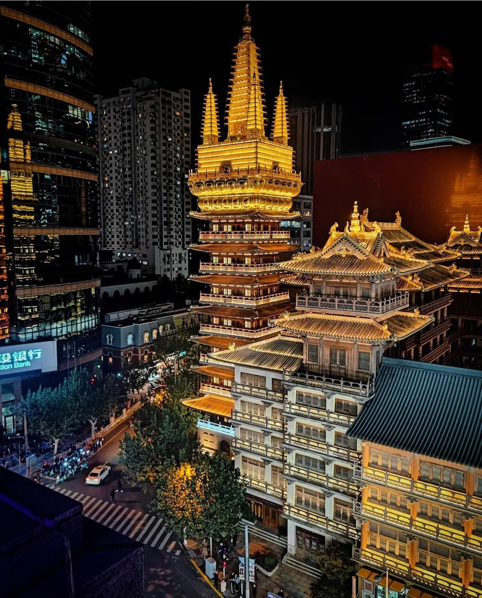

# 加入我们 

<link href="https://maxcdn.bootstrapcdn.com/font-awesome/4.7.0/css/font-awesome.min.css" rel="stylesheet" integrity="sha384-wvfXpqpZZVQGK6TAh5PVlGOfQNHSoD2xbE+QkPxCAFlNEevoEH3Sl0sibVcOQVnN" crossorigin="anonymous">
<link rel="stylesheet" href="https://cdnjs.cloudflare.com/ajax/libs/animate.css/3.5.2/animate.css" -->
<!--link rel="stylesheet" href="https://czheluo.github.io/assets/css/styles.css"-->
<link rel="stylesheet" href="styles.css">

<h2 align="center"> JOIN US </h2>

<h3 style="text-align: justify;"> The MajorBio is always on the look out for talented undergraduate, graduate students, 
  and PhD candidates who possess outstanding computational skills or have a strong interest in developing such skills. 
  If this describes you, please click the button below to access the Team Member Interest Form.</h3>
 

<a style="width:50%;font-size: 150%;color:black;" href="../contact"  target="_blank" class="button" align="center">For Bioinformatics Engineer</a>

<!--div class="designation"  style="text-align:left;"><h3>Apply</h3></div-->
<h3 style="text-align: justify;" >Please send enquiries to <a href="mailto:meng.luo@majorbio.com">Meng Luo (骆孟)</a>, 
providing your academic CV or Resume (and proof of your English proficiency 
(the score of CET-4 or CET-6 or TOEFL or IELTS, if you are not a English speaker)), 
and a summary of your research interests. Suitable candidates will be contact by phone 
in a discussion concerning the possibility of undertaking your career in the MajorBio.
 After you have received confirmation from HR, the next step is to set up a time for a 
 Zoom teleconference. </h3>

<h3>Successful applicants will have: </h3>

<li>Master’s degree or Ph.D. in Bioinformatics, Computational Science, Statistic or Genetics, Machine learning, Computational Biology, overseas education background is preferred</li>
<li>Experience with at least one of the following programming languages: R (required) and at least one of Python or Perl required (C++/Javascript) and Linux operating system</li>
<li>Some level of single cell (scRNAseq) research experience is preferred</li>
<li>Proficiency in the primary data structure and algorithm, and statistical methods</li>
<li>Proficiency in the use of bioinformatics tools, workflow and database resources</li>
<li>Relevant work experience in high-throughput biochip data analysis, second-generation or third-generation (Full-length transcriptome) high-throughput sequencing data analysis, and bioinformatics analysis is preferred</li>
<li>First-authored English papers (or three if co-first authors) with submitted, PREPRINT or accepted or published status in journals is perferred</li>
<li> With good spoken and written communication skills in English is perferred </li>

<h3>Duties/Responsibilities/Accountabilities: </h3>

<li>Processing and analysis of DNA and RNA sequencing data</li>
<li>Large-scale genome-wide association studies</li>
<li>Analyze biological data using various bioinformatics software and statistical methods</li>
<li>Design, develop and maintain various processes of bioinformatics analysis </li>
<li>Analyze project situation and deal with after-sales problems by high-throughput sequencing </li>
<li>Evaluate customer intentions, analyze details and provide solutions </li>
<li>Write technical documents and conduct training </li>

<h3>If you’re interested in applying for this position, please send your resume or CV to: meng.luo@majorbio.com</h3>

 

<h2 align="center"> Why Shanghai? </h2>

 

<a href="https://www.chinahighlights.com/shanghai/top-reasons-to-visit.htm" target="_blank"> Shanghai</a>, 
  the Oriental Paris, is China's biggest and most prosperous city. It is one of China's greatest 
  economic and cultural centers, therefore it is popularly seen as the birthplace of everything 
  considered modern in China. The city rivals New York or Paris in terms of modernity, and boasts 
  a blended culture of the East and the West. Shanghai is a tourist destination famous for historical 
  landmarks as well as modern, ever-expanding skylines.

 

 

<button style="color: rgb(18, 19, 18);background-color: bisque;padding: 4px 22px;font-size: 19px;font-family: 'Times New Roman', Times, serif;font-weight: bold;"><a href="https://www.chinahighlights.com/shanghai/top-reasons-to-visit.htm">Top 7 Reasons to Visit Shanghai</a></button>
<button style="color: rgb(18, 19, 18);background-color: bisque;padding: 4px 22px;font-size: 19px;font-family: 'Times New Roman', Times, serif;font-weight: bold;"><a href="https://www.chinahighlights.com/shanghai/top-reasons-to-visit.htm">The Top 20 Things to Do in Shanghai</a></button>

  

    
  

  

    
  

  

    
  

<h3><a href="../videos/book" target="_blank">Books online courses</a></h3>

