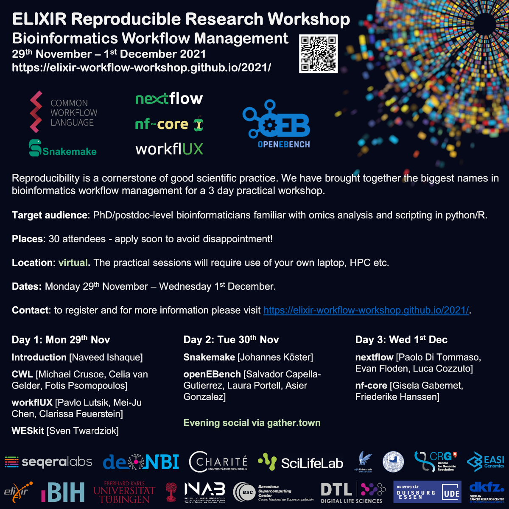

# News/Events

<!--link href="https://cdn.jsdelivr.net/npm/bootstrap@5.1.3/dist/css/bootstrap.min.css" rel="stylesheet" integrity="sha384-1BmE4kWBq78iYhFldvKuhfTAU6auU8tT94WrHftjDbrCEXSU1oBoqyl2QvZ6jIW3" crossorigin="anonymous">

<!--script src="main.js" ></!--script-->

<link rel="stylesheet" href="style.css">

<!--div class="blog-home2 py-5">
  

    

  
      

        <h3 class="my-3">TWEETS</h3>
        <button style="color: rgb(18, 19, 18);background-color: rgb(67, 201, 138);padding: 4px 22px;font-size: 19px;font-family: 'Times New Roman', Times, serif;font-weight: bold;">2021</button>
      

    

  

</div-->
<!--a class="twitter-timeline" data-lang="en" data-width="1000" data-height="604" data-theme="light" href="https://twitter.com/czheMEL?ref_src=twsrc%5Etfw">Tweets by czheMEL</a>

  

    <!-- Row  -->
    

      <!-- Column -->
      

        <h3 class="my-3">MUSIC&TWEETS</h3>
        <button style="color: rgb(18, 19, 18);background-color: rgb(67, 201, 138);padding: 4px 22px;font-size: 19px;font-family: 'Times New Roman', Times, serif;font-weight: bold;">2021</button>
      

      <!-- Column -->
      <!-- Column -->
    

    

      <!-- Column -->
      

        

          
          <iframe src="https://open.spotify.com/embed/playlist/3Rdc5Wgx3bHhGE3wVu1u6t?utm_source=generator" width="100%" height="480" frameBorder="0" allowfullscreen="" allow="autoplay; clipboard-write; encrypted-media; fullscreen; picture-in-picture"></iframe>   
        

      

      

        

          <a class="twitter-timeline" data-lang="en" data-width="600" data-height="504" data-theme="light" href="https://twitter.com/czheMEL?ref_src=twsrc%5Etfw">Tweets by czheMEL</a>
          
        

      

      <!--div class="col-lg-6">
        

                 
        

        
      </div-->                
      <!-- Column -->
      <!--div class="col-md-4 on-hover">
        

          
          
Oct23

          <h5 class="font-weight-medium mt-3"><a href="#" class="text-decoration-none link">New Seminar on Newest Food Recipe from World’s Best</a></h5>
          
Business Park, Opp. Corns Sam Restaurant, New Yoark, US

          <a href="#" class="text-decoration-none linking text-themecolor mt-2">Learn More</a>
        

      

      <- Column ->
      

        

          
          
Oct23

          <h5 class="font-weight-medium mt-3"><a href="#" class="text-decoration-none link">Learn from small things to create something bigger.</a></h5>
          
Business Park, Opp. Corns Sam Restaurant, New Yoark, US

          <a href="#" class="text-decoration-none linking text-themecolor mt-2">Learn More</a>
        

      </div-->
    

  

  

    <!-- Row  -->
    

      <!-- Column -->
      

        <h3 class="my-3">Visits</h3>
        <button style="color: rgb(18, 19, 18);background-color: rgb(67, 201, 138);padding: 4px 22px;font-size: 19px;font-family: 'Times New Roman', Times, serif;font-weight: bold;">2021</button>
      

      <!-- Column -->
      <!-- Column -->
    

    

      <!-- Column -->
      

        

                 
        

      
                
      <!-- Column -->
      <!--div class="col-md-4 on-hover">
        

          
          
Oct23

          <h5 class="font-weight-medium mt-3"><a href="#" class="text-decoration-none link">New Seminar on Newest Food Recipe from World’s Best</a></h5>
          
Business Park, Opp. Corns Sam Restaurant, New Yoark, US

          <a href="#" class="text-decoration-none linking text-themecolor mt-2">Learn More</a>
        

      

      <- Column ->
      

        

          
          
Oct23

          <h5 class="font-weight-medium mt-3"><a href="#" class="text-decoration-none link">Learn from small things to create something bigger.</a></h5>
          
Business Park, Opp. Corns Sam Restaurant, New Yoark, US

          <a href="#" class="text-decoration-none linking text-themecolor mt-2">Learn More</a>
        

      </div-->
    

  

