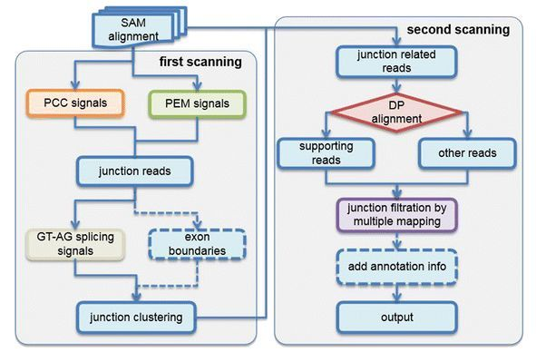
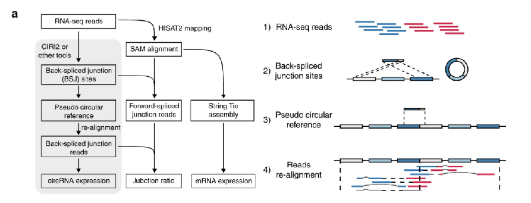
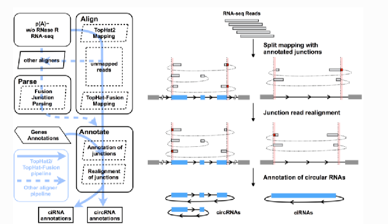
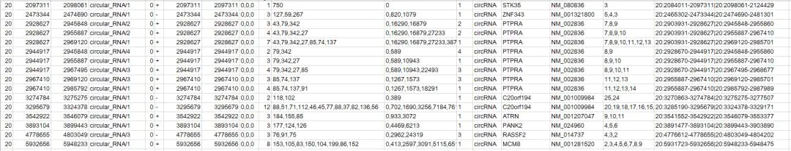
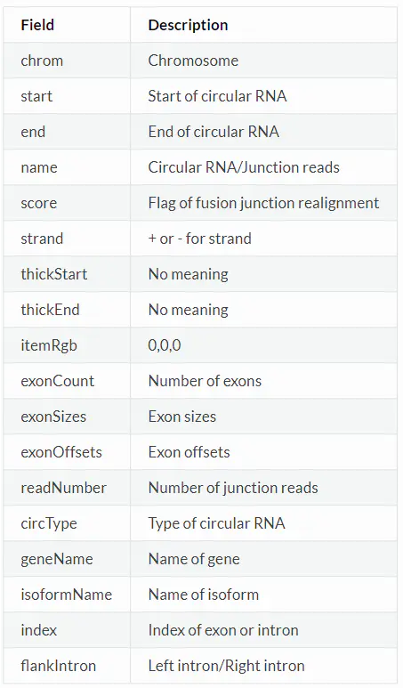
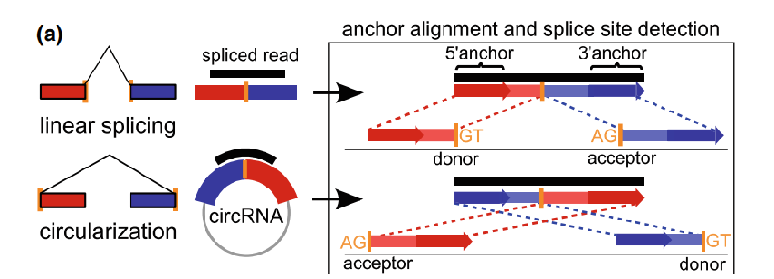
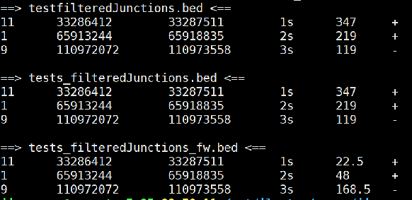

# circRNA定量软件分析比较


# 一、CIRI & CIRI2

## 1. CIRI鉴定circRNA的原理

在最初的环状RNA研究中，认为环状RNA都是由exon通过反向剪切构成的,称之为exonic circRNA，只有这样的环状RNA能够由PCR反应验证出来的。

CIRI是一款环状RNA检测软件，通过该软件的预测结果，学者第一次用实验验证出了intronic circRNA和intergenic circRNA。该软件操作简便，准确度高，是非常流行的一款环状RNA检测软件。

CIRI 相对于依赖基因注释的算法具有以下不可或缺的优势：能够从内含子或基因组间区鉴定到circRNA；对于基因注释不好甚至没有注释的真核生物也能对测序数据进行鉴定。

CIRI2是在CIRI基础上，改进了 maximum likelihood estimation（MLE）模型：判断潜在BSJ read中是否多个可能区域，有效控制由错误mapping或者基因组中重复序列所导致的假阳性；CIRI2在测试数据中F1得分平均值最高，且较其他识别程序消耗更少的内存及运算时间；CIRI2需求经RNase R处理的样本数据。

该软件至少需要两个输入文件，基因组的fasta序列和测序数据比对产生的sam文件，需要注意的是，输入的sam文件必须是由**bwa-mem**算法比对产生的 。分析的pipeline示意如下



对于输入的sam文件，需要经过两次扫描，在第一次扫描时，根据双端数据的比对情况筛选候选的环状RNA，这一步通过判断SAM文件中CIGAR那一列的值来实现，本质上是检测覆盖环状RNA连接点处的junction reads,根据测序读长和连接点处包含的基因组区域的特征，分成以下3种模型


图A：表示junction read只覆盖了起始外显子和终止外显子的部分序列，这两部分reads在基因组上的比对位置是相反的，绝大部分的环状RNA都符合这种模型。

图B：表示junction read除了覆盖了起始外显子和终止外显子的两部分序列外，还覆盖了中间的一个外显子的部分序列，这种情况下reads可以分成3个部分比对到基因组上。

图C：表示junction read除了覆盖了整个环状RNA外，还重复又读了一部分序列，这个只有当环状RNA的序列长度小于测序读长时才可能出现。

该软件将以上3种模型定义为paired chiastic clipping signals，简称PCC信号，如果一条reads比对情况符合以上任意一种，就认为该reads是一条环状RNA的junction reads。

为了提高准确性，识别到junciton reads之后，还会结合双端序列比对的质量paired end mapping即PEM和GT-AG保守的剪切位点进行过滤，示意图如下


只保留比对质量较高，且头尾符合AG-GT剪切信号的junciton reads进入下游分析，在第二次扫描SAM文件的过程中，通过动态规划算法给出最终的环状RNA预测结果，如果提供了GTF文件，还会对环状RNA进行注释。

## 2. CIRI使用方法

### 2.1. bwa比对参考基因组

首先需要使用**bwa mem** 将reads 与基因组比对

##### 代码如下：

```
bwa mem \
-T 19 \
-t 5 hg19_index \
R1.fastq.gz R2.fastq.gz \
> align.sam
```
### 2.2. 运行CIRI

```
CIRI2.pl  \
-T 20 \
-F hg19.fa \
-A hg19.gtf \
-I align.sam \
-O circRNA.xls
```
输出结果如下所示


在后续验证时，可以挑选表达量较高的来验证，在软件对应的文章中，挑选了junction reads数大于5的环状RNA来进行验证。

参考资料：

[CIRI: an efficient and unbiased algorithm for de novo circular RNA identification](https://genomebiology.biomedcentral.com/articles/10.1186/s13059-014-0571-3)

[CIRI-cookbook](https://ciri-cookbook.readthedocs.io/en/latest/CIRI2.html)


# 二、CIRIquant

> CIRIquant 与其他同类算法相比，其在鉴定circRNA的过程中降低了假阳性率。在circRNA的定量和差异表达分析方面，CIRIquant也考虑到RNase R处理不均等因素对最终结果的影响，通过qPCR验证其结果相较于其他方法拥有更高的准确度。同时，CIRIquant还提供对circRNA与线性转录本比例的分析，为circRNA生物发生和调控的相关研究提供基础。

## 1. CIRIquant 鉴定circRNA的原理

首先将1.      

1. reads使用hisat2与参考基因组进行比对，使用CIRI2或者其他软件对circRNA进行鉴定获得潜在的circRNA；

2. 为了对circRNA的表达水平进行精准的定量并筛选BSJs的假阳性，我们将BSJ区域的两个全长序列连接构建一个伪circRNA参考序列；

3. 然后将潜在的circRNA重新比对到伪序列上，确定BSJ reads 是否可以与BSJ区域完全线性对齐。

4. 结合与基因组和伪circRNA序列比对结果，可以通过计算BSJ上的环装剪切junction reads 的比列来确定每个circRNA的junction 率；然后使用RNA-seq分析流程获得转录本水平表达量信息。


## 2. ciriquan使用方法

### 2.1 circRNA的定量

参数使用：

```
Usage:
  CIRIquant [options] --config <config> -1 <m1> -2 <m2>

  <config>            Config file
  <m1>                Input mate1 reads (for paired-end data)
  <m2>                Input mate2 reads (for paired-end data)

Options (defaults in parentheses):

  -v                  Run in verbose mode
  -o, --out           Output directory (default: current directory)
  -e, --log           Specific log file (default: sample_prefix.log)
  -p, --prefix        Output sample prefix (default: input sample name)
  -t, --threads       Number of CPU threads to use (defualt: 4)
  -a, --anchor        Minimum anchor length for junction alignment (default: 5)
  -l, --library-type  Library type, 0: unstranded, 1: read1 match the sense strand, 2: read1 match the antisense strand (default: 0)

  --bed               User provided Back-Spliced Junction Site in BED format
  --circ              circRNA prediction results from other tools
  --tool              Tool name, required when --circ is specified ([CIRI2/CIRCexplorer2/DCC/KNIFE/MapSplice/UROBORUS/circRNA_finder/find_circ])

  --RNaseR            CIRIquant output file of RNase R data (required for RNase R correction)
  --bam               Specific hisat2 alignment bam file against reference genome
  --no-gene           Skip StringTie estimation of gene abundance
```
**注意:**
- 目前，–circ 和–tool 选项支持来自```CIRI2```/ ```CIRCexplorer2```/ ```DCC```/``` KNIFE```/ ```MapSplice```/ ```UROBORUS```/ ```circRNA_finder```/ ```find_cir``` 的结果
- 对于DCC和circRNA_finder等工具，需手动删除连接位置相同但链相反的重复环状rna。
- 基因表达值需要进行归一化，如果之后需要运行DE分析，不要使用-```--no-gene```。

CIRIquant需要输入一个配置文件
```bash
// Example of config file
name: hg19
tools:
  bwa: path/bwa
  hisat2: path/hisat2
  stringtie: path/stringtie
  samtools: path/samtools

reference:
  fasta: path/hg19.fa
  gtf: path/gencode.v19.annotation.gtf
  bwa_index: path//hg19
  hisat_index: path/hg19
```


**参数设置**

| Key         | Description                                                  |
| ----------- | ------------------------------------------------------------ |
| name        | the name of config file                                      |
| bwa         | the path of bwa                                              |
| hisat2      | the path of hisat2                                           |
| stringtie   | the path of stringite                                        |
| samtools    | the path of samtools, samtools version below 1.3.1 is not supported |
| fasta       | reference genome fasta, a fai index by samtools faidx is also needed under the same directory |
| gtf         | annotation file of reference genome in GTF/GFF3 format       |
| bwa_index   | prefix of BWA index for reference genome                     |
| hisat_index | prefix of HISAT2 index for reference genome                  |


对于线下提供的circRNA定量表需要有junction位点的bed文件，第4列的格式必须为```“chrom:start|end”```。例如：
```
chr1    10000   10099   chr1:10000|10099    .   +
chr1    31000   31200   chr1:31000|31200    .   -
```
**Usage**
推荐：使用CIRI2进行circRMA的预测
```
CIRIquant -t 4 \
          -1 ./test_1.fq.gz \
          -2 ./test_2.fq.gz \
          --config ./chr1.yml \
          -o ./test \
          -p test
```
使用提供的bed文件时：
```
CIRIquant -t 4 \
          -1 ./test_1.fq.gz \
          -2 ./test_2.fq.gz \
          --config ./chr1.yml \
          -o ./test \
          -p test \
          --bed your_circRNAs.bed
```
使用其它鉴定工具时：
例如使用find_circ鉴定的circRNA结果
```
CIRIquant -t 4 \
          -1 ./test_1.fq.gz \
          -2 ./test_2.fq.gz \
          --config ./chr1.yml \
          -o ./test \
          -p test \
          --circ find_circ_results.txt \
          --tool find_circ
```
# 输出结果
The main output of CIRIquant is a GTF file, that contains detailed information of BSJ and FSJ reads of circRNAs and annotation of circRNA back-spliced regions in the attribute columns
CIRIquant 输出的是一个GTF文件，其中包括circRNA的BSJ和FSJ reads 的详细信息，以及属性列中对circRNA反向拼接区域的注释。

**每一列的信息**
| column | name       | description                            |
| ------ | ---------- | -------------------------------------- |
| 1      | chrom      | chromosome / contig name               |
| 2      | source     | CIRIquant                              |
| 3      | type       | circRNA                                |
| 4      | start      | 5' back-spliced junction site          |
| 5      | end        | 3' back-spliced junction site          |
| 6      | score      | CPM of circRNAs (#BSJ / #Mapped reads) |
| 7      | strand     | strand information                     |
| 8      | .          | .                                      |
| 9      | attributes | attributes seperated by semicolon      |

**attributes包含的key与value：**
| key        | description                                                  |
| ---------- | ------------------------------------------------------------ |
| circ_id    | name of circRNA                                              |
| circ_type  | circRNA types: exon / intron / intergenic                    |
| bsj        | number of bsj reads                                          |
| fsj        | number of fsj reads                                          |
| junc_ratio | circular to linear ratio: 2 * bsj / ( 2 * bsj + fsj)         |
| rnaser_bsj | number of bsj reads in RNase R data (only when --RNaseR is specificed) |
| rnaser_fsj | number of fsj reads in RNase R data (only when --RNaseR is specificed) |
| gene_id    | ensemble id of host gene                                     |
| gene_name  | HGNC symbol of host gene                                     |
| gene_type  | type of host gene in gtf file                                |

### 2.2 RNase R效应矫正

当拥有RNase R处理和未经处理的样本时，CIRIquant 可以评估RNase R数据中处理前的circrna的表达水平。
为了去除RNase R处理效果，需要两个步骤:

- 对RNase R处理过的样品运行CIRIquant。
- 对未经处理的总RNA样本运行CIRIquant，```--RNaseR```使用之前Step1中的输出gtf文件。

然后，CIRIquant将输出RNaseR数据中鉴定到的circrna的表达水平，标题行将包含额外的RNaseR处理效率信息。

**Usage:**
```
# Step1. Run CIRIquant with RNase R treated data
CIRIquant --config ./hg19.yml \
          -1 ./RNaseR_treated_1.fq.gz \
          -2 ./RNaseR_treated_2.fq.gz \
          --no-gene \
          -o ./RNaseR_treated \
          -p RNaseR_treated \
          -t 6

# Step2. Run CIRIquant with untreated total RNA
CIRIquant --config ./hg19.yml \
          -1 ./TotalRNA_1.fq.gz \
          -2 ./TotalRNA_2.fq.gz \
          -o ./TotalRNA \
          -p TotalRNA \
          -t 6 \
          --RNaseR ./RNaseR_treated/RNaseR_treated.gtf
```

##2.3 差异表达分析
####针对无生物学重复
对于没有重复的样品，差异表达和差异剪接分析使用 CIRI_DE
```
Usage:
  CIRI_DE [options] -n <control> -c <case> -o <out>

  <control>         CIRIquant result of control sample
  <case>            CIRIquant result of treatment cases
  <out>             Output file

Options (defaults in parentheses):

  -p                p value threshold for DE and DS score calculation (default: 0.05)
  -t                numer of threads (default: 4)

Example usage:
  CIRI_DE -n control.gtf -c case.gtf -o CIRI_DE.tsv
```
**输出结果**
| column | name       | description                    |
| ------ | ---------- | ------------------------------ |
| 1      | circRNA_ID | circRNA identifier             |
| 2      | Case_BSJ   | number of BSJ reads in case    |
| 3      | Case_FSJ   | number of FSJ reads in case    |
| 4      | Case_Ratio | junction ratio in case         |
| 5      | Ctrl_BSJ   | number of BSJ reads in control |
| 6      | Ctrl_FSJ   | number of FSJ reads in control |
| 7      | Ctrl_Ratio | junction ratio in control      |
| 8      | DE_score   | differential expression score  |
| 9      | DS_score   | differential splicing score    |

### 2.3 差异表达分析

####有生物学重复

对于生物学重复，推荐使用edgeR分析，使用```prep_CIRIquant ```去生成circRNA表达水平/junction比率的矩阵，使用```CIRI_DE_replicate ```用于DE分析。

**Step1: 准备CIRIquant 的输出文件**
需要提供一个文本文件，包含样本信息和CIRIquant输出的GTF文件的路径信息

```
CONTROL1 ./c1/c1.gtf C 1
CONTROL2 ./c2/c2.gtf C 2
CONTROL3 ./c3/c3.gtf C 3
CASE1 ./t1/t1.gtf T 1
CASE2 ./t2/t2.gtf T 2
CASE3 ./t3/t3.gtf T 3
```

默认情况下，前三列是必需的。对于paired 样本，还可以添加一个主题名称列。

| column                                                       | description                                 |
| ------------------------------------------------------------ | ------------------------------------------- |
| 1                                                            | sample name                                 |
| 2                                                            | path to CIRIquant output gtf                |
| 3                                                            | group ("C" for control, "T" for treatment)  |
| 4                                                            | subject (optional, only for paired samples) |
| **注意:**如果使用```CIRI_DE```进行差异表达分析，第3列group列必须是“C”或者“T” |                                             |

然后，运行```prep_CIRIquant```汇总所以样本的circRNA的表达量
```
Usage:
  prep_CIRIquant [options]

  -i                the file of sample list
  --lib             where to output library information
  --circ            where to output circRNA annotation information
  --bsj             where to output the circRNA expression matrix
  --ratio           where to output the circRNA junction ratio matrix

Example:
  prep_CIRIquant -i sample.lst \
                 --lib library_info.csv \
                 --circ circRNA_info.csv \
                 --bsj circRNA_bsj.csv \
                 --ratio circRNA_ratio.csv
```
输出的结果可以使用DEseq2与edgeR进行分析。

**Step2: 准备 StringTie 的输出**
StringTie的输出应该位于`output_dir/gene/prefix_out.gtf`下。 需要使用stringTie中的[prepDE.py](http://ccb.jhu.edu/software/stringtie/dl/prepDE.py)来生成用于标准化的基因计数矩阵。 

例如，可以提供一个`sample_gene.lst` 包含样本 ID 和 `StringTie `输出路径的文本文件：
```
CONTROL1 ./c1/gene/c1_out.gtf
CONTROL2 ./c2/gene/c2_out.gtf
CONTROL3 ./c3/gene/c3_out.gtf
CASE1 ./t1/gene/t1_out.gtf
CASE2 ./t2/gene/t2_out.gtf
CASE3 ./t3/gene/t3_out.gtf
```
然后使用生成的`gene_count_matrix.csv`去运行`prepDE.py -i sample_gene.lst`。

**Step3: 差异表达分析**
使用`CIRI_DE_replicate`进行差异表达分析，需要安装edgeR包
```
Usage:
  CIRI_DE_replicate [options]

  --lib             library information by CIRIquant
  --bsj             circRNA expression matrix
  --gene            gene expression matrix
  --out             output differential expression result

Example:
  CIRI_DE_replicate --lib  library_info.csv \
            --bsj  circRNA_bsj.csv \
            --gene gene_count_matrix.csv \
            --out  circRNA_de.tsv
```
输出结果是未过滤的，可以设定阈值对结果进行过滤。

参考资料：
- [Accurate quantification of circular RNAs identifies extensive circular isoform switching events](https://www.nature.com/articles/s41467-019-13840-9)
- [CIRI-cookbook](https://ciri-cookbook.readthedocs.io/en/latest/CIRIquant_4_de.html)


# 三、CIRCexplorer2

环状RNA的识别包含了序列比对和环状RNA预测两步，该软件目前更新到了v2版本，相比v1版本，用法有较大变化。在v1版本中只支持tophat-fusion和STAR两款软件进行序列比对来识别junction reads,在v2版本中，扩展到了以下5种软件

- TopHat2/TopHat-Fusion
- STAR
- BWA
- MapSplice
- segemehl

## 1. CIRCexplorer原理




-  Align用于将序列比对到参考基因组上;

- Parse用于从比对结果中挑选junction reads;
- Annotate用于预测环状RNA;
- Assemble用于组装环状RNA的转录本序列；
- Denovo根据序列组装结果，识别新的环状RNA和分析环状RNA上的可变剪切事件


## 2. CIRCexplorer使用方法

### 安装

- pip install circexplorer2
- conda install circexplorer2 --channel bioconda

### 2.1 Align

虽然支持多款序列比对软件，但是由于tophat的结果更方便后续的cufflinks软件进行分析，官方推荐使用tophat来进行比对。针对单端序列的比对，代码如下

```css
CIRCexplorer2 align \
-G hg19.gtf \
-i bowtie1_index \
-j bowtie2_index \
-f RNA_seq.fastq \
> CIRCexplorer2_align.log
```

值得注意的是，align模块仅提供了针对单端序列使用tophat进行比对的功能，如果你是双端测序的结果或者想要使用其他软件，只能是自己手工进行比对，这里比较推荐STAR软件，速度较快，缺点就是内存消耗较大。

### 2.2 parse

parse用于解析序列比对的结果，支持多款软件，以常用的STAR为例，代码如下

```css
CIRCexplorer2 parse \
-t STAR \
Chimeric.out.junction \
> CIRCexplorer2_parse.log
```

对于其他软件的用法，具体请参考官方文档，无论是什么比对软件，该命令最终都会生成以下文件

```css
back_spliced_junction.bed
```

### 2.3 annotation

这一步就是根据已知的线性转录本信息，识别环状RNA，所以需要提供参考基因组对应的注释文件，官方也提供了脚本来帮助我们下载，用法如下

```css
fetch_ucsc.py hg19 ref hg19_ref.txt
```

预测环状RNA的代码如下

```css
CIRCexplorer2 annotate \
-r hg19_ref.txt \
-g hg19.fa \
-b back_spliced_junction.bed \
-o circularRNA_known.txt \
> CIRCexplorer2_annotate.log
```

`-o`参数为输出结果，内容示意如下



每列的含义如下所示




如果你只是想要使用这个软件来预测环状RNA,那么多款序列比对软件都可以选择，但是你想要使用完整功能，则必须使用tophat来进行比对。

参考资料：

- [Genome-Wide Annotation of circRNAs and Their Alternative Back-Splicing/Splicing with CIRCexplorer Pipeline](https://links.jianshu.com/go?to=https%3A%2F%2Flink.springer.com%2Fprotocol%2F10.1007%2F978-1-4939-8808-2_10)
- [CIRCexplorer2使用手册](https://links.jianshu.com/go?to=https%3A%2F%2Fcircexplorer2.readthedocs.io%2Fen%2Flatest%2F)

# 四、find_circ

## 1. find_circ鉴定circRNA的原理

> find_circ 的基本原理: find_circ根据Bowtie2比对结果，从没有比对到参考序列的 reads 的两端各提取 20nt 的 anchor 序列，将每一对 anchor 序列再次与参考序列比对。如果 anchor 序列的 5' 端比对到参考序列（起始与终止位点分别记为 A3，A4），anchor 序列的 3' 端比对到此位点的上游（起始与终止位点分别记为 A1，A2），并且在参考序列的 A2 到 A3 之间存在剪接位点（GT-AG），则将此 read 作为候选 circRNA。最后将 read count 大于等于 2 的候选 circRNA 作为鉴定的 circRNA。



## 2. find_circ的安装

> find_circ需要运行在装有python 2.7的64位系统上，同时需要安装numpy和pysam这两个python模块。其运行需要借助bowtie2和samtools来完成基因组mapping的过程。
```bash
1 wget https://github.com/marvin-jens/find_circ/archive/v1.2.tar.gz
2 tar -xzvf v1.2.tar.gz
```

## 3. 参考基因组的下载

>通过fetch_ucsc.py下载ucsc最新版本的参考基因组
```
1 fetch_ucsc.py hg19/hg38/mm9/mm10 ref/kg/ens/fa out
```
## 4. bowtie2建立参考基因组索引

```
1 bowtie2_build hg38.fa hg38
```
## 5. 基于RNA-Seq的基因组比对（pair-end模式）

**bowtie2参数介绍**
-p 使用多线程
--very-sensitive 允许多重比对，报告出最好的一个
--score-min=C,-15,0 设置比对分数函数
--mm 设置I/O模式。

**samtools view参数介绍**
-h 文件包含header line
-b 输出bam格式
-u 输出非压缩的bam格式
–S 忽略版本兼容
```
1 bowtie2 -p 16 --very-sensitive --score-min=C,-15,0 --mm -x /path/to/bowtie2_index -q -1 reads1.fq -2 reads2.fq | samtools view -hbuS - | samtools sort - -o output.bam
```
## 6. 挑出没有比对上的序列，各取两头20bp短序列（anchor)

```
1 samtools view -hf 4 output.bam | samtools view -Sb - > unmapped.bam
2 /path/to/unmapped2anchors.py unmapped.bam | gzip > anchors.fq.gz
```

## 7. 根据anchor比对基因组情况寻找潜在的circRNA

**find_circ.py参数介绍**
--prefix参数指定的是spliced_sites.bed文件中第四列内容的前缀，建议指定为物种对应的三字母缩写，需要注意的是，在spliced_sites_bed中同时包含了环状RNA和线性RNA,环状RNA的名称用circ标识，线性RNA的名称用norm标识，这里设置为--prefix=hsa_
--name参数会在生成的spliced_sites.bed文件中指定tissues列的名字
--reads参数会生成包含spliced reads的fa文件
--stats参数会生成包含数值统计信息的txt文件

```
1 bowtie2 -p 16 --reorder --mm  --score-min=C,-15,0 -q -x /path/to/bowtie2_index -U anchors.fq.gz | /path/to/find_circ.py --genome=/path/to/hg38.fa --prefix=hsa_ --name=my_test_sample --stats=<run folder>/stats.txt --reads=<run folder>/splice_reads.fa > <run folder>/spliced_sites.bed
```
**根据以下规则对结果进行筛选**
1.根据关键词CIRCULAR筛选环状RNA
2.去除线粒体上的环状RNA
3.筛选unique junction reads数至少为2的环状RNA
4.去除断裂点不明确的环状RNA
5.过滤掉长度大于100kb的circRNA,这里的100kb为基因组长度，直接用环状RNA的头尾相减即可
```
1 grep CIRCULAR spliced_sites.bed | grep -v chrM | gawk '$5>=2' | grep UNAMBIGUOUS_BP | grep ANCHOR_UNIQUE | /path/to/maxlength.py 100000 > find_circ.candidates.bed
```
## 8. 分析多个样本

>如果有多个样本，需要分别用find_circ.py运行，然后将各自的结果合并
```
1 /path/to/merge_bed.py sample1.bed sample2.bed [...] >combined.bed
```
## 9. 输出的spliced_sites_bed文件格式

>输出的spliced_sites.bed文件前六列为标准的BED文件格式，剩余的12列关于junction的一些信息

| column | name            | description                                                  |
| ------ | --------------- | ------------------------------------------------------------ |
| 1      | chrom           | chromosome/contig name                                       |
| 2      | start           | left splice site (zero-based)                                |
| 3      | end             | right splice site (zero-based).(Always: end > start. 5' 3' depends on strand) |
| 4      | name            | (provisional) running number/name assigned to junction       |
| 5      | n_reads         | number of reads supporting the junction (BED 'score')        |
| 6      | strand          | genomic strand (+ or -)                                      |
| 7      | n_uniq          | number of distinct read sequences supporting the junction    |
| 8      | uniq_bridges    | number of reads with both anchors aligning uniquely          |
| 9      | best_qual_left  | alignment score margin of the best anchor alignment supporting the left splice junction (max=2 * anchor_length) |
| 10     | best_qual_right | same for the right splice site                               |
| 11     | tissues         | comma-separated, alphabetically sorted list of supporting the left splice junction (max=2 * anchor_length) |
| 12     | tiss_counts     | comma-separated list of corresponding read-counts            |
| 13     | edits           | number of mismatches in the anchor extension process         |
| 14     | anchor_overlap  | number of nucleotides the breakpoint resides within one anchor |
| 15     | breakpoints     | number of alternative ways to break the read with flanking GT/AG |
| 16     | signal          | flanking dinucleotide splice signal (normally GT/AG)         |
| 17     | strandmatch     | 'MATCH', 'MISMATCH' or 'NA' for non-stranded analysis        |
| 18     | category        | list of keywords describing the junction. Useful for quick grep filtering |

参考资料
- [Circular RNAs are a large class of animal RNAs with regulatory potency](https://www.nature.com/articles/nature11928)


# 五、circRNA_finder

circRNA_finder是一款环状RNA预测软件，在对果蝇的研究中采用该软件进行了环状RNA的预测，该软件的源代码托管在github上，网址如下
> https://github.com/orzechoj/circRNA_finder

软件的安装比较简便，直接下载解压就可以了，需要注意的是，该软件依赖以下几个软件
- perl
- awk
- STAR
- samtools

其中samtools的版本必须是低于1.0的版本，因为两个版本samtools sort的用法有变化。软件的使用包含如下两个步骤

虽然软件提供了一个名为runStar.pl的脚本(如下)，但是由于STAR的版本问题，使用起来并不方便。该脚本本质上是对STAR的封装，直接用STAR就好了，参数设置可以参考脚本中的设置。
```
./runStar.pl --inFile1 [R1 fastq] --inFile2 [R2 fastq] --genomeDir [path to STAR genome] --maxMismatch [max mismatches realtive to read length, default 0.02] --outPrefix [output directory and prefix]
```
## 1. STAR构建index

```
 STAR     --runMode genomeGenerate  \
	--runThreadN <# cpus> \
	--genomeDir <genome output directory>  \
	--genomeFastaFiles <input Genome FASTA file>
```
- --runThreadN是指你要用几个cpu来运行；

- --genomeDir构建索引输出文件的目录；

- --genomeFastaFiles你的基因组fasta文件所在的目录

  

## 2. STAR比对

首先要明确的是，STAR软件的参数实在是太多了，那么经常用的就那么几个。
下面的代码里，其中`--twopassMode`参数凭个人爱好是否使用，这个参数是非常非常耗时的，加上这个参数以后的运行时间是正常的两倍。而且非常消耗内存（[star的twopassMode问题](https://www.jianshu.com/p/4d9b3458af2e)）。但是比对结果更为精准。

```bash
STAR \
--runThreadN 40 \ #线程数
--runMode alignReads \#比对模式
--readFilesCommand zcat \#说明你的fastq文件是压缩形式的，就是.gz结尾的，不加的话会报错
--quantMode TranscriptomeSAM GeneCounts \ #将reads比对至转录本序列
--twopassMode Basic \#先按索引进行第一次比对，而后把第一次比对发现的新剪切位点信息加入到索引中进行第二次比对。这个参数可以保证更精准的比对情况，但是费时也费内存。
--outSAMtype BAM Unsorted \ #输出BAM文件，不进行排序。如果不加这一行，只输出SAM文件。
--outSAMunmapped None \
--genomeDir /gpfs/home/fangy04/downloads/STAR_index/GRCh38/ \ #索引文件目录
--readFilesIn /gpfs/home/fangy04/downloads/SRR8112732_1.fastq.gz /gpfs/home/fangy04/downloads/SRR8112732_2.fastq.gz \ #两个fastq文件目录
--outFileNamePrefix DRB_TT_seq_SRR8112732 #输出文件前缀
```

> 因为后续运行ciriRNA_finder 除了正常比对结果还需要以下三个文件：
>
> 
>
> 所以在`STAR` 比对中最少需要增加两个参数：`--chimOutType Junctions SeparateSAMold ` `--chimSegmentMin 10`;
>
> `--chimSegmentMin`默认为`0`，如果为0着不会输出junction信息文件
>
> 


## 3.  运行circRNA_finder

```
perl \
postProcessStarAlignment.pl \
--starDir star_out_dir \
--minLen 100
--outDir output_dir
```
运行完成之后，会三个文件,对应的后缀如下所示

1. _filteredJunctions.bed
2. _s_filteredJunctions.bed
3. _s_filteredJunctions_fw.bed

第一个文件为所有环状RNA的结果文件；第二个文件为剪切位点符合GT-AG剪切信号的环状RNA；第三个文件和第二个文件的环状RNA相同，只不过新增了环状RNA连接点附近的线性RNA平均测序深度信息。通常情况下，我们选择第二个文件的结果作为最终的环状RNA预测结果，该文件内容示意如下 


每一行代表一个环状RNA,第一列代表染色体编号，第二列和第三列分别代表起始和终止位置，第四列代表name,这里用数字编号加上字母`s`表示，第五列代表环状RNA的junction reads数目,也就是表达量，第六列代表正负链信息。

**参考资料：**

- [circRNA_finder_github](https://github.com/orzechoj/circRNA_finder )
