# 使用clusterProfiler对基因集进行富集分析（任何物种）


# 使用[clusterProfiler](https://github.com/YuLab-SMU/clusterProfiler)对基因集进行富集分析
# 分析内容包括GO、KEGG、GSEA、DO Reactome


## 构建自己物种的数据库R包

>如果分析的物种没有注释信息，需要将基因/转录本与六大数据库（NR、Swiss-Prot、Pfam、EggNOG、GO和KEGG）进行比对，全面获得基因/转录本的注释信息并对各数据库注释情况。但是如果只是做GO或者KEGG富集分析，只需要比对到GO及KEGG获得相应的注释结果即可。

[]()
[]()


```bash
# 如果你有以上的数据结构，可以使用以下脚本进行处理，获得构建数据库的基本数据。
perl /mnt/ilustre/users/meng.luo/Pipeline/Pipeline/biotools/clusterprofile/database/get.anno.pl -go gene.go.list -anno all_anno_detail.xls -out ./ -kegg gene.kegg.list -ko  pathway_table.xls
# 如果有结果是空的，需要再处理
less gene_info_discription.txt|perl -ne 'chomp;my $nn=376423;my @all=split/\t/,$_;if($all[2] eq ""){print"$all[0]\t$all[1]\t$nn\t$all[3]\n";$nn++;}else{print "$_\n"}' > gene_info_entrze.txt
# 再运行R脚本进行再运行R脚本数据库
Rscript /mnt/ilustre/users/meng.luo/Pipeline/Pipeline/biotools/clusterprofile/database/build_annotation.R -i gene_info_discription.txt -g gene_GO.txt -s asa -n 9666 -o ./

参数说明：
-i：基因ID与其描述信息的文件
-g：基因ID所对应的GOID的文件
-s：构建的物种名；例如：asa 
-n: 物种的num ID；例如：9666 (随机数，没有任何影响)
-o：输出路径

```
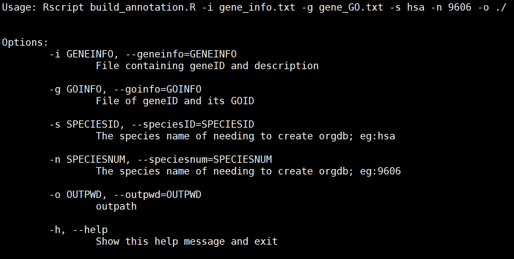

## gene_info.txt文件示例：

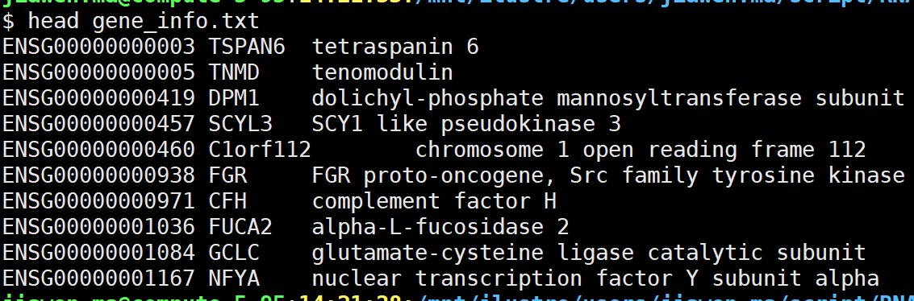

## gene_GO.txt文件示例：

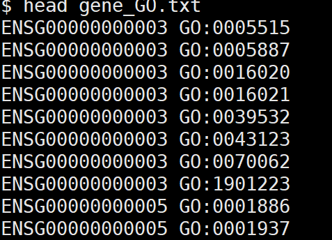

## **注意事项：** gene_info.txt文件中的基因ID不能重复。

## 脚本最后一行有效命名为安装此orgdb。

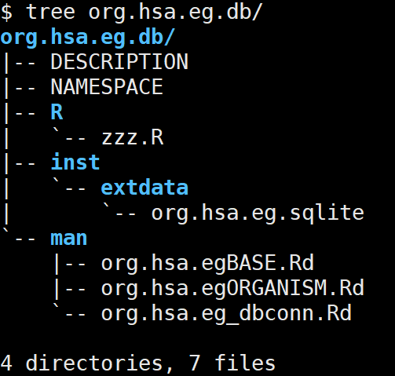

## 构建的orgdb文件为：org.hsa.eg.db, hsa 为提供的物种ID


# 富集分析

### 路径:

```bash
# 提供基因list表或者基因及其FC值（如果有FC值则进行富集分析），两列值，不用写表头。其中ko_gene.txt、ko_anno.txt、class.txt都是上面整理好的结果文件，执行脚本如下：

Rscript /mnt/ilustre/users/meng.luo/Pipeline/Pipeline/
biotools/clusterprofile/clusterProfiler.V3.R -e circrna_host.gene.DE -i ko_gene.txt -m ko_anno.txt -c class.txt -s asa

# 脚本帮助
Options:
	-e DEGFILE, --degfile=DEGFILE
		Input file of deg file
	-i KOGENEID, --kogeneID=KOGENEID
		Input file of koID mapping geneID or transcriptionID or entrezID..
	-m KODESCRIPTION, --kodescription=KODESCRIPTION
		Input file of koID and its description
	-b GSEA, --gsea=GSEA
		Whether to conduct GSEA analysis; default:FALSE
	-c CLASS, --class=CLASS
		Input file of class file;default:class1_description.txt
	-f FOLDCHANGE, --foldchange=FOLDCHANGE
		Fold change;default:2
	-l LAYOUTTYPE, --layouttype=LAYOUTTYPE
		Setting layout; default:circle
	-n NODELABEL, --nodelabel=NODELABEL
		Setting node_label; default:none,it is one of none, all,gene or category
	-s SPECIES, --species=SPECIES
		Species in this analysis;default:hsa
	-a ALL, --all=ALL
		default:deg gene; input all:genes
	-g GOENRICH, --GOenrich=GOENRICH
		Do you need GO analysis;default:TRUE
	-k KEGGENRICH, --KEGGenrich=KEGGENRICH
		Do you need KEGG analysis;default:TRUE
	-d DOENRICH, --DOenrich=DOENRICH
		Do you need DO analysis;default:FALSE
	-r REACTOMEENRICH, --Reactomeenrich=REACTOMEENRICH
		Do you need Reactome analysis;default:FALSE
	-h, --help
		Show this help message and exit

参数说明：
-e：表达基因详细文件
-c：kegg pathway class1与descripti的对应表
-f：foldchange;默认为2
-s: 物种名；默认为人
-a：富集通路图是否包含所有背景基因；默认只为差异表达基因
-g：是否进行GO分析；默认为TRUE；如不需着传递参数FALSE
-k：是否进行KEGG分析；默认为TRUE；如不需着传递参数FALSE
-d：是否进行疾病分析；默认为TRUE；如不需着传递参数FALSE
-r：是否进行反应组分析；默认为TRUE；如不需着传递参数FALSE
```


# 分析结果
### 以上是物种人的一个分析例子，输出的结果目录如下：
```console
|-- results/
        |-- DO_result
        |-- GO_result 
        |-- KEGG_result 
        |-- Reactome_result
```

# 详细分析原来如下知识点

## GO enrichment analysis

> GO comprises of three orthogonal ontologies, i.e. molecular function (MF), biological process (BP), and cellular component (CC).

> GO analyses (`groupGO()`, `enrichGO()` and `gseGO()`) support organisms that have an `OrgDb` object available (see also [session 2.2](https://yulab-smu.top/biomedical-knowledge-mining-book/GOSemSim.html#gosemsim-supported-organisms)).
>
> If user have GO annotation data (in data.frame format with first column of gene ID and second column of GO ID), they can use `enricher()` and `gseGO()` functions to perform over-representation test and gene set enrichment analysis.
>
> If genes are annotated by direction annotation, it should also annotated by its ancestor GO nodes (indirect annation). If user only has direct annotation, they can pass their annotation to `buildGOmap` function, which will infer indirection annotation and generate a `data.frame` that suitable for both `enricher()` and `gseGO()`.

## GO over-representation analysis

> The [clusterProfiler](http://bioconductor.org/packages/clusterProfiler) package implemented `enrichGO()` function for gene ontology over-representation test.

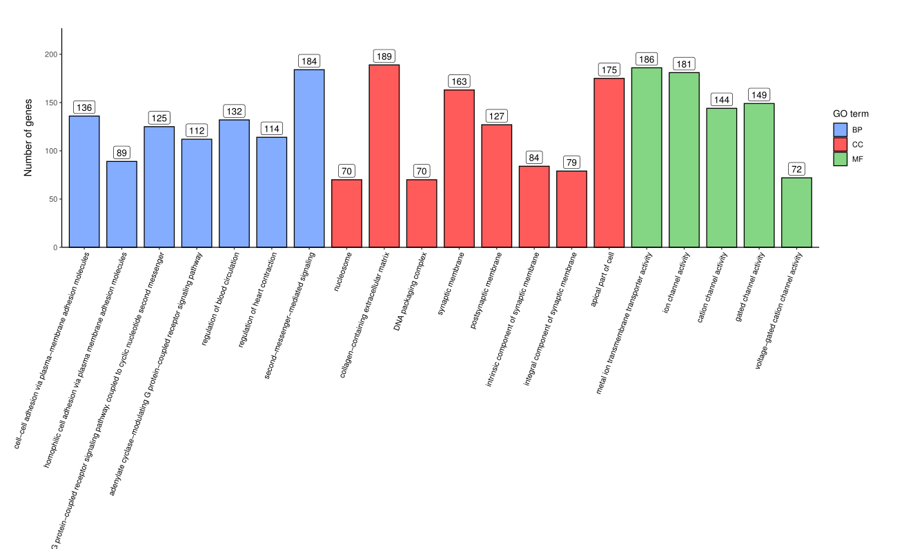

##  GO Gene Set Enrichment Analysis

> The [clusterProfiler](http://bioconductor.org/packages/clusterProfiler) package provides `gseGO()` function for [gene set enrichment analysis](https://yulab-smu.top/biomedical-knowledge-mining-book/enrichment-overview.html#gsea-algorithm) using gene ontology.

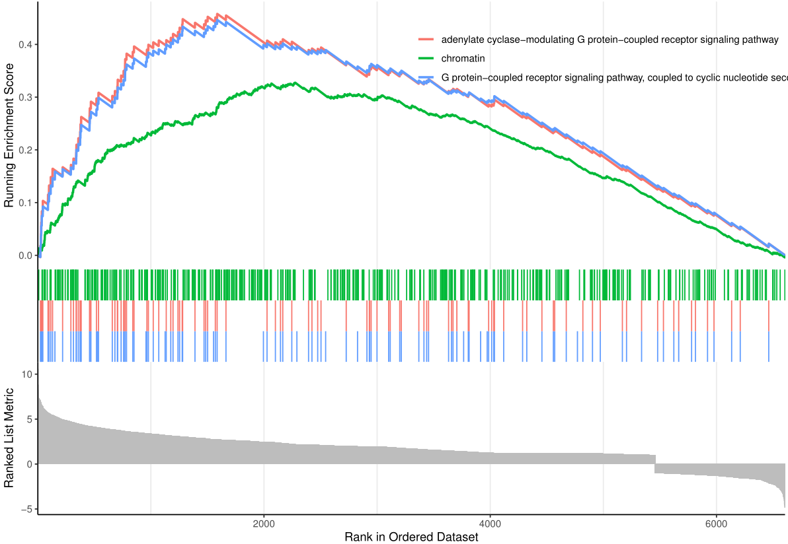

## KEGG enrichment analysis

> The KEGG FTP service is not freely available for academic since 2012, and there are many software packages using out-dated KEGG annotation data. The [clusterProfiler](http://bioconductor.org/packages/clusterProfiler) package supports downloading latest online version of KEGG data using the [KEGG website](https://www.kegg.jp/), which is freely available for academic users. Both KEGG pathway and module are supported in [clusterProfiler](http://bioconductor.org/packages/clusterProfiler).

> The [clusterProfiler](http://bioconductor.org/packages/clusterProfiler) package supports all organisms that have KEGG annotation data available in KEGG database. User should pass abbreviation of academic name to the `organism` parameter. The full list of KEGG supported organisms can be accessed via http://www.genome.jp/kegg/catalog/org_list.html. [KEGG Orthology](https://www.genome.jp/kegg/ko.html) (KO) Database is also supported by specifying `organism = "ko"`.
>
> The [clusterProfiler](http://bioconductor.org/packages/clusterProfiler) package provides `search_kegg_organism()` function to help searching supported organisms.

## KEGG pathway over-representation analysis

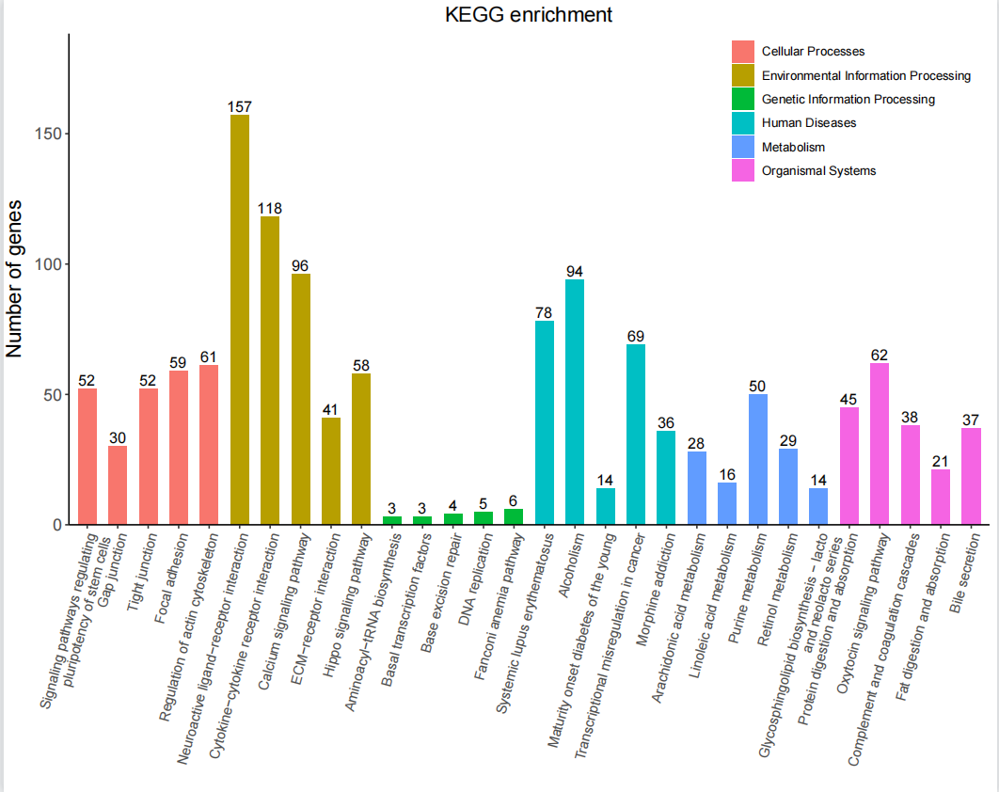


##  KEGG pathway gene set enrichment analysis

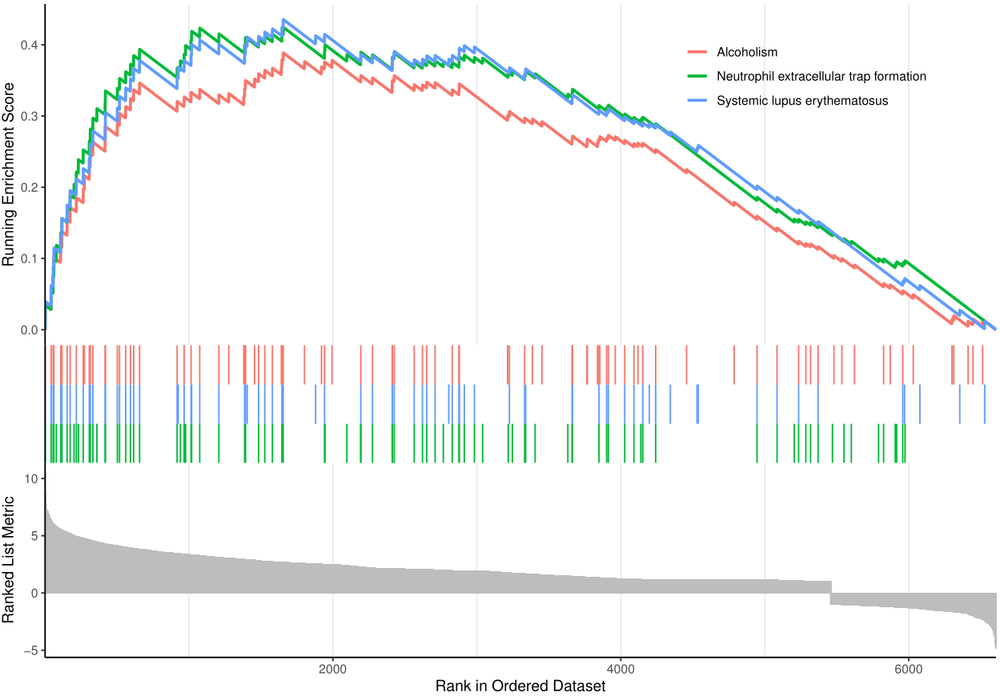

##  Reactome enrichment analysis

> [ReactomePA](http://bioconductor.org/packages/ReactomePA) is designed for reactome pathway based analysis ([Yu and He 2016](https://yulab-smu.top/biomedical-knowledge-mining-book/references.html#ref-yu_reactomepa_2016)). Reactome is an open-source, open access, manually curated and peer-reviewed pathway database.

> Currently [ReactomePA](http://bioconductor.org/packages/ReactomePA) supports several model organisms, including ‘celegans,’ ‘fly,’ ‘human,’ ‘mouse,’ ‘rat,’ ‘yeast’ and ‘zebrafish.’ The input gene ID should be Entrez gene ID. We recommend using [`clusterProfiler::bitr()`](https://yulab-smu.top/biomedical-knowledge-mining-book/useful-utilities.html#bitr) to convert biological IDs.

##  Reactome pathway over-representation analysis

> Enrichment analysis is a widely used approach to identify biological themes. [ReactomePA](http://bioconductor.org/packages/ReactomePA) implemented `enrichPathway()` that uses [hypergeometric model](https://yulab-smu.top/biomedical-knowledge-mining-book/enrichment-overview.html#ora-algorithm) to assess whether the number of selected genes associated with a reactome pathway is larger than expected.

**Pathway Visualization**

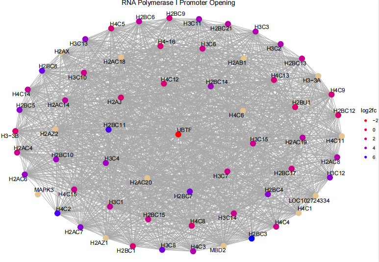

## Reactome pathway gene set enrichment analysis

**Pathway Visualization**

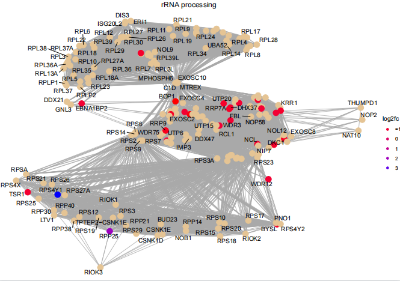

##  Disease enrichment analysis

> We developed [DOSE](http://bioconductor.org/packages/DOSE) ([Yu et al. 2015](https://yulab-smu.top/biomedical-knowledge-mining-book/references.html#ref-yu_dose_2015)) package to promote the investigation of diseases. [DOSE](http://bioconductor.org/packages/DOSE) provides five methods for [measuring semantic similarities among DO terms and gene products](https://yulab-smu.top/biomedical-knowledge-mining-book/DOSE-semantic-similarity.html#DOSE-semantic-similarity), hypergeometric model and gene set enrichment analysis (GSEA) for associating disease with gene list and extracting disease association insight from genome wide expression profiles.

> [DOSE](http://bioconductor.org/packages/DOSE) supports enrichment analysis of Disease Ontology (DO) ([Schriml et al. 2011](https://yulab-smu.top/biomedical-knowledge-mining-book/references.html#ref-schriml_disease_2011)), [Network of Cancer Gene](http://ncg.kcl.ac.uk/) ([A. et al. 2016](https://yulab-smu.top/biomedical-knowledge-mining-book/references.html#ref-omer_ncg)) and [Disease Gene Network](http://disgenet.org/) (DisGeNET) ([Janet et al. 2015](https://yulab-smu.top/biomedical-knowledge-mining-book/references.html#ref-janet_disgenet)). In addition, several visualization methods were provided by [enrichplot](http://bioconductor.org/packages/enrichplot) to help interpreting semantic and enrichment results.

## Over-representation analysis for disease ontology

> **Enrichment Map**
>
> 选取padjust前30个pathway可视化

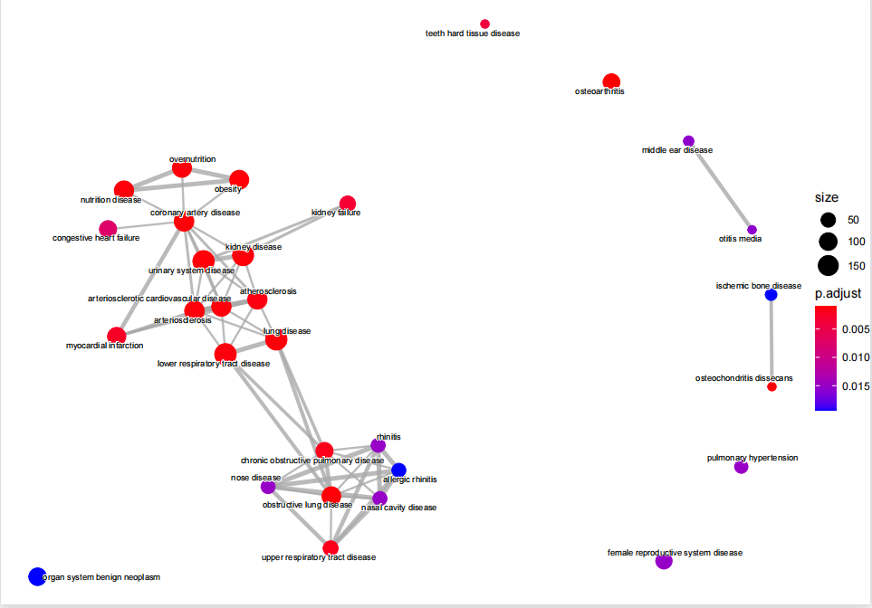

### **边的宽度代表两个富集的Term共有的基因数目，点大小代表条目内基因数目多少，颜色代表Padjust，值越小越红；**

> **Gene-Concept Network**
>
> 选取padjust前5个Category可视化

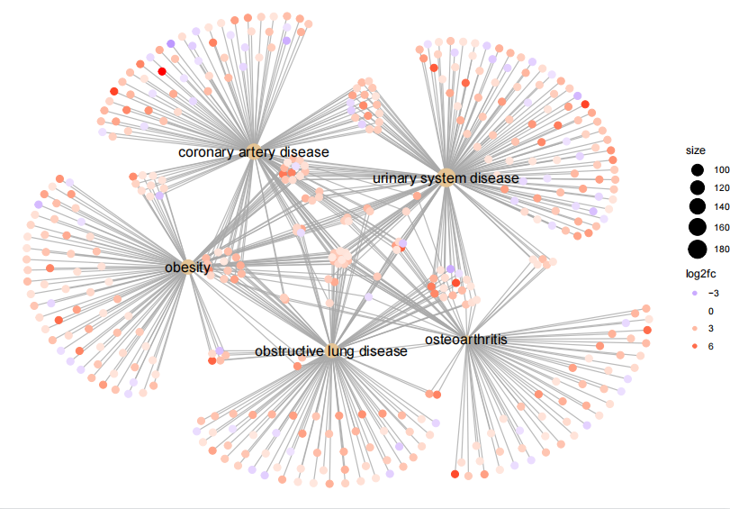

**基因与其被注释的条目连线，点的颜色代表表达变化，圈的大小代表对应注释内基因数目多少**

##  Disease gene set enrichment analysis

**Enrichment Map**

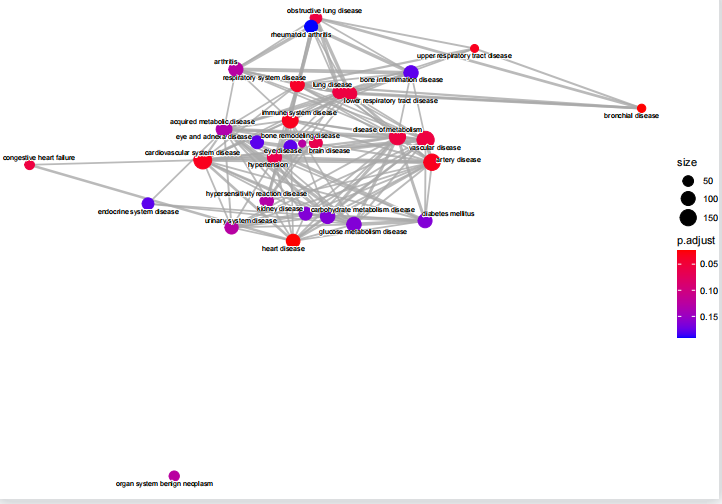

**Gene-Concept Network**

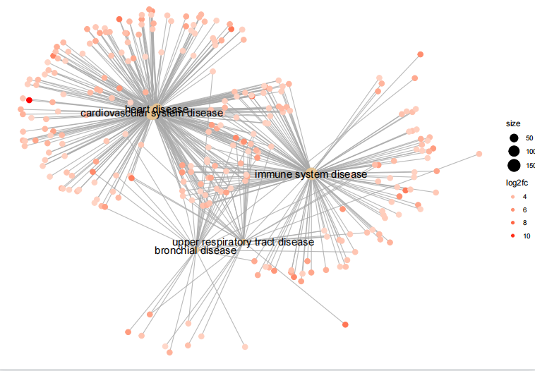

## 可视化的结果，还加上了热图，聚类树及upset图
>## 热图

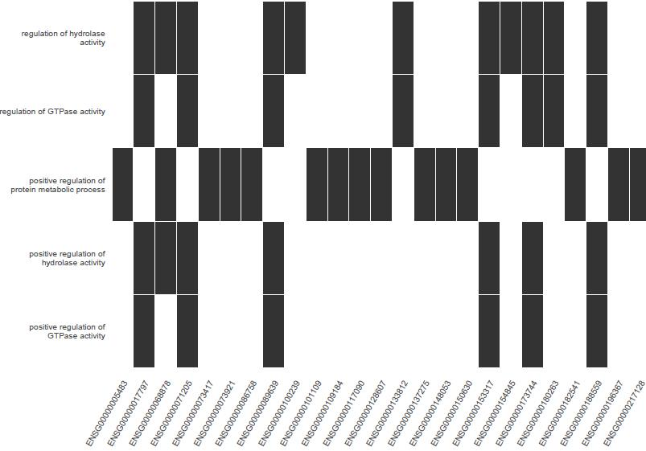

>## 聚类树

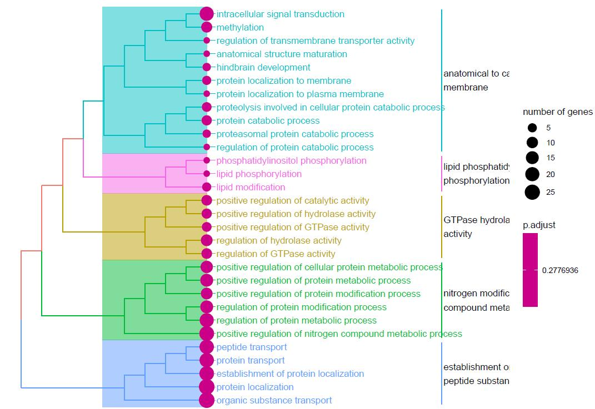

