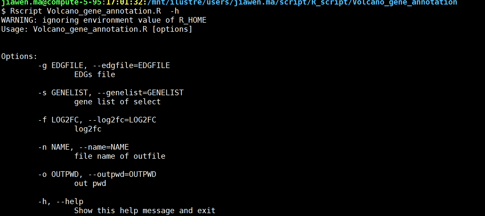
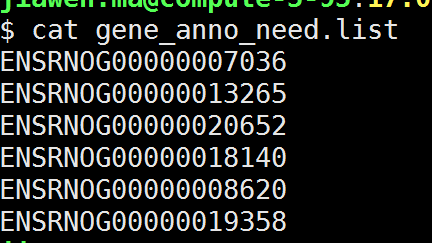
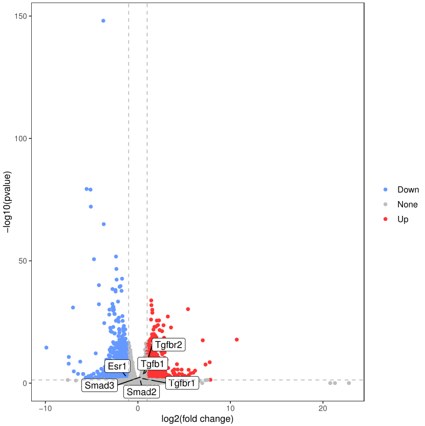
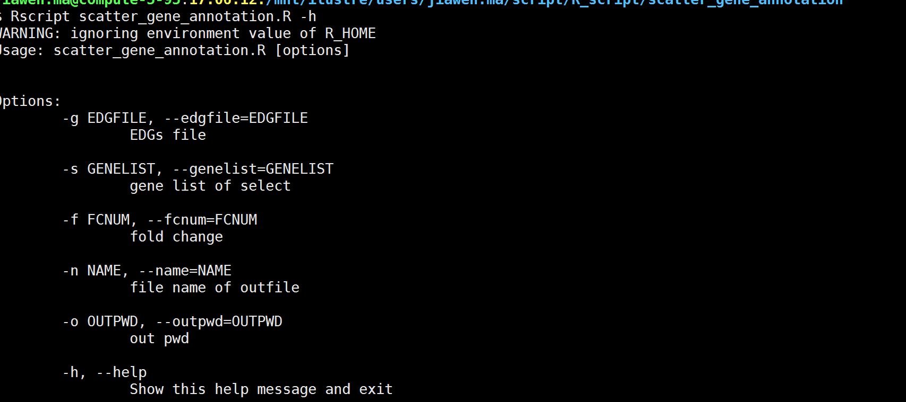
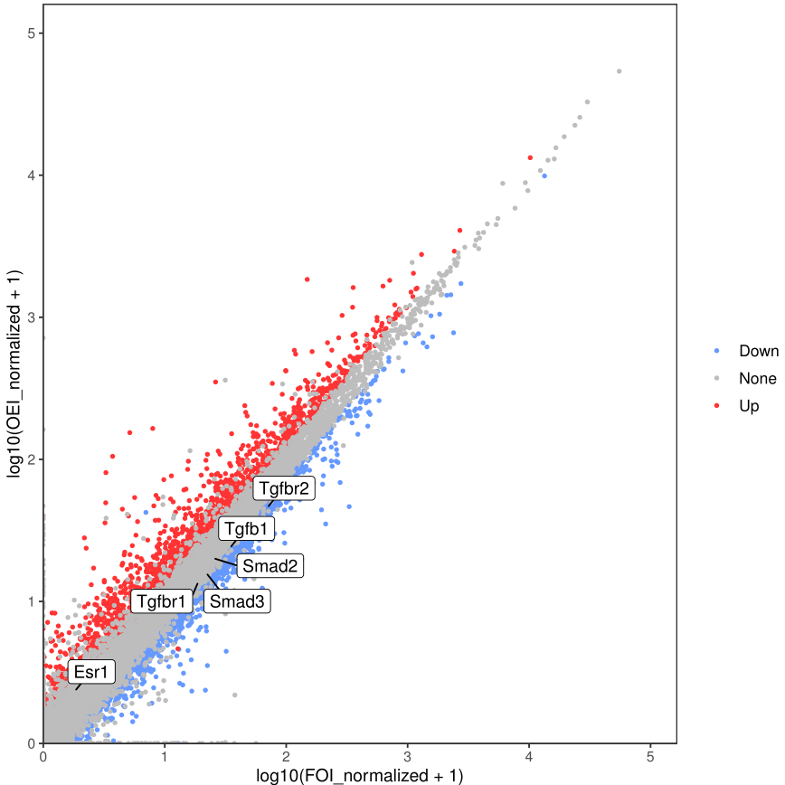
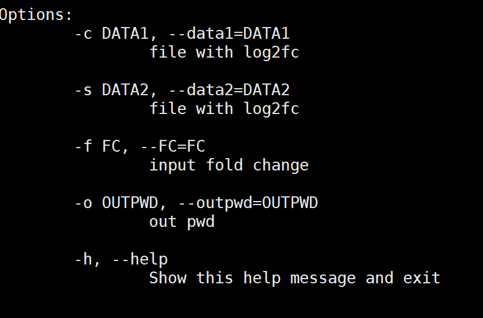
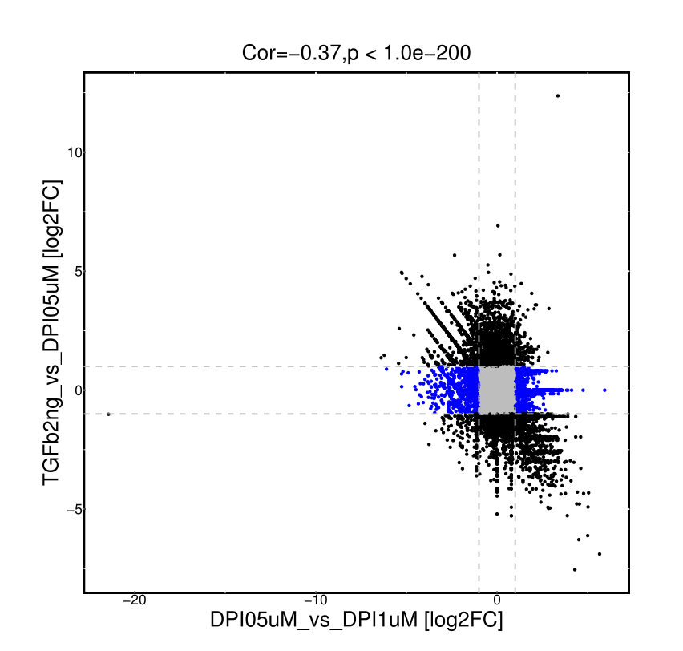

# 差异表达分析结果可视化


# 一.目的：

> 使用Volcano_gene_annotation.R对基因表达量进行火山图绘制以及基因标注

# 二.使用示例：

### 脚本路径:

```bash
/mnt/ilustre/users/jiawen.ma/script/R_script/Volcano_gene_annotation
```

### 程序执行：

```bash
Rscript Volcano_gene_annotation.R -g FI_vs_FOI.deseq2.annot.xls -s gene_anno_need.list -f 1 -n FI_vs_FOI.deseq2 -o ./ 
```

参数说明：
-g：云平台下载的差异基因表达量
-s：需要标记的基因list
-f：需要设定的log2fc的值（如：1；1.2；2）
-n：输出的文件名
-o：输出路径




> **补充信息：**


> -s：将需要标记的基因做成一列的list文件（如下图所示）
>
> **注意事项：**如果不需要对基因基因标记，输入的list为空文件即可。
>
> 
>
> 


# 三.结果展示：

> 


# 一.目的：

> 使用scatter_gene_annotation.R对基因表达量进行散点图绘制以及基因标注

# 二.使用示例：

### 脚本路径:

```bash
/mnt/ilustre/users/jiawen.ma/script/R_script/scatter_gene_annotation
```

### 程序执行：

```bash
Rscript scatter_gene_annotation.R -g FI_vs_FOI.deseq2.annot.xls -s gene_anno_need.list -f 1 -n FI_vs_FOI.deseq2 -o ./ 
```

参数说明：
-g：云平台下载的差异基因表达量
-s：需要标记的基因list
-f：需要设定的fc的值（如：1；1.2；2）
-n：输出的文件名
-o：输出路径



> **补充信息：**


> -s：将需要标记的基因做成一列的list文件（如下图所示）
>
> **注意事项：**如果不需要对基因基因标记，输入的list为空文件即可。
>
> 
>
> 


# 三.结果展示：

> 


# 一.目的：

> 使用 cor_plot.R 绘制差异表达基因的FoldChange的相关性图

# 二.使用示例：

### 脚本路径:

```bash
/mnt/ilustre/users/jiawen.ma/workspace/plot_data/cor_210707
```

### 程序执行：

```bash
Rscript cor_plot.R -c DPI05uM_vs_DPI1uM.deseq2.annot.xls -s TGFb2ng_vs_DPI05uM.deseq2.annot.xls -f 1 -o ./
```

参数说明：
-c：对照组文件
-s：处理组文件
-f：设定一个fc的值
-o：输出结果路径
-h：脚本使用的帮助信息



> **注意事项：**
>
> 如果 -c 与 -s 输入的文件中log2fc为其他大小写（如：Log2FC、log2FC等）需要将列名改为log2fc。


# 三.结果展示：

> 输出文件为file1_name_VS_file2_name.pdf



