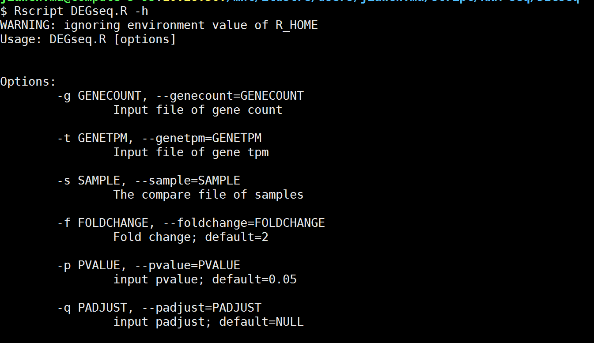
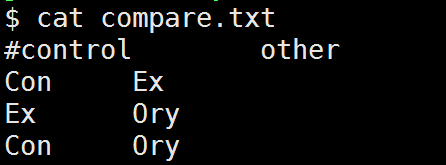
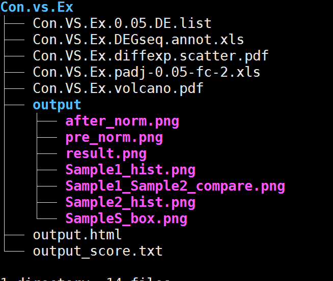

# DEGseq 对无重复样本进行差异分析


# DEGseq 对无重复样本进行差异分析


# 一.目的：

> 使用DEGseq.R 对无重复样本进行差异分析

# 二.使用示例：

### 脚本路径:

```bash
/mnt/ilustre/users/jiawen.ma/script/RNA-seq/DEGseq/DEGseq.R
```

### 程序执行：

```bash
Rscript DEGseq.R  -g gene.count.matrix.annot.xls -t gene.TPM.matrix.annot.xls -s compare.txt -o ./
```
```bash
参数说明：
-g：样本的gene count 
-t: 样本gene的tpm表（如输入文件则添加基因的tpm，如未输入则不添加）
-s：样本对照组文件
-f：fold change（默认为2倍）
-p：pvalue（默认为0.05）
-p：padjust（默认为null，如以padjust为条件则pvalue则自动无效）
-o：输出结果路径
```


> **提示：**
>
> -s：对照组文件样式：
>




# 三.结果展示：

Con.VS.Ex.0.05.DE.list：差异表达基因list

Con.VS.Ex.DEGseq.annot.xls ：基因的差异表达情况表

Con.VS.Ex.diffexp.scatter.pdf：基因差异表达的散点图

Con.VS.Ex.padj-0.05-fc-2.xls：以padjust(0.05)，fc(2)挑选的差异表达基因

Con.VS.Ex.volcano.pdf：基因差异表达的火山图


