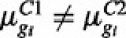

# circRNA差异表达分析软件


# circRNA差异分析

​        独特的环状结构使得二代测序较短的读长对其鉴定以及定量被限制，目前仅仅依靠其反向剪切序列；另外，环状RNA的表达总是与来源基因（host gene）线性RNA的表达纠缠不清，让人们很难区分差异是来源于反向剪切还是只是来源基因的副产物。
​        对此，许多软件在识别上下功夫，比如DCC、CIRCexplorer、CIRI等等，然后用DESeq2或edgeR进行差异分析；而另一些软件在定量上使劲，对环状 RNA 的定量不仅仅使用反向剪切序列（BSJ），而且考虑到来源基因线性分子表达的影响，使用BS ratio进行定量，例如DCC、CIRI2、CIRIquant以及CLEAR。当然这种定量就不适合用于DESeq2或edgeR，一般可以用DCC::CircTest或CIRIquant等软件进行差异分析。

## 1. 使用EBSeq 进行差异表达分析

### 1.1 原理：

​	EBSeq: an empirical Bayes model for identifying DE genes and isoforms.


   一句话描述，贝叶斯方法就是利用先验知识，结合当前获得数据，来更新关于未知参数的信息，以此获得修订后的参数的可能性，也就是后验概率。

EBSeq requires gene counts or estimates of isoform expression, but it is not specific to any particular estimation method (e.g. RSEM, Rseq, Cufflinks or another method may be used).

library size：total number of reads or obtained by TMM (Robinson and Oshlack, 2010), Median Normalization (Anders and Huber, 2010) or Upper Quartile Normalization (Bullard et al., 2010).

Since the total number of reads may be adversely affected by outliers from PCR or other artifacts, the latter three methods are recommended. The EBSeq code defaults to Median Normalization, but Quantile Normalization is also available. 

mean:	;	variance:

When RNA-seq reads in two biological conditions are available:

                                           

 p denote the prior probability of DE:	


### 1.3 结果展示：

```bash
cat *_maxrount.txt
```


> 3个指标用于判断选择的迭代次数maxround是否合理，一般来说每个指标的最后两个值相差小于0.01就可以了

```bash
head *_DEG_FDR005.txt # FDR < 0.05 时的差异基因
```


```bash
head *_EBSeq_summary.xls #每个基因的在不同组别中的平均表达量，差异倍数，FDR
```


## 2. 使用DEBKS进行差异表达分析

### 2.1 原理：

​	通过比较，DEBKS具有更优秀的性能并且更少受来源基因表达的影响。        

​	由于需要包含线性剪切位点的表达（LJC），因此，**DEBKS只能应用于既包含环状 RNA又包含线性RNA的测序**，例如rRNA-depleted RNA-seq或exome capture RNA-seq。
​	另外，基因间区的环状RNA由于缺乏线性分子的表达，因此无法用DEBKS评估。


### 2.2 使用示例：

DEBKS设计了4个模块, count与anno两个模块为非必需步骤。


#### 路径:

```bash
脚本：/mnt/ilustre/users/jiawen.ma/test/debks
```

#### 程序执行：

```bash
ls CIRI/*.txt > samplelist.txt
DEBKS merge  -s ciri2 -f samplelist.txt
DEBKS dec -c merge_circ.txt -l merge_linear.txt -t 20  -o dec_star.txt 
```

```bash
文件与参数说明：
samplelist.txt：circRNA预测结果的文件路径
-s：circRNA预测的软件名
```

#### 2.3 结果展示：


结果文件每列的说明：


**参考资料：**

- [EBSeq: an empirical Bayes hierarchical model for inference in RNA-seq experiments](https://academic.oup.com/bioinformatics/article/29/8/1035/228913)
- [DEBKS: A Tool to Detect Differentially Expressed Circular RNA](https://www.sciencedirect.com/science/article/pii/S1672022921000292)
- [DEBKS_github](https://github.com/yangence/DEBKS)


