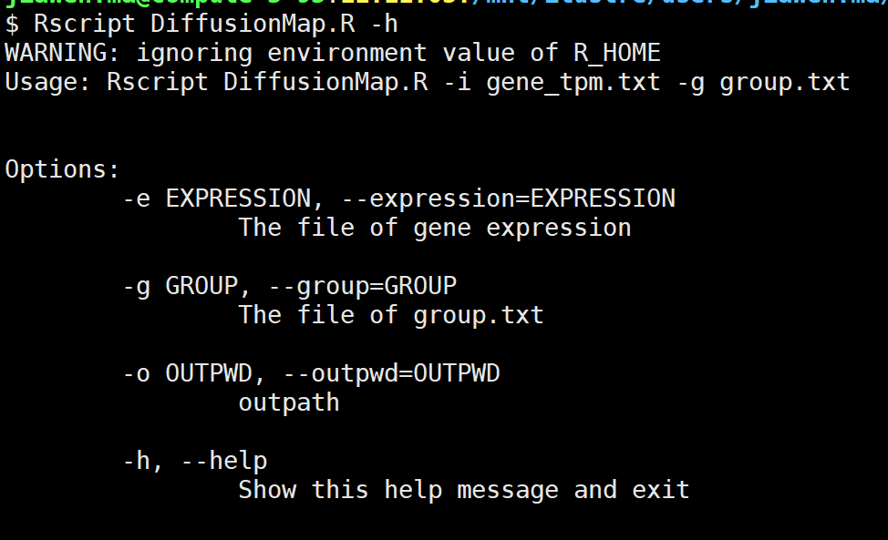

# 比较不同降维分析方法在RNAseq数据的可视化结果


# 不同的降维分析方法

​        数据降维就是通过特征选择或者特征变换操作将数据从原始的D维空间投影到新的K维空间，直白的说是把数据的维度降下来，用一个相对低维的向量来表示原始高维度的特征。从理解上讲降维要做的就是学习数据新的表示，这种数据新的表示在形式上更简洁，而且要求能够尽可能多地保存数据原有的信息（或者让其信息变得更好，更清晰更明确）。数据降维方法主要分为特征选择和特征抽取(特征降维)两类。
特征选择方法：是在所有的特征中通过子集搜索算法寻找和模型最相关的特征子集的过程，简单的说就是在所有特征中选择和目标最相关的一些特征，丢弃掉一些不太重要的特征。
特征抽取：也被称为特征降维，用的最广泛也最常见的一种特征抽取方法就是PCA。


## 1. ICA(独立成分分析)

独立成分分析（ICA），指在只知道混合信号，而不知道源信号、噪声以及混合机制的情况下，分离或近似地分离出源信号的一种分析过程；是盲信号分析领域的一个强有力方法，也是求非高斯分布数据隐含因子的方法

#### 1.1 ICA与PCA区别：

**相同点：**

1) **都不需要对源信号的分布做具体的假设**； 如果观察到的信号为高斯，那么源信号也为高斯，此时PCA和ICA等价。
2) **都可以实现数据得降维**； PCA是寻找特征值矩阵，ICA是寻找解混矩阵；从线性代数的角度去理解，PCA和ICA都是要找到一组基，这组基张成一个特征空间，数据的处理就都需要映射到新空间中去。

**不同点：**

1）处理数据的类型不同： ICA处理非高斯数据，PCA、FA都是处理高斯数据。
2）处理目的不同： ICA提取相互独立的属性，而且降维；PCA只做数据的降维。ICA的数据预处理中会用到PCA
3）求解过程不同：ICA 认为观测信号是若干个统计独立的分量的线性组合，ICA要做的是一个解混过程；而PCA是一个信息提取的过程，4）将原始数据降维，现已成为ICA将数据标准化的预处理步骤；

PCA和ICA的用途完全不同。 如果只在意数据的能量或方差、假设噪声或不感兴趣的信号都比较微弱，那么用PCA就能把主要信号留下来。在某种意义上，ICA更智能——它不在意信号的能量或方差，只看独立性。所以给定的待分析的混合信号经任意的线性变换都不会影响ICA的输出结果，但会严重影响PCA的结果。简而言之：PCA有助于压缩数据，而ICA有助于分离数据

#### 1.2 使用示例：

**路径:**

```
脚本：/mnt/ilustre/users/jiawen.ma/script/RNA-seq/DR
```

**程序执行：**

```bash
Rscript ICA.R -e gene.tpm.matrix.annot.xls  -g group.txt
```

```
参数说明：
-e：基因表达矩阵
-g：分组文件
-a：算法选择；默认为"par"
-f：负熵方法的选择；默认为"logcosh"
-o：输出路径；默认为./
```


#### 1.3 结果展示


## 2. LDA

#### 2.1 KDA与PCA区别：

**相同点：**

1）两者均可以对数据进行降维。

2）两者在降维时均使用了矩阵特征分解的思想。

3）两者都假设数据符合高斯分布。

**不同点：**

1）LDA是有监督的降维方法，而PCA是无监督的降维方法

2）LDA降维最多降到类别数k-1的维数，而PCA没有这个限制。

3）LDA除了可以用于降维，还可以用于分类。

4）LDA选择分类性能最好的投影方向，而PCA选择样本点投影具有最大方差的方向。

## 3. FA (因子分析)

#### 3.1 FA与PCA区别：

**因子分析（Factor analysis）**旨在提出**因子模型（Factor model）**来研究如何用几个公共因子，记作F_{1},...,F_{m}，通常m<p，来刻画原始变量之间的相关性。

**相同点：**

1. PCA与FA都是数据降维的重要方法，都对原始数据进行标准化处理，都消除了原始指标的相关性对综合评价所造成的信息重复的影响，都属于因素分析法，都基于统计分析方法；
2. 二者均应用于高斯分布的数据，非高斯分布的数据采用ICA算法；
3. 二者构造综合评价时所涉及的权数具有客观性，在原始信息损失不大的前提下，减少了后期数据挖掘和分析的工作量。

不同点：

1. 原理不同：PCA仅仅是变量变换，找出原始变量的线性组合；FA是寻找变量内部相关性及潜在的共同因素。
2. 功能、作用不同：PCA简化原有变量，强调解释数据变异的能力，适合做数据简化；FA解释原有变量之间关系，强调变量之间的相关性，适合检测数据结构。
3. 有无误差：PCA模型无误差项、不需要旋转；FA模型有误差项，一般需要旋转才能对因子进行命名和解释。

#### 3.2 R实战分析

​	与主成分分析相同的是，FA分析需要使用**psych**包中**fa.parallel()**函数绘制碎石图，确定组成分数与因子数。

```R
fa.parallel(cor_data, n.obs=112, fa="both", n.iter=100) #fa参数为输出组成分或因子的数。
Parallel analysis suggests that the number of factors =  4  and the number of components =  3
```


结合上图和函数给出的信息得到以下结论：如果使用PCA，我们需要选择三个主成分；如果使用EFA，我们需要选择4个因子。


使用fa()函数进行因子提取，调用公式如下：

```R
> fa(r, nfactors=, n.obs=, rotate=, scores=, fm=)
# r:相关系数矩阵或原始数据矩阵，
# nfactors:设定主提取的因子数（默认为1）
# n.obs:观测数（输入相关系数矩阵时需要填写）
# rotate:设定旋转的方法（默认互变异数最小法）
# scores:设定是否需要计算因子得分（默认不需要）
# fm:设定因子化方法（默认极小残差法） 
```

与主成分分析不同的是，在因子分析中我们需要指定提取公因子的方法（**fm**），方法包括：

- **ml**：最大似然法
- **pa**：主轴迭代法
- **wls**：加权最小二乘法
- **gls**：广义加权最小二乘法
- **minres**：最小残差法

#### 3.3 使用示例：

**路径:**

```
脚本：/mnt/ilustre/users/jiawen.ma/script/RNA-seq/DR
```

**程序执行：**

```bash
Rscript FA.R -e gene.tpm.matrix.annot.xls  -g group.txt
```

```bash
参数说明：
-e：基因表达矩阵
-g：分组文件
-r：设定旋转的方法；默认为"varimax"
-f：提取公因子的方法；默认为"gls"
-o：输出路径；默认为./
```


#### 3.4 结果展示


> gene_FA.pdf: 使用FA方法时，样本在二维坐标的分布图。


> gene_fa_parallel.pdf: 碎石图。


## 4. t-SNE

​	t-SNE将数据点之间的相似度转化为条件概率，原始空间中数据点的相似度由正态分布表示，嵌入空间中数据点的相似度由t分布表示。通过原始空间和嵌入空间的联合概率分布的KL散度（用于评估两个分布的相似度的指标）来评估嵌入效果的好坏。

​	t-SNE的主要优势在于通过t分布与正态分布的差异，解决了降维后的拥挤问题，使得相似的样本能够聚集在一起，而差异大的样本能够有效地分开，避免了其他降维方法样本分布拥挤、边界不明显的缺点。但它同时也有计算慢、对参数敏感、结果具有随机性等缺陷。在实践中具体采用哪种方法，可以根据情况决定。

#### 4.3 使用示例：

**路径:**

```
脚本：/mnt/ilustre/users/jiawen.ma/script/RNA-seq/DR
```

**程序执行：**

> **注意事项：**需要使用unique函数去除重复数据

```bash
Rscript Tsne.R -e gene.tpm.matrix.annot.xls  -g group.txt
```

```bash
参数说明：
-e：基因表达矩阵
-g：分组文件
-o：输出路径；默认为./
```


#### 4.4 结果展示


## 5. Diffusion Map(扩散映射)

Diffusion Map又称为扩散映射，其原理是将空间距离转换为一种状态转移的概率，从而确定随机游走的方向，从而确定细胞发育轨迹
该算法分为确定细胞转移方向（Markov矩阵）和降维（Markov矩阵特征值分解降维）两块

1. 其通过 整合数据的局部几何关系 揭示 数据集在不同尺度的几何结构。

2. 与PCA (principal component analysis)、MDS (Multidimensional Scaling) 这些降维方法相比，扩散映射 非线性，聚焦于发现数据集潜在的流形结构。

3. 优点：对噪声鲁棒，计算代价较低

#### 5.1 使用示例：

**路径:**

```
脚本：/mnt/ilustre/users/jiawen.ma/script/RNA-seq/DR
```

**程序执行：**

```bash
Rscript DiffusionMap.R -e gene.tpm.matrix.annot.xls  -g group.txt
```

```R
参数说明：
-e：基因表达矩阵
-g：分组文件
-o：输出路径；默认为./
```



#### 5.2 结果展示


## 6. glmpca

实现主成分分析（GLM-PCA）的广义版本，用于非正态分布数据（如计数或二进制矩阵）的降维。

#### 6.1 使用示例：

**路径:**

```
脚本：/mnt/ilustre/users/jiawen.ma/script/RNA-seq/DR
```

**程序执行：**

```bash
Rscript Glmpca.R -e gene.tpm.matrix.annot.xls  -g group.txt
```

```R
参数说明：
-e：基因表达矩阵
-g：分组文件
-f：对数据进行似然法，默认为：“poi”；其它参数可为："nb", "nb2", "binom", "mult", "bern"
-o：输出路径；默认为./
```


#### 6.2 结果展示


### 7. ISOMAP(等距特征映射)

isomap算法是基于前面所讲的MDS算法，不同之处在于isomap用图中两点的最短路径距离替代了MDS中欧式空间的距离，这样能更好的拟合流行体数据。

当我们已知数据嵌在一个高维的流行体时候，使用isomap明显会有更好的效果。

#### 7.1 使用示例：

**路径:**

```
脚本：/mnt/ilustre/users/jiawen.ma/script/RNA-seq/DR
```

**程序执行：**

```bash
Rscript Isomap.R -e gene.tpm.matrix.annot.xls  -g group.txt
```

```R
参数说明：
-e：基因表达矩阵
-g：分组文件
-o：输出路径；默认为./
```

#### 7.2 结果展示


### 8. LLE( Locally linear embedding)

局部线性嵌入(Locally Linear Embedding，以下简称LLE)是非常重要的降维方法。和传统的PCA，LDA等**关注样本方差**的降维方法相比，LLE关注于降维时**保持样本局部的线性特征（保持原有拓扑结构）**，由于LLE在降维时保持了样本的局部特征，它广泛的用于图像识别，高维数据可视化等领域。**LLE是非线性降维技术**，可以说是流形学习方法最经典的算法之一。

但是LLE在有些情况下也并不适用，**如果数据分布在整个封闭的球面上，LLE则不能将它映射到二维空间，且不能保持原有的数据流形**。那么我们在处理数据中，首先假设数据不是分布在闭合的球面或者椭球面上。

LLE算法认为每一个数据点都可以由其近邻点的线性加权组合构造得到。算法的主要步骤分为三步：(1)寻找每个样本点的k个近邻点；（2）由每个样本点的近邻点计算出该样本点的局部重建权值矩阵；（3）由该样本点的局部重建权值矩阵和其近邻点计算出该样本点的输出值。

#### 8.1 使用示例：

**路径:**

```
脚本：/mnt/ilustre/users/jiawen.ma/script/RNA-seq/DR
```

**程序执行：**

```bash
Rscript LLE.R -e gene.tpm.matrix.annot.xls  -g group.txt
```

```R
参数说明：
-e：基因表达矩阵
-g：分组文件
-o：输出路径；默认为./
```

#### 8.2 结果展示

**找出使rho最小的K值**


**降维结果图**


### 9. LTSA（Local Tangent Space Alignment）

LTSA的基本思路是用样本点的近邻区域的切空间来表示局部几何结构，然后对局部切空间进行重新排列得到非线性流形的用自然参数刻画的低维表示，是经典的流形学习与降维算法。

#### 9.1 使用示例：

**路径:**

```
脚本：/mnt/ilustre/users/jiawen.ma/script/RNA-seq/DR
```

**程序执行：**

> **注意事项：**需要使用pca降维的特征值进行后续分析

```bash
Rscript Ltsa.R -e gene.tpm.matrix.annot.xls  -g group.txt
```

```R
参数说明：
-e：基因表达矩阵
-g：分组文件
-o：输出路径；默认为./
```

#### 9.2 结果展示


### 10. NMF（非负矩阵分解）

 NMF(Non-negative matrix factorization)，即对于任意给定的一个非负矩阵V，其能够寻找到一个非负矩阵W和一个非负矩阵H，满足条件V=W*H,从而将一个非负的矩阵分解为左右两个非负矩阵的乘积。其中，V矩阵中每一列代表一个观测(observation)，每一行代表一个特征(feature)；W矩阵称为基矩阵，H矩阵称为系数矩阵或权重矩阵。这时用系数矩阵H代替原始矩阵，就可以实现对原始矩阵进行降维，得到数据特征的降维矩阵。

#### 10.1 使用示例：

**路径:**

```
脚本：/mnt/ilustre/users/jiawen.ma/script/RNA-seq/DR
```

**程序执行：**

```bash
Rscript NMF.R -e gene.tpm.matrix.annot.xls  -g group.txt
```

```R
参数说明：
-e：基因表达矩阵
-g：分组文件
-o：输出路径；默认为./
```

#### 10.2 结果展示


### 11.ZINB-WaVE(Zero-Inflated Negative Binomial Model for RNA-Seq Data)

Implements a general and flexible zero-inflated negative binomial model that can be used to provide a low-dimensional representations of single-cell RNA-seq data. The model accounts for zero inflation (dropouts), over-dispersion, and the count nature of the data. The model also accounts for the difference in library sizes and optionally for batch effects and/or other covariates, avoiding the need for pre-normalize the data.

#### 11.1 使用示例：

**路径:**

```
脚本：/mnt/ilustre/users/jiawen.ma/script/RNA-seq/DR
```

**程序执行：**

```bash
Rscript ZINBWaVE.R -e gene.tpm.matrix.annot.xls  -g group.txt
```

```R
参数说明：
-e：基因表达矩阵
-g：分组文件
-o：输出路径；默认为./
```

#### 11.2 结果展示


### 12. pCMF

The pCMF package contains mplementation of the probabilistic Count Matrix Factorization (pCMF) method based on the Gamma-Poisson hirerarchical factor model with potential sparisty-inducing priors on factor V. This method is specifically designed to analyze large count matrices with numerous potential drop-out events (also called zero-inflation) such as gene expression profiles from single cells data (scRNA-seq) obtained by high throughput sequencing.

#### 12.1 使用示例：

**路径:**

```
脚本：/mnt/ilustre/users/jiawen.ma/script/RNA-seq/DR
```

**程序执行：**

```bash
Rscript ZINBWaVE.R -e gene.tpm.matrix.annot.xls  -g group.txt
```

```R
参数说明：
-e：基因表达矩阵
-g：分组文件
-o：输出路径；默认为./
```

#### 12.2 结果展示


**参考资料：**

- [Accuracy, robustness and scalability of dimensionality reduction methods for single-cell RNA-seq analysis](https://genomebiology.biomedcentral.com/articles/10.1186/s13059-019-1898-6#Sec21)
- [[DRComparison](https://github.com/xzhoulab/DRComparison)](https://github.com/xzhoulab/DRComparison/tree/master/algorithms)
- [How to Use t-SNE Effectively](https://distill.pub/2016/misread-tsne/)
- [LLE](https://cran.r-project.org/web/packages/lle/lle.pdf)
- [zinbwave](https://www.bioconductor.org/packages/release/bioc/manuals/zinbwave/man/zinbwave.pdf)
- [pCMF-github](https://github.com/gdurif/pCMF)


