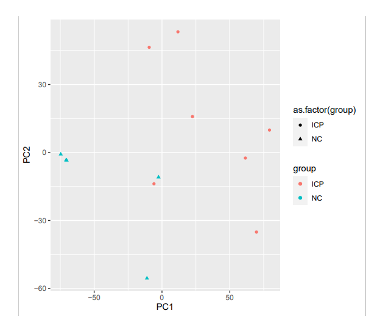
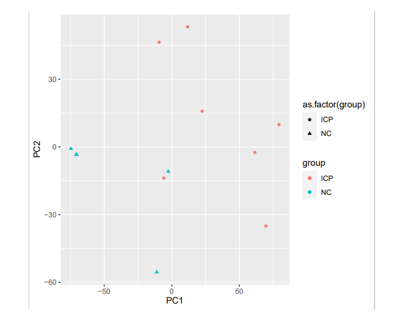
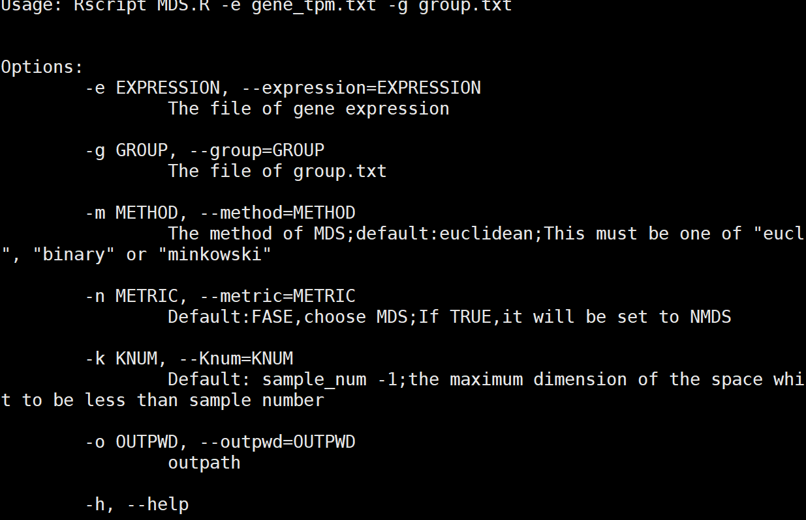
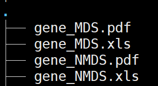
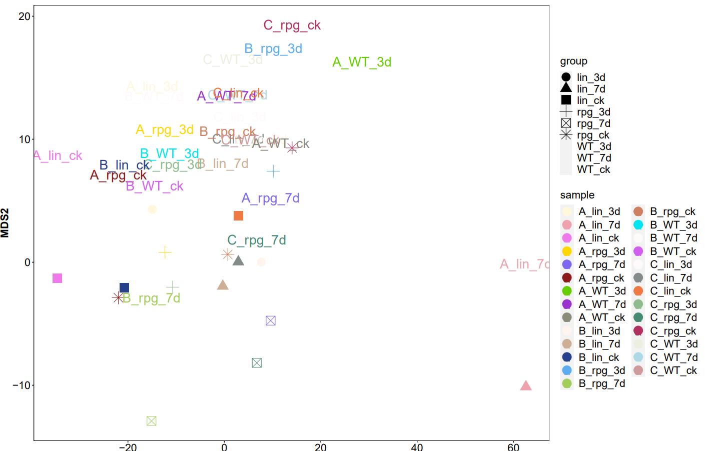
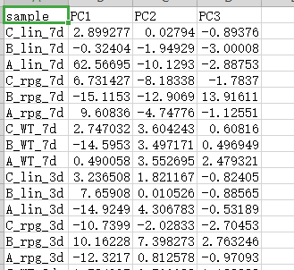

# 降维分析方法比较


# 转录组对定量结果降维分析比较


## 概述

### MDS原理

MDS算法解决的问题是:当n个对象之间的相似性给定，确定这些对象在低维空间中的表示，并使其尽可能与原先的相似性大致匹配。高维空间中每一个点代表一个对象，因此点与点之间的距离和对象之间的相似度高度相关。可以这么理解，两个相似的对象在高维空间中由两个距离相近的点所表示，两个不相似的对象在高维空间中由两个距离比较远的点表示。

MDS与PCA非常相似，都是一种降维的方法。根据样本是否可以计量，MDS分为度量MDS（Metric Multidimensional scaling）和非度量MDS（Non-metric Multidimensional scaling）。）。对于Metric MDS，这个方法以样本间相似度作为实际输入，需要样本是等距（interval）比例（ratio）尺度，优点是精确，可以根据多个准则评估样本间差异，缺点是计算成本高，耗时。对于很多应用问题，样本不费可计量，需要使用NonMetric MDS，这种方法接受样本的顺序尺度作为输入，并以此自动计算相似值。样本尺度要求是顺序的（ordinal），较简便，直观，从非计量的样本导出计量的分析结果，应用范围更广，但没法知道评估准则，效果较差。

根据是否使用欧氏距离，其中MDS又分为classical MDS和no-classical MDS。

Classical MDS(经典多维尺度变换):经典多维尺度变换的距离标准采用欧式距离。

No-classical MDS(非经典多维度尺度变换):非经典多维度尺度变换的距离标准采用非欧式距离。

MDS即将高维坐标中的点投影到低维空间中，保持点彼此之间的相似性尽可能不变。MDS算法可以缓解在高维情况下出现的样本数据稀疏和距离计算困难等问题，与主成分分析法和线性降维分析法都不同的是，MDS的目标不是保留数据的最大可分性，而是更加关注与高维数据内部的特征。

###  MDS的优缺点

优点：

(1) 不需要先验知识，计算简单

(2) 保留了数据在原始空间的相对关系，可视化效果比较好

缺点:

(1) 如果用户对观测对象有一定的先验知识，掌握了数据的一些特征，却无法通过参数化等方法对处理过程进行干预，可能会得不到预期的效果

(2) 认为各个维度对目标的贡献相同，然而事实上有一些维度对目标的影响很小，有一些对目标是影响比较大。

### MDS与PCA比较

> PCA采用降维的思想，将组成复杂的数据信息（样本中包含大量物种信息，没有已知的坐标轴可以解释分布）进行降维排序，寻找能最大程度反应规律的坐标系。然而PCA分析存在着自身的局限性，PCA分析需基于线性模型（linear model）开展，所谓线性模型就是假设物种丰度伴随着环境变量的变化做出线性变化的响应，这种模型使用范围较为有限。
>
> PCA通过对N个数据点本身进行特征分析来选择影响维度，而MDS通过对成对距离矩阵的数据点进行特征分析来选择影响维度。本质上，PCA 更侧重于维度本身，并尽可能地拟合方差，而 MDS 更侧重于缩放对象之间的关系。
>
> PCA可能被称为最简单MDS的算法，如果使用欧几里得距离，则PCA产生与经典MDS完全相同的结果（如下图）。


对同一表达量数据进行MDS与PCA进行降维：

​	MDS（衡量距离使用欧氏距离）



​	PCA: 使用R函数：prcomp



#  开发的脚步及分析例子比较

```bash
/mnt/ilustre/users/meng.luo/Pipeline/Pipeline/script/MDS

#程序执行：
Rscript MDS.R -e gene_tpm.txt -g group.txt

参数说明：
-e：基因表达矩阵
-g：分组文件
-m：距离算法模型选择；默认为欧几里得
-n：是否进行NMDS（非度量MDS）分析；默认为FALSE
-k：维度数；默认为样本个数减1，可以自定义但必须小于等于样本数减1
-o：输出路径；默认为./
```




# 三.结果展示：



> gene_MDS.pdf: 使用MDS方法时，样本在二维坐标的分布图。



> gene_MDS.xls：使用MDS方法时，样本在不同维度中的信息。



> *gene_NMDS* : 为使用NMDS方法得出的结果;
>
> 注意：在xls文件中NMDS会多一列stress的信息；Stress值是反映模型合适程度的指标，NMDS会多次打乱数据计算Stress值，直到找到最合适的模型，也就是最低的Stress值；理想状况下，Stress值为0，一般Stress值低于0.1较为合理。


**参考资料：**

- [Multidimensional scaling](https://www.ncbi.nlm.nih.gov/pmc/articles/PMC3555222/)

- [MDS](https://www.ncbi.nlm.nih.gov/pmc/articles/PMC3555222/)

- [多维尺度变换(multidimensional scaling, MDS)](https://blog.csdn.net/mingjinliu/article/details/70194660)

