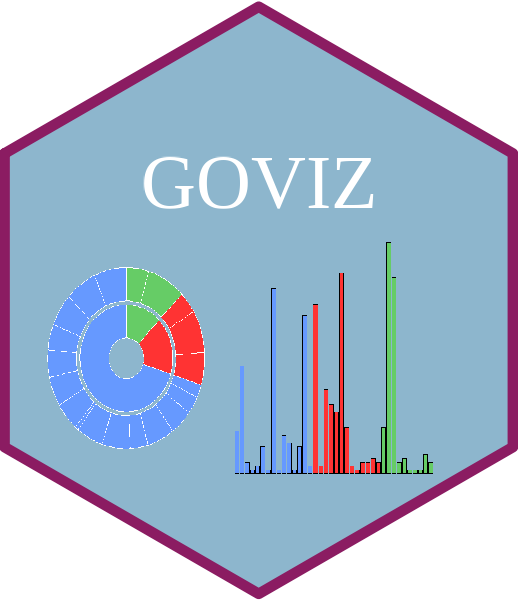

# 富集分析结果数据可视化


[]()


# 一.目的：

> 使用Go_pie.R绘制GO功能富集图

# 二.使用示例：

### 脚本路径:


```bash
/mnt/ilustre/users/jiawen.ma/script/R/GO/GO_pie/Go_pie.R
```

### 程序执行：

```bash
Rscript Go_pie.R -g GoEnrich_20210731_104746207.txt -n GoEnrich_20210731_104746207 -o ./
```

参数说明：
-g：云平台下载的GO功能富集文件
-n：输出的文件名（例如：GO）
-o：输出结果路径


> **提示：**
>
> GO file 来源于云平台交互结果中GO功能富集文件（如下图，为10列文件）


# 三.结果展示：


# 一.目的：

> 使用ggbarplot_modify.R绘制GO功能富集图

# 二.使用示例：

### 脚本路径:

```bash
/mnt/ilustre/users/jiawen.ma/script/R_script/GO_plot
```

### 程序执行：

```bash
Rscript ggbarplot_modify.R -g GO_20210411_235811629.xls  -n GO -o ./ 
```

参数说明：
-g：云平台下载的GO功能富集文件
-n：输出的文件名（例如：GO）
-o：输出结果路径


> **提示：**
>
> GO file 来源于云平台GO功能富集文件（如下图，为6列文件）


# 三.结果展示：


### Learning Video
<iframe src="//player.bilibili.com/player.html?aid=378781859&bvid=BV1Tf4y137HE&cid=431839460&page=1" height="600" width="800" scrolling="no" border="0" frameborder="no" framespacing="0" allowfullscreen="true"> </iframe>


