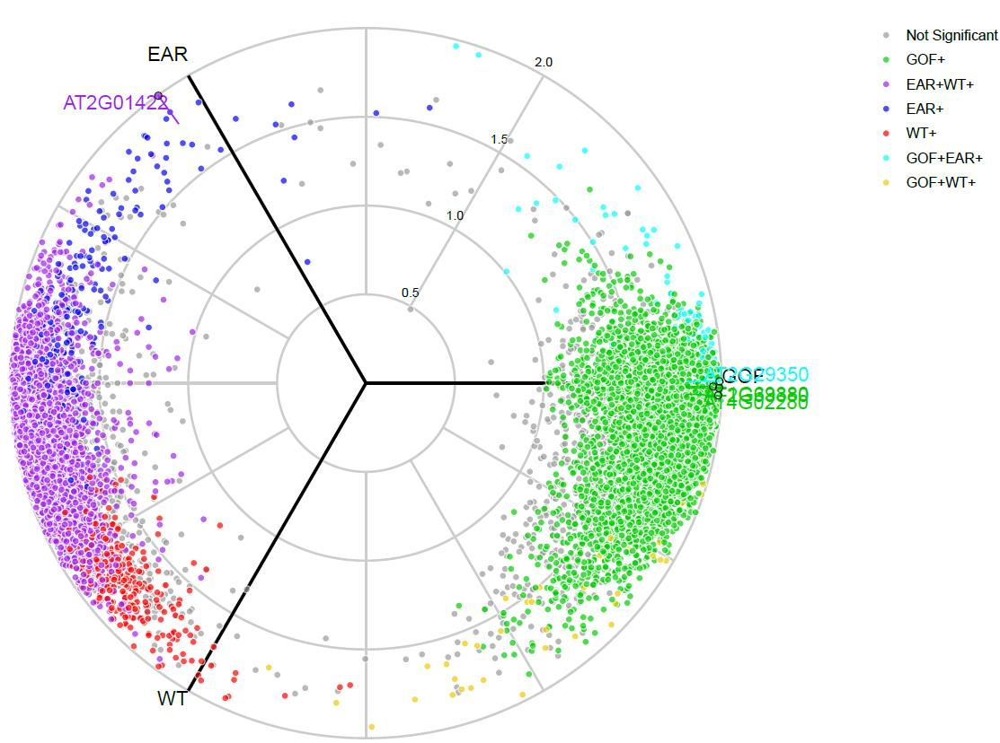
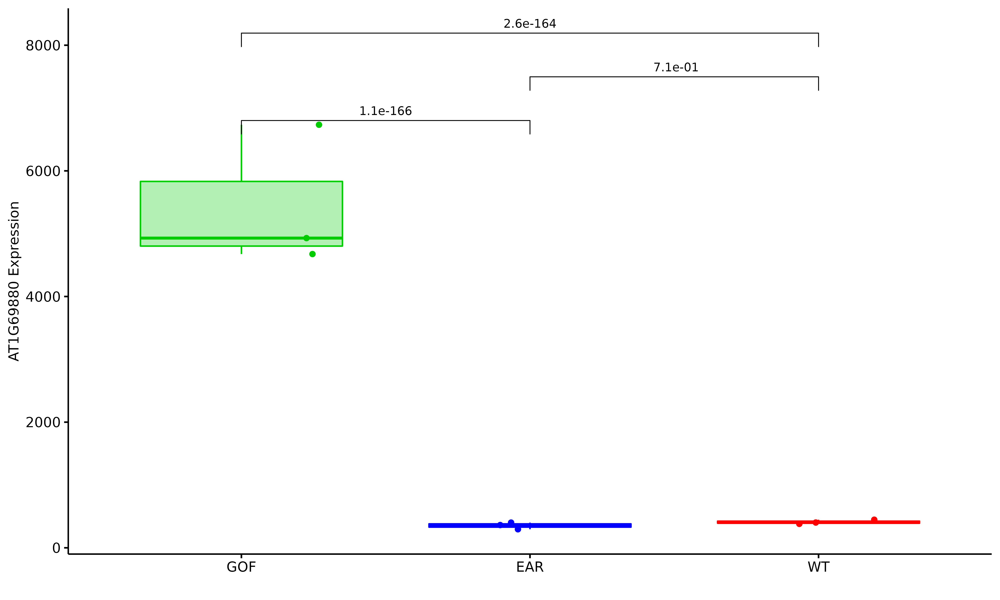
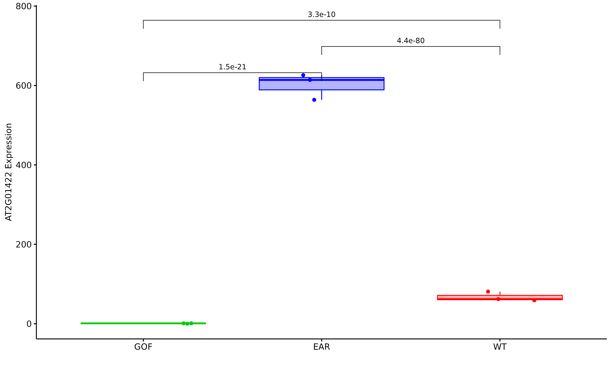
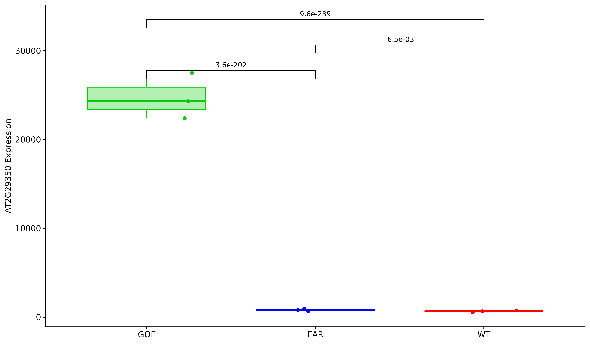

# RNAseq三个差异组比较分析


# 使用[volcano3D](https://github.com/KatrionaGoldmann/volcano3D)进行三个差异组间的可视化分析

[]()

# 概述

> The volcano3D package enables exploration of probes differentially
expressed between three groups. Its main purpose is for the visualisation 
of differentially expressed genes in a three-dimensional volcano plot. 
These plots can be converted to interactive visualisations using plotly.

> The methodology has been published in [Lewis, Myles J., et al. *Molecular portraits of early
rheumatoid arthritis identify clinical and treatment response
phenotypes*. Cell reports 28.9 (2019): 2455-2470. (DOI:
10.1016/j.celrep.2019.07.091)](https://doi.org/10.1016/j.celrep.2019.07.091)
with an interactive web tool available at <https://peac.hpc.qmul.ac.uk>.

# 分析方法 

> 当前差异分析方法只用DESeq2 和limma 两个模型，其他差异软件也可以使用，建议只对有生物学重复的项目进行分析。当然无重复也是可以做的，可以使用DEGseq进行分析，但是综合组间并不能进行分析，所以总体无生物学重复的项目不考虑做。当前根据DESeq2和limma两个模型，我们整合到了一个脚步中，这个脚本使用如下[分析参考](https://katrionagoldmann.github.io/volcano3D/articles/Extended_Vignette.html)：

## 脚本执行:


```bash
Rscript /mnt/ilustre/users/meng.luo/Pipeline/Pipeline/script/3Dplot/volcano3d.R --count gene.count.txt  --group group.txt  --diff  DESeq2  --p 0.05

参数说明：
--count：基因定量结果readcount文件
--group：样品分组文件（至少有3个组别）
--diff：差异分析方法，可选择DESeq2或者Limma，默认DESeq2
--p: 过滤不显著差异基因的padj值，默认0.05
```
**注意事项：** group.txt文件中的分组需要大于等于3组


# 结果可视化

> 生成的颜色是随机的，根据情况，可以再自行定义

## 组间不同条件下的二维火山图

> 只显示显著与不显著的结果
> 


> 根据结果，显示所有不同组间的差异结果
> Alternatively using the polar significance levels
> 


> 只显示组间，差异上调的基因结果
> upregulated group within the standard volcano plot
> 


>


# Radial Plots

> 以放射性图展示所有不同组间的差异情况
> The differential expression can now be visualised on an interactive radar plot using radial_plotly
> 



# Boxplots

> 根据最显著的五个基因，做箱图，比较其在不同组间是否显著差异







# Three Dimensional Volcano Plots

> 最后根据以上的结果，做3D图呈现最终的结果图
> The final thing we can look at is the 3D volcano plot which projects differential gene expression onto cylindrical coordinates.
>


> 可以呈现[html](volcano_3D.html)的格式


# 多组差异比较 

> 增对不同的项目，进行多组间差异比较，当前只使用的模型是DESeq2 和 Limma 

## 执行脚本 


```bash
Rscript /mnt/ilustre/users/meng.luo/Pipeline/Pipeline/script/multipleDGEs/test/multipleDGEs.R -c readcount.txt -g group.txt -m Limma 

参数说明：
-c：基因定量结果readcount文件
-g：样品分组文件（至少有3个组别）
-m：差异分析方法，可选择DESeq2或者Limma 

```


**参考资料及文献：**

- [volcano3D包的使用方法](https://katrionagoldmann.github.io/volcano3D/index.html)
- [Molecular Portraits of Early Rheumatoid Arthritis Identify Clinical and Treatment Response Phenotypes](https://www.cell.com/cell-reports/fulltext/S2211-1247(19)31007-1?_returnURL=https%3A%2F%2Flinkinghub.elsevier.com%2Fretrieve%2Fpii%2FS2211124719310071%3Fshowall%3Dtrue)


