# Network Analysis with R


# R网络画图

R中的画网络图的方法主要有 igraph/networkD3/sna（network）包主要用来做2基因之间的网络画图

### 导入计算画图的R包

```
#!/usr/bin/env Rscript
suppressMessages({
library(tidyverse)                                                                                                                                                          
library(igraph)
library(graphlayouts)
library(ggraph)
library(extrafont)
library(reshape2)
library(plotly)
library(networkD3)
library(argparser)
library(RColorBrewer)
loadfonts()})
```

igraph 是一个开源免费网络分析工具集合，在效率和便捷性上表现较好。 igraph 为 R、Python、Mathematica 和 C/C++ 均有支持

参考:

1.   https://igraph.org/    igraph 官网
2.   https://kateto.net/networks-r-igraph

ggraph是建立在ggplot2一个扩展R包，它的目标是为网络、树和系统树等等表示关系与层次的数据结构进行可视化。ggraph继承了ggplot2的图形语法，建立了面向节点和边的新的图形对象（geom），并添加了布局的概念。这样就可以在ggplot2框架下进行更加灵活美观的网络可视化

tidygraph是对传统的igraph包的打包和扩展，目的是在R的tidyverse语法框架下进行网络数据分析，ggraph使用tidygraph提供的tbl_graph类对象作为图形表示的数据结构，因此它可以直接支持tidygraph支持的每个对象，包括data.tree、phylo和graph等等，还可以通过as_tbl_graph()支持其他网络可视化包提供的数据对象，如igraph（igraph包）、dendrogram(stats包)、hclust（stats包）和network（network包）。不仅如此，ggraph还可以直接调用tidygraph的网络布局和网络分析算法

参考：

1.   https://www.rdocumentation.org/packages/ggraph/versions/0.1.1     ggraph官网

networkD3  R包生成的结果将是一个html文件，即网页文件(当然你也可以把它保存成静态图片的格式)，可以向他人更清晰地呈现数据本身

参考：

1.  http://christophergandrud.github.io/networkD3/  github主页
2.   https://kateto.net/network-visualization
3.   https://cran.r-project.org/web/packages/networkD3/networkD3.pdf

sna是一个可以确定点的坐标，首先要生成plotcord这个坐标矩阵，然后调用网络图的R包画图，作者只是用sna包来得到数据，其实用的是ggplot来画网络图

参考：

1.   https://cran.r-project.org/web/packages/network/network.pdf
2.   https://cran.r-project.org/web/packages/sna/sna.pdf   官方说明

### 参数传递

```
argv <- arg_parser('')
argv <- add_argument(argv,"--file1", help="the gene list")
argv <- add_argument(argv,"--file2", help="the tpm file")
argv <- add_argument(argv,"--file3", help="the input file")
argv <- add_argument(argv,"--file4", help="the  name file")
argv <- parse_args(argv)

file1 <- argv$file1
file2 <- argv$file2
file3 <- argv$file3
file4 <- argv$file4
```

使用方法：

脚本路径：/mnt/ilustre/users/meng.luo/Pipeline/Pipeline/script/network

方法1：Rscript   network.R    --file1 Significant_meta2d_gene_tpm2.xls    --file2  gene_tpm1.txt    

前期文件准备，如果基因ID需要转换name，则数据应该要自己添加name信息，也可以使用这个脚本进行处理names.py。

输入文件file1第一列是geneid是要画网络图的基因list,第二列是gene_name是图中要展示的genename ，第三列第四列等可以选择添加其他的属性，第一列必须有，第二列和其他列可以没有

输入文件file2是一个表达量文件，第一列是geneid,后面几列是不同样品的表达量的tpm或者fpkm值，用于计算基因之间的相关性系数，筛选相关性系数0.8至1  和-0.8至 -1  

方法2：Rscript network.R  --file3  ppi6.xls   --file4  gene_info.txt 

输入文件file3可以直接输入ppi的结果进行作图, 第一列和第二列是有相关性的两geneid,第三列是相关性系数值，第一列和第二列必须有，第三列可以没有

输入文件file4是file3里所有gene的描述信息，第一列是geneid,第二列是gene_name,第三列之后可以添加其他属性信息，file4里的geneid可以比file3里的多，但是不能少，file4可有可无

添加R随机颜色

```
color <- grDevices::colors()[grep("gr(a|e)y", grDevices::colors(), invert = T)]
rcolor <- color[sample(1:length(color), length(color))][1]
```

### 网路图数据矩阵搭建

方法1，根据tpm值计算基因之间的相关性系数，根据筛gene间相关性系数搭建网路图矩阵 

```
if (!is.na(file1)){
    gene_list <- read.delim(file1,header=TRUE,sep='\t',row.names=1)
    tpm <- read.delim(file2,header=TRUE,sep='\t',row.names=1)

    data <- subset(tpm)[rownames(gene_list),]
    data <- data[rowSums(data)>1,]
    data <- na.omit(data)
    data <- log2(data+1)

    correlation <- cor(as.data.frame(t(data)),method='pearson',use='pairwise.complete.obs')
    correlations <- melt(correlation)
    correlations_up  <- subset(correlations, value < 1  & value >= 0.8 )
    correlations_down  <- subset(correlations, value <= -0.8  & value >-1 )
    edges  <- rbind(correlations_up,correlations_down)
    colnames(edges) <- c("source","target","value")

    if (!is.na(gene_list$gene_name)) {
	    nodes_f <- cbind(id=rownames(gene_list),as.data.frame(gene_list)) 
        got_graphs <- graph_from_data_frame(edges,vertices = nodes_f,directed = FALSE)
    }
    else {
        nodes_f <- cbind(id=rownames(gene_list),gene_name=rownames(gene_list))
        got_graphs <- graph_from_data_frame(edges,vertices = nodes_f,directed = FALSE)
    }
 }
```

相关性计算使用cor函数计算，筛选相关性0.8至1  和-0.8至 -1 的之间的gene关系搭建网络矩阵

采用igraph包中的graph_from_data_frame（）搭建网络矩阵

graph_from_data_frame  function (d, directed = TRUE, vertices = NULL) 
d <- as.data.frame(d) 必须大于等于2列的矩阵，用来指定边id，默认将数据框d的前两列作为边id，其他列作为边的属性
directed  节点的指向性，默认TRUE
vertices  用于指定节点属性矩阵，默认NULL，如果指定第一列作为节点名称（name），那么剩余列作为节点的其他属性

参考:

1.   https://igraph.org/   


方法2，根据给出来的相关性gene搭建网络图矩阵

```
if (!is.na(file3)){
	edges <- read.delim(file3,header=TRUE,sep='\t',col.names = c("source","target","value"))
    if (!is.na(file4)){
	    nodes_f <- read.delim(file4,header=TRUE,sep='\t',col.names = c("id","gene_name"))
	    }
	else {
	    nodes_f <- data.frame(gene_id=unique(c(edges$source,edges$target)),gene_name=unique(c(edges$source,edges$target)))
	 }
	got_graphs <- graph_from_data_frame(edges,vertices = nodes_f,directed = FALSE)
}
```

### 聚类分系和参数配置

平面网路图中的gene聚类和参数配置

```
clu <- cluster_louvain(got_graphs)
V(got_graphs)$clu <- as.character(clu$membership)
V(got_graphs)$size <- graph.strength(got_graphs)
size1 <- V(got_graphs)$size[order(V(got_graphs)$size,decreasing=TRUE)[1]]
name1 <- V(got_graphs)$name[order(V(got_graphs)$size,decreasing=TRUE)[1]]
```

聚类方法采用igraph包的cluster_louvain函数

clu <- cluster_louvain(got_graphs)//聚类分析
membership(clu) //成员所属社团
print(clu) //社团和社团成员
modularity(clu)
length(clu) //社团个数
sizes(clu)  //各社团成员数
algorithm(clu) //所用算法名
is_hierarchical(clu) //是否是层次算法
plot(clu,got_graphs ) //对网络中成员社团所属类绘图

\#另一种聚类方法

wc <- cluster_walktrap(got_graphs)
modularity(wc)
membership(wc)
plot(wc, karate)

参考：
1. http://igraph.org/r/doc/cluster_louvain.html   louvain社团发现算法
2. http://igraph.org/r/doc/communities.html    从发现的社团中抽取信息
3. http://jfaganuk.github.io/2015/01/24/basic-network-analysis/   关于在igraph中用SNA包的flow betweenness功能


3D网络图的数据配置

```
Nodes_f <- cbind(name=V(got_graphs)$name,group=V(got_graphs)$clu,size=V(got_graphs)$size,gene_name=V(got_graphs)$gene_name)
Nodes_f <- data.frame(Nodes_f,stringsAsFactors = FALSE)
linkData <- data.frame(source = (match(edges$source, Nodes_f$name)-1),
					target = (match(edges$target, Nodes_f$name)-1),
					value = edges$value)
```

3D网络图的数据配置中需要两个矩阵，Nodes_f 矩阵包含网络图节点的属性信息，linkData 矩阵包含网络图边的属性信息

由于networkD3 是java语言开发，所以索引是从0开始，而R语言索引是从1开始，所以构建data.frame的时候需要减1


### g'graph画网路图


##### `layout`：

定义图的布局，布局定义了节点在图形中的位置，它是将数据的关系结构转换为图形中每个节点的x值和y值的过程，不同的布局算法对图的展示差异很大，因此，为自己的数据找到一个合适的布局很重要。ggraph可以访问`igraph`中可用的所有布局功能，而且还提供了大量自己的选择，总共提供了20多种不同的布局可供选择。没有所谓的“最佳布局算法”，因为算法已经针对不同的场景进行了优化。常用的布局有蜂巢图hive plots、树图treemaps和圆堆图circle packing等，如下：

```
c("layout_with_dh", "layout_with_drl", "layout_with_fr", 
  "layout_with_gem", "layout_with_graphopt", "layout_with_kk", 
  "layout_with_lgl", "layout_with_mds", "layout_with_sugiyama",
  "layout_as_bipartite", "layout_as_star", "layout_as_tree")
```

参考：

Ji, S., Pan, S., Cambria, E., Marttinen, P., & Yu, P. S. (2021). *A Survey on Knowledge Graphs: Representation, Acquisition, and Applications. IEEE Transactions on Neural Networks and Learning Systems, 1–21.* doi:10.1109/tnnls.2021.3070843

| 简写         |                           算法名称                           |     分类     |                             备注                             |
| ------------ | :----------------------------------------------------------: | :----------: | :----------------------------------------------------------: |
| grid         |                         网格布局算法                         |   几何布局   |  |
| circle       |                         环形布局算法                         |   几何布局   |  |
| concentric   |                        同心圆布局算法                        |   几何布局   |  |
| radial       |                        辐射状布局算法                        |   几何布局   |  |
| avsdf        | 邻接点最小度优先算法（Adjacent Vertex with Smallest Degree First） |   几何布局   |  |
| dagre        |   有向无环图树布局算法（Directed Acyclic Graph and Trees）   |   层级布局   |  |
| breadthfirst |                       广度优先布局算法                       |   层级布局   |  |
| elk          |           Eclipse布局算法（Eclipse Layout Kernel）           |   层级布局   |  |
| klay         |                     K层布局算法（K Lay）                     |   层级布局   |  |
| fcose        |  最快复合弹簧内置布局算法（Fast Compound Spring Embedder）   |   力导布局   |  |
| cola         |             约束布局（Constraint-based Layout）              |   力导布局   |  |
| cise         |       环形弹簧内置布局算法（Circular Spring Embedder）       |   力导布局   |  |
| elk2         |           Eclipse布局算法（Eclipse Layout Kernel）           |   力导布局   |  |
| euler        |                         欧拉布局算法                         |   力导布局   |  |
| spread       |                         扩展布局算法                         |   力导布局   |  |
| fruchterman  |                 Fruchterman-Reingold布局算法                 |   力导布局   |  |
| combo        |                         混合布局算法                         |   力导布局   |  |
| mds          |      高维数据降维布局算法（Multi Dimensional Scaling）       | 其他布局算法 |  |
| random       |                         随机布局算法                         |   其他布局   |  |

##### geom_edge_：边的格式

定义边的属性如geom_edge_link0直线，geom_edge_arc曲线，其他格式如下：

```
c("geom_edge_arc", "geom_edge_arc0", "geom_edge_arc2", "geom_edge_density", 
  "geom_edge_diagonal", "geom_edge_diagonal0", "geom_edge_diagonal2", 
  "geom_edge_elbow", "geom_edge_elbow0", "geom_edge_elbow2", "geom_edge_fan", 
  "geom_edge_fan0", "geom_edge_fan2", "geom_edge_hive", "geom_edge_hive0", 
  "geom_edge_hive2", "geom_edge_link", "geom_edge_link0", "geom_edge_link2", 
  "geom_edge_loop", "geom_edge_loop0")
```

##### `Edges`：边的样式

定义边的样式，如edge_colour颜色，edge_width粗细

```
edge_colour (colour of the edge)
edge_width (width of the edge)
edge_linetype (linetype of the edge, defaults to “solid”)
edge_alpha (opacity; a value between 0 and 1)
arrow = arrow(length = unit(2, 'mm'))  设置边的长度和箭头
end_cap = circle(3, 'mm')) strat_cap和end_cap参数可用于在与终端节点绝对距离处开始和停止边的绘制
circle(), square(), ellipsis()和rectangle()用于表示边在两端的封顶方式
```

##### geom_node_：节点

节点是关系结构中连接的实体，某些节点几何图形对某些布局更有意义。geom_node_point_()绘制节点，geom_node_text_()绘制节点的描述信息

```
c("geom_node_arc_bar", "geom_node_circle", "geom_node_label", 
"geom_node_point", "geom_node_text", "geom_node_tile", "geom_node_treemap")
```

##### shape 定义点的形状如下：

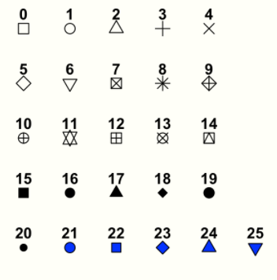

##### geom_node_point() 常用格式设置：

- alpha (opacity; a value between 0 and 1)
- colour (colour of shapes 0-20 and border colour for 21-25)
- fill (fill colour for shape 21-25)
- shape (node shape; a value between 0 and 25)
- size (size of node)
- stroke (size of node border)

##### geom_node_text() 常用格式设置

- label (attribute to be displayed as node label)
- colour (text colour)
- family (font to be used)
- size (font size)

##### Scales：尺度

The `scale_*` functions are used to control aesthetics that are mapped within `aes()`. You do not necessarily need to set them, since `ggraph` can take care of it automatically.

```
scale_fill_manual(values = got_palette) +
scale_edge_width_continuous(range = c(0.2,3)) +
scale_size_continuous(range = c(1,6))
scale_fill_brewer(palette = "Dark2")+
```

##### themes：主题

```
theme_graph()+
theme(legend.position = "none")
theme(legend.position = "bottom")
```

#### 采用ggraph 的 stress 布局 画整体网络图

While “stress” is the key layout algorithm in `graphlayouts`

MDS是Multidimensional Scaling的简称，即为高维数据降维算法，其是一种力导算法高维数据下的稳定下布局的优化，避免数据超载而导致的整体的布局不稳定

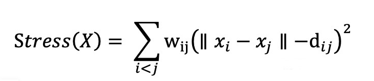

```
p <- ggraph(got_graphs,layout = "stress",bbox = 15)+  ##bbox越大，不同图层的排布宽度越大
        geom_edge_link0(edge_colour= "Gainsboro")+   ##直线边的颜色可以调试，简单快速画图，建议点多于100使用
    #   geom_edge_link0(aes(width=value),edge_colour= "Gainsboro")+   ##直线边的粗细可以按value值设置，建议点少于100使用
    #   geom_edge_link2(aes(edge_colour = corr),edge_width = 0.5)+   ##直线边的颜色和粗细可以按corr值设置，建议点少于100使用，边越多运行越慢
    #   geom_edge_arc(aes(edge_colour = corr),edge_width = 0.5)+    ##曲线边的颜色和粗细可以按corr和value值设置，建议点少于100使用
       geom_node_point(aes(filter = size >= 2,fill=clu,size=size),shape = 21)+  ##filter过滤size小于2的点，fill颜色可以按点的属性clu设置，size设置点大小，shape设置点的形状
       geom_node_text(aes(filter = size >= size1,label = gene_name),repel=F)+   ##filter过滤size小于一定值的点显示标记,label设置点的标记，repel避免重复标记                  
       theme_graph()+  ##设置图的标题类似ggplot2
       theme(legend.position = "none") ##设置图例类似ggplot2

```

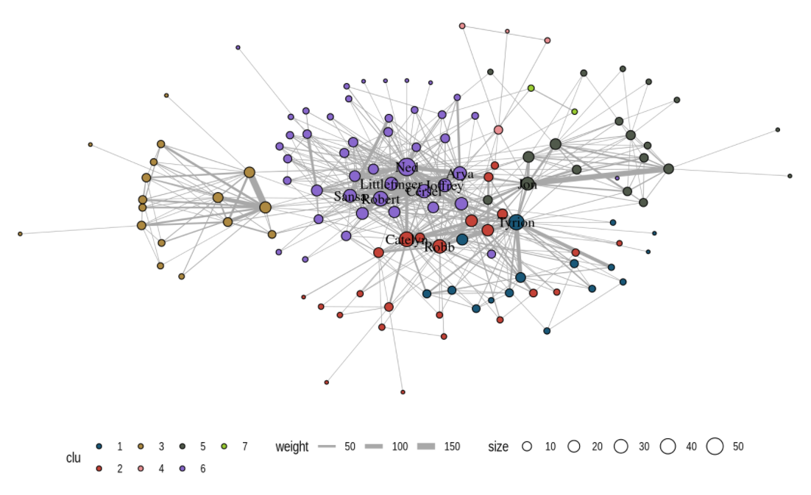


#### 采用ggraph 的 linear 布局 画整体网络图（建议少于100节点时画图）

```
#p <- ggraph(got_graphs,layout = "linear")+  ##默认点的分布为线性                                                            
p <- ggraph(got_graphs,layout = "linear",circular = TRUE)+  ##circular=T点的分布为圆形
       geom_edge_arc(aes(edge_colour = corr))+  ##按正相关和负相关设置颜色
       geom_node_point(aes(filter = size >= 2,fill=clu,size=size),shape = 21)+  
       geom_node_text(aes(filter = size >= size1,label = gene_name),repel=F)+
       theme_graph()
```

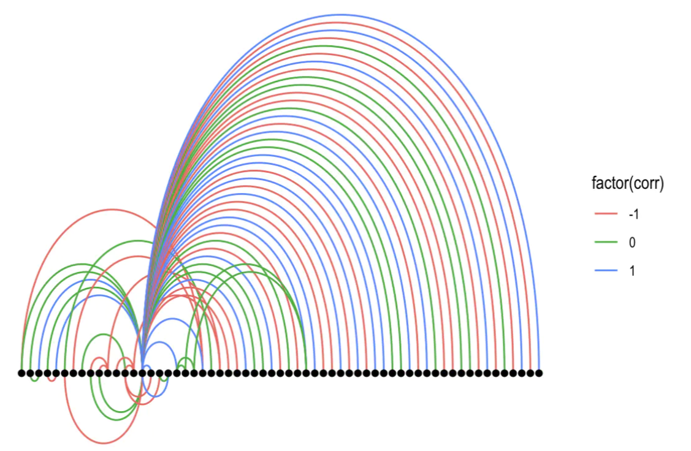


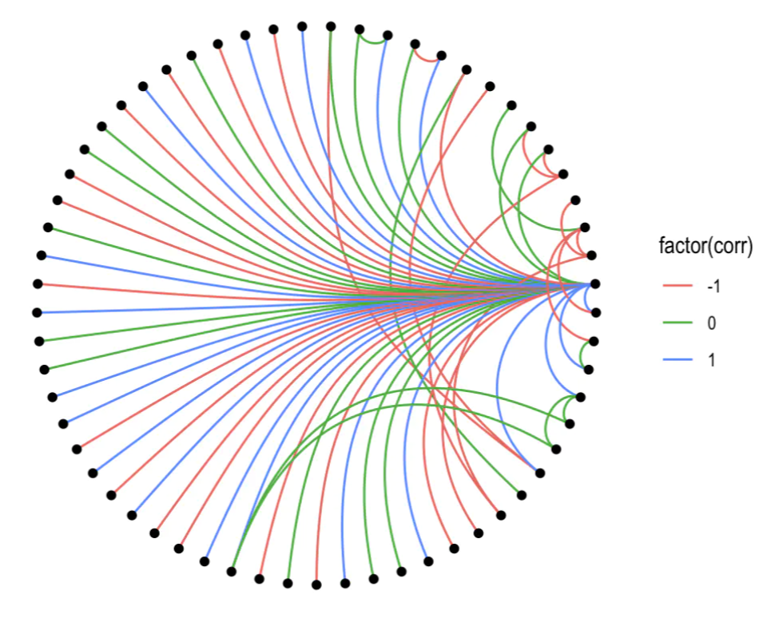


### 使用igraph从顶点的子集中提取一个连通的子图

同一份数据里会可能会出现多个网络图并行分布，这时候需要单独对不同的子图画图分析，igraph package 其实提供了decompose.graph 函数，可以控制min.vertices，配合clusters和V函数得到的最大csize的vertex sequence，再用delete.vertices从igraph class 中剔除这些vertex

```
clusters(got_graphs) ##计算图表的连接组件
clusters(got_graphs)$csize  ##计算图表的连接组件的size
decompose.graph(got_graphs)  ##创建单独的组件
big <- order(clusters(got_graphs)$csize,decreasing=TRUE)[1]  ##挑选size最大的子图
dg <- decompose.graph(got_graphs)[[big]]  ## 挑选size最大的子图创建单独的图表
```

#### 采用ggraph对的stress布局对网络图中size最大的网络画子图画图

```
p <- ggraph(dg,layout = "stress")+  ##由于已经筛选了节点最多的图形，所以不需要bbox参数排布
       geom_edge_link0(edge_colour= "Gainsboro")+  
       #geom_edge_link0(aes(width=value),edge_colour= "Gainsboro")+  ##直线边
       #geom_edge_link2(aes(edge_colour = corr),edge_width = 0.5)+ 
       #geom_edge_arc(aes(edge_colour = corr),edge_width = 0.5)+   ##曲线边
       geom_node_point(aes(fill=clu,size=size),shape = 21)+
       geom_node_text(aes(filter = size >= size1,label = gene_name),repel=F)+
       scale_size(range=c(2,5))+
       theme_graph(title_size = 40)+
       theme(legend.position = "none")
```


#### 采用ggraph 的 focus 布局 画size最大的网络图的子图，该布局只能画成分单一的网络图

Circular layouts are generally not advisable. Concentric circles, on the other hand, help to emphasize the position of certain nodes in the network. The `graphlayouts` package has two function to create concentric layouts, `layout_with_focus()` and `layout_with_centrality()`.

The first one allows to focus the network on a specific node and arrange all other nodes in concentric circles (depending on the geodesic distance) around it. Below we focus on the character Ned Stark.

```
p <- ggraph(dg,layout = "focus",focus = 1)+
       geom_edge_link0(edge_colour = "Gainsboro")+
       #geom_edge_link0(aes(width=value),edge_colour= "Gainsboro")+  ##直线边
       #geom_edge_link2(aes(edge_colour = corr),edge_width = 0.5)+                                                                                                           
       #geom_edge_arc(aes(edge_colour = corr),edge_width = 0.5)+   ##曲线边
       geom_node_point(aes(fill = clu,size=size),shape = 21)+
       geom_node_text(aes(filter = (name == name1 ),size = size,label = gene_name))+
       coord_fixed()+
       theme_graph()+
       theme(legend.position = "none")
```

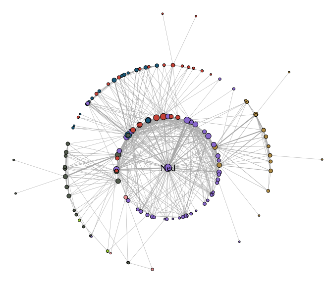


#### 采用ggraph 的 centrality 布局 画成分最大的网络图的子图，该布局只能画成分单一的网络

“同心圆”形式的布局：`layout_with_centrality（）`。可以指定任何中心性索引（或数值向量），并创建一个同心布局，其中最中心的节点放在图形中心，最外围的节点放在最大的圆中。用于布局的数值属性由cent参数指定。

```
p <- ggraph(dg,layout = "centrality",cent = graph.strength(dg))+  ##对size最大的点为中心做图，可以改为具体某基因
       geom_edge_link0(edge_colour = "Gainsboro")+
       #geom_edge_link0(aes(width=value),edge_colour= "Gainsboro")+  ##直线边
       #geom_edge_link2(aes(edge_colour = corr),edge_width = 0.5)+
       #geom_edge_arc(aes(edge_colour = corr),edge_width = 0.5)+   ##曲线边
       geom_node_point(aes(fill=clu,size=size),shape = 21)+
       geom_node_text(aes(filter = size >= size1,size = size,label = gene_name))+
       coord_fixed()+
       theme_graph()+
       theme(legend.position = "none")
```

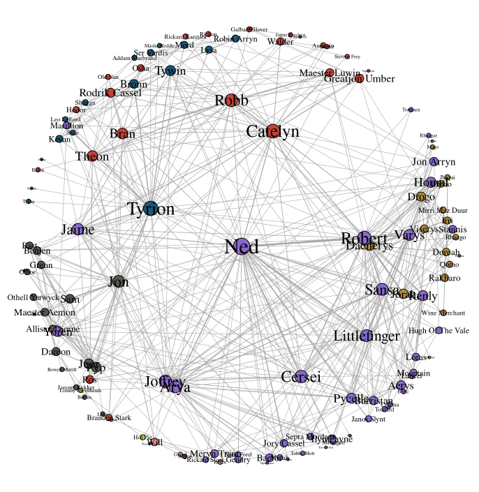

#### 采用ggraph 的 kk 布局 画成分最大的网络图的子图，该布局只能画成分单一的网络图

力导向算法 `Kamada Kawai`

```
p <- ggraph(dg,layout = "kk")+
       geom_edge_link0(edge_colour= "Gainsboro")+
       geom_node_point(aes(fill=clu,size=size),shape = 21)+
       geom_node_text(aes(filter = size >= size1,label = gene_name),repel=F)+
       theme_graph(title_size = 40)+
       theme(legend.position = "none")
```

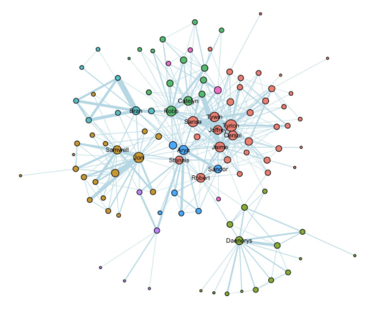


#### 3d网络图

networkD3包基于D3.JS(最流行的可视化库之一)构建，还可以和R中常见的网络可视化包例如**network**、**igraph**等连用，支持**管道操作符%>%**(dplyr中常用)**和ggplot2语法**，是一个非常灵活的网络可视化包。networkD3最大的亮点，在于clickAction = clickJS这一句，可以设置自己的鼠标点击事件，比如节点放大，弹出对话框，点击节点显示节点描述，加入搜索框等等。networkD3包生成的结果将是一个html文件，即**网页文件**。


##### 3d网络图参数简介：

 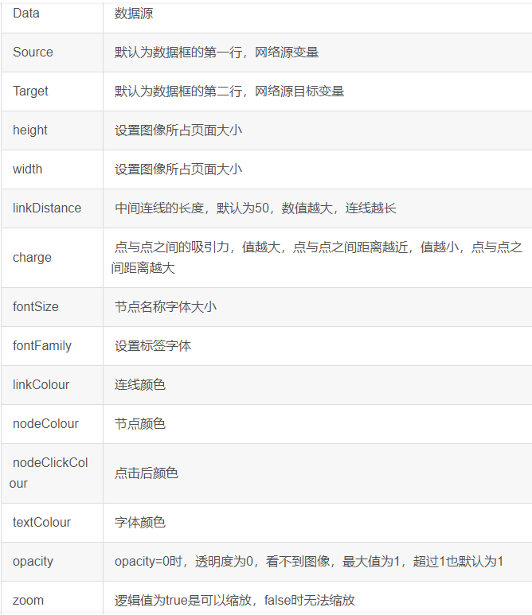


#### 力导向网络图

这种图采用物理上的弹簧模型，将节点之间想象成是用弹簧连接的，然后把这些用弹簧连接的节点扔到桌面上，让这些弹簧自己弹啊弹，弹啊弹，最后总能停下来，达到一个平衡状态。这个状态下的节点连接图，能力最小，线和线之间的交叉最小。这种方法的学名叫spring-embedder 或者 force-directed。

拖动中间的图里的任意节点，整个网络就会被拖动，并达到新的平衡位置。从图里，我们可以大致看出不同的群体，群体里的关系紧密，而不同群体之间的关系比较松散。群体分析也是网络数据可视化的一个主要目的。


```
p <- forceNetwork(Links = linkData,Nodes = Nodes_f,Source = "source",Target = "target",Value = "value",NodeID = "gene_name",Group = "group")
```

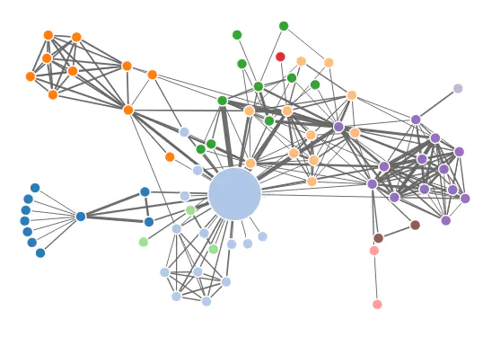

#### 桑基图

桑基图（Sankey diagram），即桑基能量分流图，也叫桑基能量平衡图。它是一种特定类型的流程图，右图中延伸的分支的宽度对应数据流量的大小。因1898年Matthew Henry Phineas Riall Sankey绘制的“[蒸汽机](https://baike.baidu.com/item/蒸汽机/367409)的[能源](https://baike.baidu.com/item/能源/23358)效率图”而闻名，此后便以其名字命名为“桑基图”。

```
p <- sankeyNetwork(Links = linkData,Nodes = Nodes_f,Source = "source",Target = "target",Value = "value",NodeID = "gene_name",Group = "group")
```

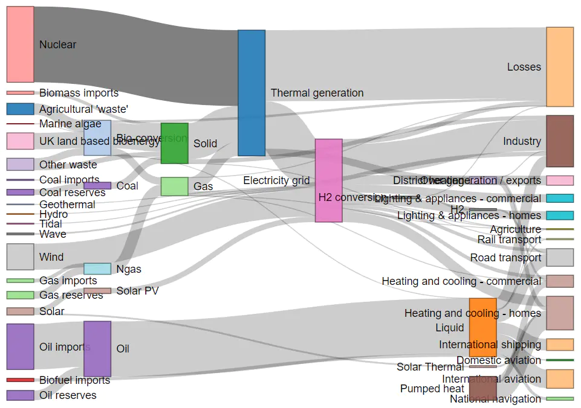
