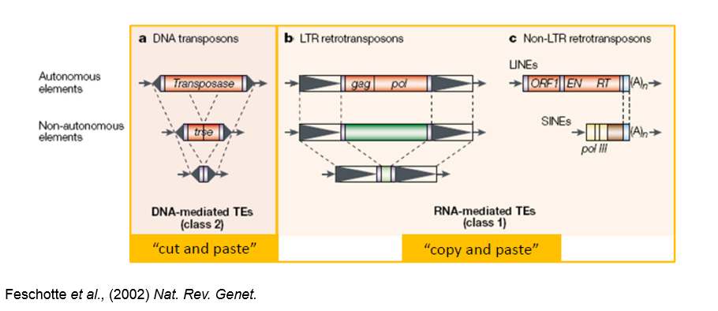
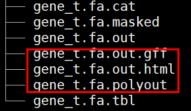
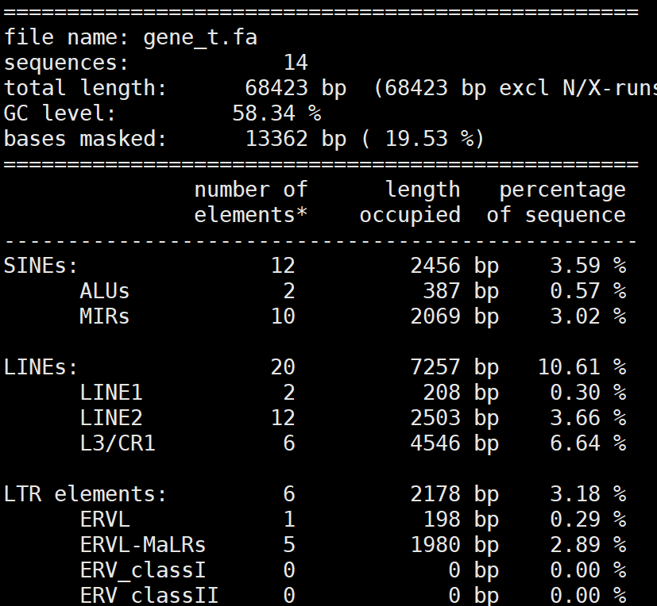
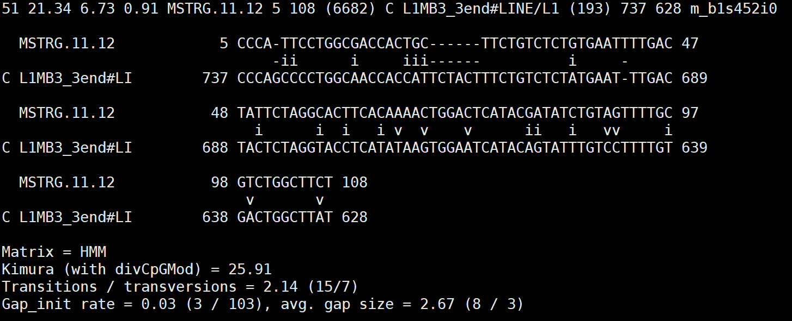
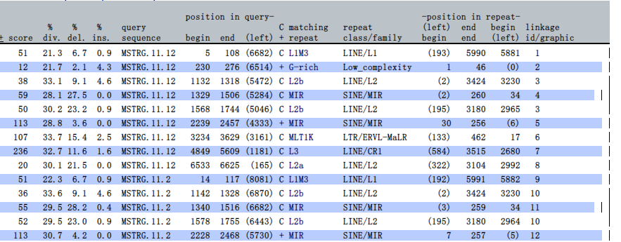
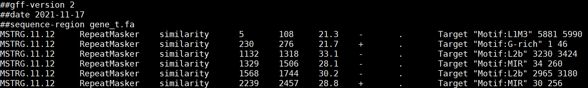
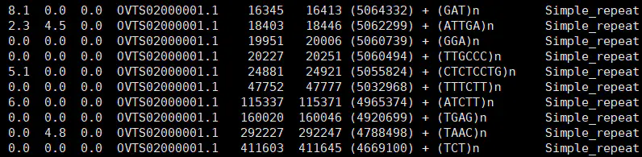
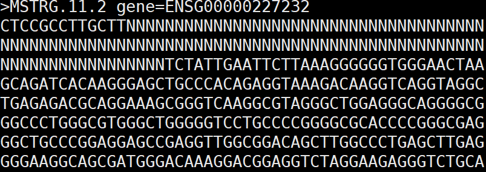

# 转座元件分析


# Dfam数据库的使用

The Dfam database is a collection of **Repetitive DNA element** sequence alignments, **hidden Markov models (HMMs)** and **matches lists** for complete Eukaryote genomes.

## 1. 概述

**转座元件**是一类能改变其自身在基因组当中的位置的DNA重复序列，它能够使得突变产生，也能“逆转”已有突变，它能改变生物细胞的遗传属性和基因组稳定性。1951年，美国冷泉港著名女性细胞遗传学家Barbara McClintock发表文章“Induction of Instability at Selected Loci in Maize”，首次在玉米种发现这类“跳跃基因”，这一研究成果使其在1983年荣获诺贝尔生理学或医学奖。

简单来说，转座元件可以分成两类：Class I和Class II。 Class I又被称为Retrotransposon，逆转录转座子，指那些通过“复制-粘贴”机制来实现其在基因组中“跳跃”的转座元件，这种类型的转座元件能不断增加其自身在基因组中的拷贝数。这类转座元件在跳跃的过程中，依赖其中一类元件——LINE1，长散在元件所编码的ORF1p和ORF2p。ORF1p行使RBP的功能，携带转座元件的RNA中间体进入细胞核，在ORF2p（含有一个EN，核酸内切酶和一个RT，逆转录酶）的帮助下，完成基因组的重组。Class II，也叫做DNA转座子，这种类型的转座子主要是通过“剪切-粘贴”的机制进行“跳跃”。不像Class I,它们的转座反应仅依赖部分元件编码的转座酶。在此分类基础上，根据各种元件的结构特征，转座元件还可以被细分为不同的family和subfamily。



**Dfam**是真核生物TE-centric数据库，这个数据库更正式地定义了转座元件，并且将共有序列一样的转座元件形成一个“集合”，利用隐马尔可夫模型（hidden Markov models）来进行多序列比对（multiple sequence alignments）。

**RepeatMasker**是最常用的TE序列工具，是当前研究在进行TE注释时的金标准，它以RepBase和Dfam两大数据库为支持。

## 2. RepeatMasker的使用

RepeatMasker is a program that screens DNA sequences for interspersed repeats and low complexity DNA sequences. The output of the program is a detailed annotation of the repeats that are present in the query sequence as well as a modified version of the query sequence in which all the annotated repeats have been masked (default: replaced by Ns). On average, almost 50% of a human genomic DNA sequence currently will be masked by the program. Sequence comparisons in RepeatMasker are performed by the program cross_match, an efficient implementation of the Smith-Waterman-Gotoh algorithm developed by Phil Green.

### 2.1 使用命令

```bash
RepeatMasker -pa 4 -species human -poly -html -gff -dir repeat1 gene_t.fa #gene_t.fa 需要提供作为输入的fa格式的序列文件
 
#需要注意的地方
#-dir 指定的输出结果文件夹
#一定要通过 -species 指定物种，否则默认比对的是人类重复序列数据库
#如果使用本地的参考库，通过 -lib 指定，替代 -species
# -poly，-html -gff等参数输出结果另外的形式（不必须参数）
#-s、-q、-qq 等参数可控制序列比对的灵敏度，如果你的目标物种和参考物种不是很近，可能需要提升灵敏度
```

### 2.2 结果输出

图中红圈的三个文件分别是加了 -poly、-html 、-gff三个参数输出的结果，默认结果只有剩下四个。



***.tbl**

本次RepeatMasker运行的结果报告，该文件默认生成，包含了基因组长度、GC含量、重复区长度以及重复区各类别基本统计信息等。其中，“bases masked”就是重复序列的总长度和在基因组中的占比，视物种而定。




***.cat**

记录了输入的基因组序列和数据库中参考重复序列的比对详情，该文件默认生成。

会存在个别碱基的差异，其中“i”和“v”分别代表了碱基转换（transitions）和颠换（transversions），“-”表示该位点存在碱基插入/删除。




***.out和\*.out.html**

这两个文件中的信息是一致的，将基因组中预测得到的重复序列和参考序列相比的碱基替换频率、插入/删除率，以及重复序列的位置、结构、类型等信息展示出。其中，*.out（默认生成）是纯文本样式，*.out.html（-html参数生成）以网页列表展示。




***.out.gff**

将*.out中的内容，整理为标准gff文件的结构类型（-gff参数生成）。主要包含重复序列的位置、结构等信息。




***.polyout**

命令行中通过-poly参数，可额外将预测结果*.out中的微卫星注释识别出来，单独整理为一张表，文件结构同*.out。




**\*.masked**

相较于原始输入fasta文件中的序列，..masked中将其中重复序列部分屏蔽为了N碱基，该文件默认生成。
 注意区分，这里有的N碱基是屏蔽的重复序列，而有的N碱基则是原来这个基因组fasta文件中就有的（一般为gap）。



那么这个文件有什么作用呢？可以将该文件作为后续基因序列预测的输入文件。这样，基因预测时就不会再考虑这些重复序列区域（因为这些区域的碱基已经屏蔽为了N碱基，不会被识别），缩小了基因组范围，大大减少了资源消耗，提升准确度。


参考资料：

- [Repeatmasker](http://www.repeatmasker.org/webrepeatmaskerhelp.html)

- [The Dfam community resource of transposable element families, sequence models, and genome annotations](https://mobilednajournal.biomedcentral.com/articles/10.1186/s13100-020-00230-y)


