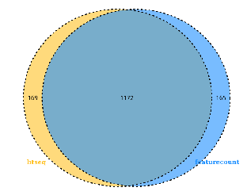

# RNAseq定量软件比较

# 一些RNAseq定量软件的简介

RNAseq定量软件的简介

kallisto,salmon,rsem,stringtie,featurecount,htseq软件的定量原理简介

kallisto,salmon,rsem,stringtie,featurecount,htseq定量结果的差异分析比较

## RNAseq定量软件的简介

**基因水平**(gene-level)：常见的软件包括HTSeq-count，featureCounts，BEDTools, Qualimap, Rsubread, GenomicRanges等(Anders, S.,2012)

这些软件在处理测序中得到的multimapping reads时方式不同，例如HTSeq-count就直接当它们不存在，而Qualimpa则是一人一份，平均分配,featureCounts是参数决定要不要multimapping reads

**转录本水平**(transcript-level)：常用工具为RSEM，Cufflinks，StringTie，eXpress，kallisto，silfish，salmon等(Tuimala, J. , 2014.)

这些软件要处理的难题是转录本亚型（isoforms）之间通常是有重叠的，当二代测序读长低于转录本长度时，如何进行区分？这些工具大多采用的都是expectation maximization（EM）算法
上述软件中RSEM，Cufflinks，StringTie，eXpress都是alignment-based，目前许多alignment-free软件，如kallisto, silfish, salmon，能够省去比对这一步，直接得到read count，在运行效率上更高。不过最近一篇文献(Sahraeian, S. M. E,2017)指出这类方法在估计丰度时存在样本特异性和读长偏差

[1] Sahraeian, S. M. E., Mohiyuddin, M., Sebra, R., Tilgner, H., Afshar, P. T., Au, K. F., … Lam, H. Y. K. (2017). *Gaining comprehensive biological insight into the transcriptome by performing a broad-spectrum RNA-seq analysis. Nature Communications, 8(1).* doi:10.1038/s41467-017-00050-4 
[2] Anders, S., Reyes, A., & Huber, W. (2012). *Detecting differential usage of exons from RNA-Seq data. Nature Precedings.* doi:10.1038/npre.2012.6837.2 
[3] Tuimala, J. . (2014). Rna-seq data analysis: a practical approach. *Crc Press*.

## kallisto,salmon,rsem,stringtie,featurecount,htseq软件的定量原理简介

### kallisto定量软件简介

#### Kallisto官网

https://pachterlab.github.io/kallisto/starting

#### kallisto 简介

kallisto 是2016年Nature Biotechnology 杂志发布的一款无须比对的转录本定量工具（Nicolas L Bray，2016）
采用了名为pseudo-alignment的算法，pseudo-alignment 算法不关系reads具体的比对位置，而是通过reads的kmer特征来判断其属于哪一条转录本
 kallisto 软件的优势：
极大地降低了运行时间
算法上更新——绕过传统方法中序列比对（alignment）的步骤直接做量化分析，软件重于确定一个 read 属于哪一个基因，而不关心这个 read 在基因上的具体位置

[1] Nicolas L Bray, Harold Pimentel, Páll Melsted and Lior Pachter, [Near-optimal probabilistic RNA-seq quantification](http://www.nature.com/nbt/journal/v34/n5/full/nbt.3519.html), Nature Biotechnology **34**, 525–527 (2016), doi:10.1038/nbt.3519

#### kallisto 比对原理

第一步：建立索引
k-mers默认是31，k-mers越小会越敏感。图上的每一个node都代表一个k-mer。

如上图有三条overlapping的 transcripts，红、蓝、绿各代表一条。
k-compatibility class：transcripts包含node的k-mers ，那么称transcripts为该node的一个k-comptibility class。如图上最左边的node有三个k-compatibility class，因为三条transcripts都包含该node代表的k-mer。三个最上面的node只有两个k-compatibility class，因为只有蓝和红两条transcripts包含node 代表的k-mer。
contig:连续的有相同k-compatibility class的node组成。如上图中最左边的三个node构成一个contig，最上面的node也构成一个contig。
index会建立一个hash table<KmerEntry,KmerHash> KmerEntry里包含k-mer映射到contig的信息，KmerHash kmer的hash值。

第二步：比对

上图黑色的代表一条read。比对的时候read也会被切成一个个的k-mer。黑色的node代表比对上的。

然后找出每个比对上的node的k-compatibility class，然后取这些k-compatibility class的交集，就得到read的k-compatibility class，如果是paired-end，那就沿着一条参考序列取k-compatibility class。

冗余信息。最左段的3个node有相同的k-compatibility class，文章中又把这些相同的node称为k-equivalence class。在比对的过程中我们可以跳过这些k-equivalence class。这些信息已经存储在contig里。同一个contig里的node都有相似的k-compatibility class。为了确保跳过的是k-equivalence class,kallisto会检查跳过的最后一个node是否符合预期。正因为省掉这些冗余的node，比对速度快。如上图只需要取三个node的k-compatibility class的交集就能确定read的k-compatibility。

确定好要比对的node后使用expectation_maximization (EM) 的算法来定量转录本

#### kallisto 比对和定量结果分析

kallisto比对分析的准确度：
   Kallisto与 Bowtie2比对分析中，66.22%reads比对到了相同转录本上
   对于比对到不同转录本上的reads（ambiguous reads），Bowtie2的平均比对得分 8.94，Kallisto是4.86
   由于Kallisto读取的碱基少总比对率 90.8%，而Bowtie2的比对率为86.5%
   Kallisto的比对运行时间短

kallisto定量分析的优势：
   Kallisto采用EM算法，Cufflinks没有使用EM算法导致其multi-map遍布整个基因组
   Kallisto的伪对齐保留了reads的k-mers信息，Sailfish将reads切割成k-mers，导致信息丢失
   Kallisto的定量运行时间短

median relative difference为不同定量软件的readcount值与GEUVADIS数据中心提供的20个模型的所有转录本的（RSEM）readcount之间的绝对差异值除以两者的平均值的均值

#### kallisto 的使用方法

1. 对转录本序列建立索引

   kallisto index -k 31 -i hg19.idx  hg19.refMrna.fa

   -k参数指定kmer的长度
   -i参数指定输出的索引的名字

2. 定量

   kallisto quant \
   -i hg19.idx  \
   -o out_dir  \
   -t  20 \ 
   R1.fastq.gz R2.fastq.gz

   -i参数指定转录本的索引文件
   -o参数指定输出结果的目录
   -t参数指定线程数
   对于单端数据而言，必须指定fragment长度的均值和方差，分别对应-l和-s参数
   添加参数--genomebam --gtf ${gtf_file}定量完成后会在结果目录多生成一个bam文件，可以用igv查看

#### kallisto 的输出文件

在输出目录，会生成以下3个文件

run_info.json 文件为JSON格式，保存了运行的命令和参数。
前缀为abundance 的文件，保存了转录本的定量信息
后缀为h5为HDF5格式的文件，当转录本数量较多时，相比纯文本，这种格式的文件大小会小很多
对于HDF5的文件，可以采用如下命令转换为tsv格式的文件
kallisto h5dump  -o out_dir  abundance.h5
abundance.tsv中包含转录本名称，长度,count值和tpm,格式如下：

#### kallisto 的总结

kallisto软件本身的特点就是对设备要求不高且速度快，但是其定量结果的准确性比较有争议

kallisto进行定量时，有专门的软件sleuth进行差异表达分析（Pimentel, H.2017）

[1] Pimentel, H., Bray, N. L., Puente, S., Melsted, P., & Pachter, L. (2017). *Differential analysis of RNA-seq incorporating quantification uncertainty. Nature Methods, 14(7), 687–690.* doi:10.1038/nmeth.4324 

### salmon定量软件简介 

#### salmon官网

https://combine-lab.github.io/salmon/

#### salmon简介

Salmon 是2017年Nature Methods发表的一篇无需比对的定量软件（Patro, R 2017）
将新的双相并行推理算法和功能丰富的偏差模型与超快速读长映射过程结合在一起
它与Kallisto(熊神星)和Sailfish(旗鱼)类似，不基于比对而直接对基因进行定量的工具，适用于转录组、宏基因组等的分析
salmon优势是：
定量时考虑到不同样品中基因长度的改变（比如不同isoform的使用）
速度快、需要的计算资源和存储资源小
敏感性高，不会丢弃匹配到多个基因同源区域的reads
可以直接校正GC-bias
自动判断文库类型

[1] Patro, R., Duggal, G., Love, M. I., Irizarry, R. A., & Kingsford, C. (2017). Salmon provides fast and bias-aware quantification of transcript expression. Nature Methods.

#### salmon原理

salmon quasi-mapping的比对原理是基于k-mers+Suffix Array

第一步：建立索引

如果有多个transcript，那将多个transcripts连起来用$分割
基于k-mer建立hash table

第二步：比对

Suffix Array(T) ：建立Transcriptome的后缀数组
SA interval ：就是该kmer所对应的后缀数组区间。
计算MMP（Maximum Mappable Prefix）最大映射前缀。就是图中蓝色虚线圈出来的部分。
通过LCP(longest common prefix)最长公共前缀。如图中红色圈出来的部分
可能会出现LCP(T[SA[b’] ] ,T[SA[e’−1] ] )) |>|MMPi|的情况，就是LCP比MMP长。也就是说，在几条transcript里，都是ATTGACTA，而read是ATTGAGTA。则认为这不是虚假的匹配，而是测序过程中出现了错误。
NIP(next informative position)下一个信息位置，与kallisto相似跳过相同k-mer
最后会生成一个查询的集合，根据kallisto获得的灵感，对每一个命中的区间取交集。但这里与kallisto不同的是，这里取交集的时候分正向反向，kallisto是不区分的

#### Salmon的定量优势

准确度指标中所述的平均绝对相对差异（mean absolute relative differences，MARD）Salmon和Kallisto产生的MARD相似，尽管Salmon的MARD分布比Kallisto的小得多（Mann-Whitney U检验，p = 0.00017）。两种方法都优于eXpress（Mann-Whitney U检验，p = 3.39781×10-8）。
在典型的FDR值下，使用Salmon的估计找到真正的差异转录本的敏感性比使用Kallisto的估计要高53％–450％，比使用eXpress的Polyester模拟数据的估计要高210％-250％
Salmon的结果可以由R包转换后直接用edgeR/DESeq2等进行counts值的下游分析

#### Salmon的使用方法

1. 构建索引
   salmon index -t  all_transcripts.fa   -i all_transcripts_index

2. 定量分析
   salmon quant \
   --gcBias
   -l A 
   -1  RASshCON.R1.fastq.gz  \
   -2  RASshCON.R2.fastq.gz   \
    -i   all_transcripts_index  \
    -g  all_transcripts.gtf \
    -o  RASshCON.count 
    -p 10

--gcBias: 校正测序片段GC含量
--seqBias：矫正测序偏差
-l: A自动判断文库类型
-g  提供转录本对应gene的信息，如果提供，则输出quant.sf and quant.genes.sf 两份结果

高级参数介绍

--writeMappings  将mapping结果以SAM格式输出

--validateMappings 启用选择性比对到转录本。能够提高比对的灵敏度和特异性从而提高了定量的准确度。

--mimicBT2 和 --mimicStrictBT2 让比对模仿一些 Bowtie2 行为。

--recoverOrphans 这个参数应与 --validateMappings 一起用。如果只有一端 reads 能比对或者两端 reads 比对不在同一个转录本，Salmon 会在比对上位置的上下游寻找另一端 reads 的比对。

--hardFilter 这个参数仅在 --validateMappings 模式使用，关闭软过滤(soft filter)。

--allowDovetail 默认丢弃“燕尾比对”(Dovetailing mapping)，开启这参数后不丢弃。“燕尾比对”见下面 Bowtie 的示意。

-p/--threads 线程数，默认会使用所有线程，想要用少些线程就设置。

--incompatPrior 与文库类型(library type)不兼容的比对先验概率。Salmon 默认设置了一个非常小但非0数值，如果一个插入片段(fragment)的唯一比对是这种非兼容比对，Salmon 会把这个比对计数。如果希望不计入，将这个参数设置数值 0.0 即可。

--minScoreFraction 最低比对得分限制，低于此比对被丢弃。

--rangeFactorizationBins 提高对“困难”转录本的定量准度。配合比对模式的 --useErrorModel 参数或者 fastq 模式的 --validateMappings 参数使用。

--seqBias 从输入数据学习然后矫正测序偏差。

--gcBias 进行 GC 偏差矫正。建议根据质控的 GC 偏差情况设置。

-g/--geneMap 提供基因注释文件 Salmon 就额外生成 quant.genes.sf 文件给出基因的定量

#### salmon输出结果

quant.sf文件，其记录了每个转录本的count数以及对应的TPM值
ambig_info.tsv文件可以看每个转录本对应的Unique and ambiguous count
meta_info.json 参与计算的reads的信息如mapping上的总reads数

name:转录本id
length:转录本长度
effectivelength:考虑了基因长度分布和序列特异性和 GC片段偏差
tpm:每千个碱基的转录每百万映射读取的Transcripts
numreads:  readcount值

#### salmon 的总结

salmon 和 kallisto 都是不基于比对而直接对基因进行定量的工具

salmon 相比 kallisto，具有丰富的偏差模型可以矫正测序GC-bias和低质量reads的影响，有丰富的参数控制，参数解释说明见网站（https://salmon.readthedocs.io/en/latest/salmon.html）

kallisto官方推荐的适用基因组是小麦，建议小麦使用kallisto

### RSEM(RNASeq by Expectation Maximization)定量软件简介

#### RSEM官网

http://deweylab.biostat.wisc.edu/rsem/

#### RSEM简介

2011年问世的老牌比对/定量/差异分析软件（Li, B 2011）
trinity官方推荐的转录本定量软件

rsem的主要参数：

1. prepare-reference   构建转录本索引
2. calculate-expression   比对定量（可以输入bam也可以输入reads）
3. Differential Expression Analysis using EBSeq   差异分析
    3.1 generate-data-matrix    构建数据矩阵
    3.2 run-ebseq     调用EBseq进行检验
    3.3 control_fdr    控制FDR(错误发现率)来挑选差异基因

特点
 EM算法准确处理ambiguous reads
 不依赖参考基因组文件

Li, B., & Dewey, C. N. (2011). *RSEM: accurate transcript quantification from RNA-Seq data with or without a reference genome. BMC Bioinformatics, 12(1), 323.* doi:10.1186/1471-2105-12-323 

RSEM采用转录本水平的比对

1 QNAME 序列的名字（Reads id）2 flag 标记（81=1+16+64）3 RNAME   参考序列染色体的名字4 POS     在参考序列上的位置（染色体上的位置）5 MAPQ    mapping qulity 越高则位点特异性越好 6 CIGAR   代表比对结果的CIGAR字符串7 RNEXT   双末端测序中另一个reads比对的参考序列的名称，如果没有则用 “ * ” 表示，如果和前一个reads比对到同一个参考序列则用“ = ”表示 8  PNEXT   双末端测序中另一个reads比对到参考序列上的位置，如果没有则用0表示 9 TLEN    估计出的query模板序列的长度，当mate序列位于本序列上游时该值为负值。Template的长度，最左边得为正，最右边的为负，中间的不用定义正负，不分区段（single-segment)的比对上，或者不可用时，此处为0；10 SEQ    read的序列;序列片段的序列信息 11 QUAL   ASCII码格式的序列质量;序列的质量信息 12 可选的字段（field）

#### RSEM的比对定量优势

RSEM对于基因组水平的比对的优势：
可变剪接和多聚腺苷酸化（ polyA）干扰基因组水平的比对
对于没有基因组的物种，转录本水平的比对是一种方法
转录本水平的比对参与的碱基少，所以快
综合考虑了测序方式（PE/SE）,测序片段长度分布和reads质量值的影响

RSEM的定量优势：
RSEM采用EM算法模型，相对于只计算比对到单一位置reads的Alexa-seq算法，似然函数更适合处理那些ambiguous reads
95%可信区间算法(CI)和后验均值算法(PME)以及最大似然法算法(ML)被开发应用于定量基因（转录本）
RSEM调用bowtie根据reads的具体比对情况来定量reads,不是仅判断reads的比较率高低，比如rsem在默认情况下只允许reads起始25bp有2个错配
RSEM的结果可以通过probabilistically-weighted可视化reads的深度

#### RSEM原理

1.调用bowtie寻找每个read的所有比对情况
2.EM算法找到抽取样本中θ的最大可能性（Maximum likelihood）
3.根据θ的值计算所有reads的表达量情况

RSEM的EM算法：

RSEM数学模型由n个随机变量控制
Gn/Fn/Sn/On分别代表转录本来源/长度/起始位置和方向
对于PE data,变量为L1n/L2n和Q1n/Q2n和R1n/R2n,分别代表read长度/质量分数/序列
对于SE数据，L2n,Q2n和R2n是不考虑的
这个模型的主要参数是由θ给出，它代表一个片段来自每个转录本的先验概率

先验概率：事情还没有发生，要求这件事情发生的可能性大小
最大似然法：当从模型总体随机抽取n组样本观测值后，最合理的参数估计量应该使得从中抽取该n组样品观测值的概率最大

#### RSEM结果评估

错误率：采用MPE/EF/FP得分来估计不同软件的定量结果和ensemble提供的定量结果之间的差异度

Cufflinks在处理短转录本序列（小于280bp）时表达量和ensemble结果比相比，异常高，不适易用于定量短转录本

RSEM和IsoEM都采用EM算法，结果相似，RSEM优化了poly(A) 的处理和CI/PME算法矫正，所以结果更准一些

AB双端测序  CD单端测序  AC转录本定量  BD基因定量
x轴：错误率阈值
y轴：大于错误阈值的转录本/gene的比例

上部 是reads的实际丰度分布
底部是比对到基因组唯一位置的reads的丰度分布

Rsem比对定量内存和时间占用情况

#### RSEM的使用方法

1.构建索引

rsem-prepare-reference --gtf genome.gtf genome.fa reference_name -p 8

--gtf genome.gtf：输入基因组GTF注释文件
genome.fa：基因组文件
reference_name：索引名称
-p：线程数

2.定量
STAR/bowtie—RSEM
reads---RSEM

rsem-calculate-expression RASshETV4_2.clean.1.fastq.gz  RASshETV4_2.clean.2.fastq.gz  all_transcripts   RASshETV4_2    --paired-end --bowtie2 -p 8

--paired-end：表示输入的数据为双端测序数据
-no-bam-output：不输出BAM文件
--alignments：输入文件为BAM文件
-p：线程数

#### RSEM输出结果

转录本定量的bam
转录本/gene的定量结果

isoforms.results中包含了转录本ID，基因ID，转录本长度，有效长度，expected_count，TPM，FPKM和IsoPct（该转录本表达量占基因总表达量的百分比）
genes.results中的内容与之类似，只是少了IsoPct

#### 基因标准化常用方法

RPKM（Reads Per Kilobase Million）：每百万reads中来自于某基因每千碱基长度的reads数
FPKM（Fragments Per Kilobase Million）：每百万 fragments 中来自某一基因每千碱基长度的 fragments 数目

TPM（Transcripts Per Kilobase of exon model per Million mapped reads ）每千个碱基的转录每百万映射读取的Transcripts

nr：mapping到目标基因上的read数（readcount值）；
Lr：目标基因的外显子长度的总和（转录本长度）

特点：可以用于同一物种不同组织间的比较，因为Sum(TMPs)的值总是唯一的

#### RSEM总结

RSEM是准确转录本定量的首选

转录本比对定量和基因比对定量的突出优缺点：
优点：可变剪接和多聚腺苷酸化（ polyA）干扰基因组水平的比对
缺点：转录本相对于基因长度短，导致ambiguous reads多，干扰准确性（Charlotte，2015）

[1] Charlotte, Soneson, Michael, I, Love, & Mark, et al. (2015). Differential analyses for rna-seq: transcript-level estimates improve gene-level inferences. *F1000research*.

### StringTie定量软件简介

#### stringtie官网

https://ccb.jhu.edu/software/stringtie/index.shtml

#### stringtie简介

Stringtie应用了起源于最优化理论的网络流算法与从头组装策略一起来将这些短读段组装成转录本（cufflinks的升级版）（Pertea, M. 2015）

作用：
转录本组装/定量

Pertea, M., Pertea, G. M., Antonescu, C. M., Chang, T.-C., Mendell, J. T., & Salzberg, S. L. (2015). *StringTie enables improved reconstruction of a transcriptome from RNA-seq reads. Nature Biotechnology, 33(3), 290–295.* doi:10.1038/nbt.3122 

#### StringTie原理和优势

人类基因组中90%的多外显子蛋白编码基因和30%的ncRNA都具有可变剪切体
其他组装软件有专注于转录本确定的Trinity、专注于表达定量的RSEM以及二者兼顾的Cufflink等
cufflinks用的是overlap graph，该模型中nodes代表fragment，如果两个fragment存在overlap并存在兼容的剪切模式，则对应的node连接起来。他利用吝啬法利用read来产生最少的转录本，尽管效果还行，但是异构体过多时，效果会变差，还有就是它没有考虑到转录本的丰度并且对于某些isoform来说该方法没有办法组装

Stringtie通过使用genome指导的组装的方法与从头组装的概念结合（String+SR）的新方法来改善转录组组装，利用了read 和super read 两种数据
stringtie采用了组装转录本和估计表达量同步进行的方法，这不同于cufflinks的先组装后定量的策略
首先，stringtie将read聚成cluster，然后采用了splice graph，其中node代表外显子或外显子的一部分path，将graph中可能的剪切现象都连起来，最终对每个转录本通过创建一个网络流的方法，利用最大流算法（maximum flow algorithm）估计转录本的表达量
与其它组装软件相比，stringtie具有很高的准确性和新型isoform的发现能力，其优势在于使用了网络流算法，同时stringtie也支持将read从头组装成更长的片段，这进一步提高了其组装的正确性
其另一个优势在于它的最优化策略，它平衡了每次组装中每条转录本的覆盖度，这样可以对组装算法产生一定的限制，因为在组装基因组时，覆盖度是很重要的一个参数因为它需要被用来限制算法，否则组装器可能将重复的片段错误地堆叠到一起，相似地转录组装也是如此，在isoform中的每一个外显子需要有相似的覆盖度，如果忽略这个参数可能会产生一些保守但是错误的转录本，其中含有大量剪切位点的基因组装起来尤其困难

相对其他转绿本组装软件比如Cufflinks，IsoLasso，Scripture，Traph等，StringTie的敏感性和阳性检测率往往更准确，更加完整，同时对于基因表水平的评估也更为准确。
举例，对于人血液中90百万的read数据，它成功的组装出10990个正确的转录本，而cufflinks（排第二）只有区区7187个，相对而言有53%的提升。对于模拟数据，组装出7559相对cufflinks 6310 有20%的提升。另外在处理同一批数据的时候，StringTie相对其他软件要快的多

在表达定量方面，评估了真实表达值和各个软件估计表达值的情况，cufflinks 相似性最高，但是StringTie 效果也可以，可以说定量准确水平旗鼓相当
定量时间复杂度和空间复杂度上，StringTie处理模拟数据是耗时31分钟，而cufflinks 用时81分钟，在真实数据上，耗时在35-76分钟，速度大概是其他软件的3倍左右。在内存使用方面，处理真实数据时，大约利用了1.6~12g，cufflinks等软件利用了6.4~26.6g

#### StingTie定量方法

stringtie -p 10 -G all_transcripts.gtf -o output.gtf  -b  RASshCON  -e RASshCON.bam

-G参数指定参考基因组的gtf文件

-o指定输出的文件，格式也为gtf

 -b指定ballgown的输出结果目录，这个参数是为了方便下游进行ballgown差异分析

-e参数要求软件只输出已知转录本的定量结果

#### StingTie输出文件

stringtie的定量结果输出在一个gtf格式的文件中，如下：

seqname:该转录本所在的染色体号，contig或scaffold;
source:GTF文件来源；
feature:特征类型，例：外显子，转录本，mRNA和5’UTR；
start:起始位置；
end:终止位置；
score: 组装转录本的可信度打分；
strand:转录本所在的正负链信息；
frame:CDS特征，StringTie不使用该信息，所以其结果用”.”表示；
attributes:该特征的属性，包括基因id，转录本id，外显子个数，read coverage，FPKM和TPM等
官网提供了计算count值的脚本：prepDE.py

#### StingTie总结

优点：genome组装准确性远超Cufflinks等常用软件
缺点：定量结果不直接提供count值

### HTSeq (high-throughput sequencing)定量软件简介

#### HTSeq官网

https://htseq.readthedocs.io/en/master/count.html

#### HTSeq简介

特征：采用python语言开发的基因定量软件（Simon, A, 2015）

HTSeq是转录组定量分析的软件，其输入文件必须有bam（sorted）和GTF文件。

一般情况下HTSeq得到的Counts结果会用于下一步不同样品间的基因表达量差异分析，而不是一个样品内部基因的表达量比较。因此，HTSeq设置了-a参数的默认值10，来忽略掉比对到多个位置的reads信息，其结果有利于后续的差异分析。

输入的GTF文件中不能包含可变剪接信息，否则HTSeq会认为每个可变剪接都是单独的基因，导致能比对到多个可变剪接转录本上的reads的计算结果是ambiguous，从而不能计算到基因的count中。即使设置-i参数的值为transcript_id，其结果一样是不准确的，只是得到transcripts的表达量。

[1] Simon, A. , Theodor, P. P. , & Wolfgang, H. . (2015). Htseq—a python framework to work with high-throughput sequencing data. *Bioinformatics*(2), 166-9.

#### HTSeq原理

由于序列读长的限制和基因组的同源性，一条reads可能比对到多个基因上，而且基因之间也存在overlap, 在对这些特殊情况进行处理时，htseq-count内置了以下3种模式

union

interp-strict

interp-nonempty

在BAM文件，包含了比对上的reads和没有比对上的reads, 只有比对上的reads 会用来计数，htseq-count默认会根据mapping的质量值对BAM文件进行过滤，默认值为10, 意味着只有mapping quality > 10的reads才会用来计数，当然可以通过-a参数来修改这个阈值。

能够明确reads属于一个featurer时，比如示意图种的第一种情况，reads完全是gene_A的一个片段，该feature的计数就加1；能明确reads不属于一个feature时，称之为no_feature, 比如示意图种的第二种情况，reads的一部分比对上了gene_A, 在interp_strict模式下，判定该reads不属于gene_A, 就是no_feature。

当不明确一条reads是否属于某个feature时，通常是由于reads在两个gene的overlap区，比如示意图中的第六和第七种情况，这样的reads被标记为ambigous。

当一条reads比对上了两个feature时，会被标记为alignment_not_unique。

在统计属于某个基因的reads数时，需要重点关注对 ambiguous 和 alignment_not_unique 的reads的处理， 通过--nonunique参数来指定，取值有以下两种

none

all

默认值为none时，这两种reads被忽略掉，不进行任何的计数；取值为all时，对应的所有feature的计数都会加1。

除了--mode和--nonunique两个参数外，还需要关注--stranded参数，这个参数指定文库的类型，默认值为yes, 代表文库为链特异性文库，no代表为非链特异性文库。对于非链特异性文库文库，在判断一条reads是否属于一个基因时，只需要关注比对位置，而链特异性文库还需要关注比对的正负链和基因的正负链是否一致，只有一致时，才会计数。

#### HTSeq定量方法

HTSeq是对有参考基因组的转录组测序数据进行表达量分析的，其输入文件必须有SAM/bam和GTF文件
hisat2比对软件得到的bam文件，sort by pos, 所以需要重新sort，命令如下：

samtools sort -n yourfile.bam > yourfile_name.bam

定量命令：
python3 -m HTSeq.scripts.count -f bam  -s no  -t exon -i transcript_id -m intersection-nonempty  RASshCON.sort.bam all_transcripts.gtf  > RASshCON.count

-f | --format default: sam 设置输入文件的格式，该参数的值可以是sam或bam。
-r | --order default: name 设置sam或bam文件的排序方式，该参数的值可以是name或pos。
-s | --stranded default: yes 设置是否是链特异性测序。该参数的值可以是yes,no或reverse。
-a | --a default: 10 忽略比对质量低于此值的比对结果。在0.5.4版本以前该参数默认值是0。
-t | --type default: exon 程序会对该指定的feature（gtf/gff文件第三列）进行表达量计算，而gtf/gff文件中其它的feature都会被忽略。
-i | --idattr default: gene_id 设置feature ID是由gtf/gff文件第9列那个标签决定的；若gtf/gff文件多行具有相同的feature ID，则它们来自同一个feature，程序会计算这些features的表达量之和赋给相应的feature ID。
-m | --mode default: union 设置表达量计算模式。该参数的值可以有union, intersection-strict and intersection-nonempty
-o | --samout 输出一个sam文件，该sam文件的比对结果中多了一个XF标签，表示该read比对到了某个feature上。
-q | --quiet 不输出程序运行的状态信息和警告信息。

#### HTSeq输出结果

输出的count里就2列，第一列是geneid第二列是count

-o 参数输出一个sam文件，该sam文件的比对结果中多了一个XF标签，表示该read比对到了某个feature上的具体特征，如下：

#### HTSeq总结

是一个非常经典的gene-level定量软件

运行速度和内存占用情况不如featurecount

### featurecounts（Subread package）定量软件简介

#### featurecounts官网

http://subread.sourceforge.net/

http://bioinf.wehi.edu.au/featureCounts/

#### featurecounts简介

一个C语言编写的基因定量软件（Y Liao 2013）
特点：应用了高效率的染色体哈希算法和feature区块技术
突出优点：快

featurecounts属于subread
subread是一个能快速进行序列比对/定量/SNP分析的工具

[1] Y Liao, Smyth, G. K. , & Shi, W. . (2013). Featurecounts: an efficient general-purpose program for assigning sequence reads to genomic features.

#### featurecounts原理

每条染色体分为128 kb 的bins，根据feature（染色体下的实线如exon）的起始位置，将其分配到各自对应的bin中, 然后这些feature后又被平均分为不同的block（灰色框),尽量保证一个block中的feature的数目与bin中的block的数目近似相等

Reads先与不同的基因组bin进行比对，定位到其bin中后，再与不同的特征block（虚线箭头）进行对比，最后与feature进行比较（实线箭头）.在maping过程中，featurecount只使用这一套bin和block,  在最后的统计过程中，featurecount会根据不同的参数要求来统计是否去除multimapping reads.
图中，该reads与bin I 的第一个特征块中的两个特征区域重叠。

#### featurecounts结果评估

htseq-count 把gff文件中的特征区域的终止位置的碱基不算在该特征区域内
featureCounts 和 summarizeOverlaps 软件则把终止位置的碱基统计在特征区域内
桑格研究所规定gff文件中特征区域的起始和终止碱基是包含在特征区域内的，所以featureCounts 比htseq的定量结果更准确一些

双端测序时，summorizeOverlops软件统计到的fragments数比其他两个软件少的原因主要是因为summarizeOverlaps要求双端测序的两个end reads 都成功的mapped 后才会进行分配到基因, 而 featureCounts and htseq-count 只要有一端reads 成功的mapped后，其就可以将它分配到基因上

如果某一fragment能够同时匹配上两个基因，但是其中一个基因（a)可以被这一fragment的两端reads匹配上，而另一个基因(b)只被一个end read 匹配上，那么featurecount就会认为该fragment来自a基因, 而htseq-count遇到这样的问题时，就会认为这个fragment发生了multmaped，从而舍弃此基因

#### featurecounts使用方法

/mnt/ilustre/users/wanyun.yang/script/quant/featurecount/subread-1.6.0-Linux-x86_64/bin/featureCounts -p -t exon -g gene_id -a all_transcripts.gtf -o RASshCON.count.txt  RASshCON.bam

主要的参数：

| input file                              | 输入的bam/sam文件，支持多个文件输入                          |
| --------------------------------------- | ------------------------------------------------------------ |
| -a < string >                           | 参考gtf文件名，支持Gzipped文件格式                           |
| -F                                      | 参考文件的格式，一般为GTF/SAF，C语言版本默认的格式为GTF格式  |
| -A                                      | 提供一个逗号分割为两列的文件，一列为gtf中的染色体名，另一列为read中对应的染色体名，用于将gtf和read中的名称进行统一匹配，注意该文件提交时不需要列名 |
| -J                                      | 对可变剪切进行计数                                           |
| -G < string >                           | 当-J设置的时候，通过-G提供一个比对的时候使用的参考基因组文件，辅助寻找可变剪切 |
| -M                                      | 如果设置-M，多重map的read将会被统计到                        |
| -o < string >                           | 输出文件的名字，输出文件的内容为read 的统计数目              |
| -O                                      | 允许多重比对，即当一个read比对到多个feature或多个metafeature的时候，这条read会被统计多次 |
| -T                                      | 线程数目，1~32                                               |
| 下面是有关featrue/metafeature选择的参数 | 参数说明                                                     |
| -p                                      | 只能用在paired-end的情况中，会统计fragment而不统计read       |
| -B                                      | 在-p选择的条件下，只有两端read都比对上的fragment才会被统计   |
| -C                                      | 如果-C被设置，那融合的fragment（比对到不同染色体上的fragment）就不会被计数，这个只有在-p被设置的条件下使用 |
| -d < int >                              | 最短的fragment，默认是50                                     |
| -D < int >                              | 最长的fragmen，默认是600                                     |
| -f                                      | 如果-f被设置，那将会统计feature层面的数据，如exon-level，否则会统计meta-feature层面的数据，如gene-levels |
| -g < string >                           | 当参考的gtf提供的时候，我们需要提供一个id identifier 来将feature水平的统计汇总为meta-feature水平的统计，默认为gene_id，注意！选择gtf中提供的id identifier！！！ |
| -t < string >                           | 设置feature-type，-t指定的必须是gtf中有的feature，同时read只有落到这些feature上才会被统计到，默认是“exon” |

#### featurecounts输出结果

feature_count.txt

文件中包含基因ID，定量到该基因的所有外显子的染色体编号，和所有外显子的起始 ，终止位置，链的特征，外显子长度总和   和  各个样品中该基因的表达量

RASshCON.count.txt.summary

输出mapping的总体情况

#### featurecounts总结

featurecounts软件内部编程大多使用c语言编写而htseq使用python,所以featurecounts快，featurecounts对genome的bin和block区块化，更加速了定量速度

在对gtf的理解上和处理ambiguous reads时，featurecounts比htseq参数控制多

## kallisto,salmon,rsem,stringtie,featurecount,htseq定量结果的差异分析比较

### 测试数据不同软件定量结果分析

从云平台上随机下载了一个项目的数据（MJ20200513073-FX2020061700029），针对该项目的2个样品分别使用kallisto,salmon,rsem,stringtie,featurecount,htseq进行了定量分析，并对定量结果的count值和tpm值进行了整理，tpm值整理结果如下:

#### tpm值的相关性分析

#### tpm值的pca

#### 相关性和pca总结：

featurecount和htseq定量结果相似
salmon和rsem定量结果相似

featurecount和htseq和stringtie定量结果相似可能是由于他们输入文件都是相同的bam

salmon和rsem和kallisto定量结果相似可能是由于他们都是基于转录本定量的结果并且他们都是基于EM算法模型

#### tpm值的大小情况

#### tpm值大小总结：

stringtie的定量结果总体偏高
rsem的定量结果总体偏低
rsem和salmon对低表达水平gene比较敏感

### 测试数据不同定量结果的差异分析

从云平台上随机下载了一个项目的数据（MJ20200513073-FX2020061700029），针对该项目的2个样品分别使用kallisto,salmon,rsem,stringtie,featurecount,htseq进行了定量分析，之后使用edgR进行差异分析，结果如下：

| compare                        | all  | up   | down | software | padj | fc   |
| ------------------------------ | ---- | ---- | ---- | -------- | ---- | ---- |
| featurecount_1vsfeaturecount_2 | 1336 | 640  | 696  | edgeR    | 0.05 | 2    |
| htseq_1vshtseq_2               | 1340 | 642  | 698  | edgeR    | 0.05 | 2    |
| kallisto_1vskallisto_2         | 1525 | 743  | 782  | edgeR    | 0.05 | 2    |
| rsem_1vsrsem_2                 | 1463 | 728  | 735  | edgeR    | 0.05 | 2    |
| salmon_1vssalmon_2             | 1467 | 709  | 758  | edgeR    | 0.05 | 2    |
| stringtie_1vsstringtie_2       | 3640 | 1707 | 1933 | edgeR    | 0.05 | 2    |

#### 差异gene的Venn图

#### 差异基因聚类分析

| compare                        | all  | up   | down | software | padj | fc   |
| ------------------------------ | ---- | ---- | ---- | -------- | ---- | ---- |
| featurecount_1vsfeaturecount_2 | 103  | 26   | 77   | edgeR    | 0.01 | 2    |
| htseq_1vshtseq_2               | 100  | 27   | 73   | edgeR    | 0.01 | 2    |
| kallisto_1vskallisto_2         | 131  | 37   | 94   | edgeR    | 0.01 | 2    |
| rsem_1vsrsem_2                 | 164  | 56   | 108  | edgeR    | 0.01 | 2    |
| salmon_1vssalmon_2             | 171  | 60   | 111  | edgeR    | 0.01 | 2    |
| stringtie_1vsstringtie_2       | 793  | 331  | 462  | edgeR    | 0.01 | 2    |

#### 差异分析总结

featurecount和htseq的差异分析结果比较相似
salmon和rsem的差异分析结果比较相似
kallisto的差异分析结果和其他定量软件相比差异较大
