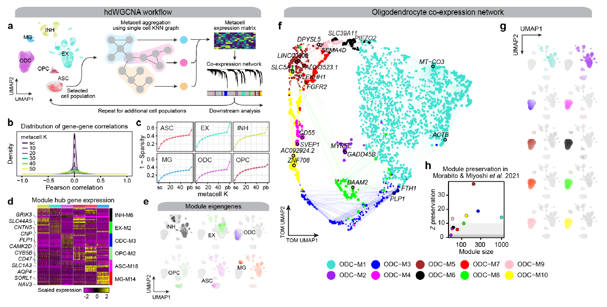
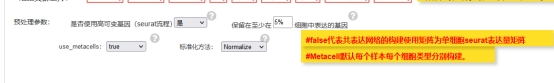
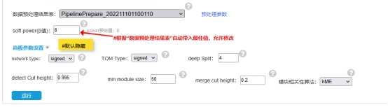
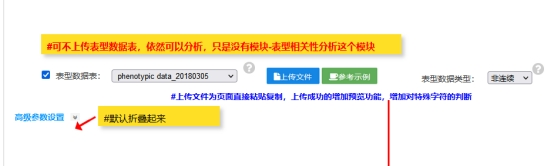
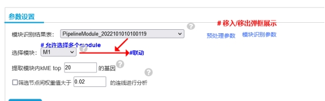
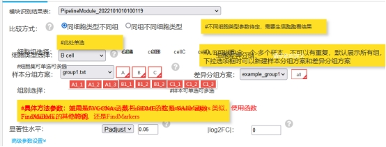
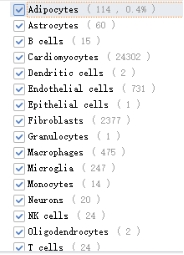
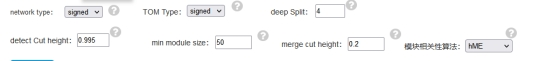

# The workflow of hdWGCNA analysis for scRNAseq data

##  The workflow of hdWGCNA analysis for scRNAseq data




分析思路：有细胞注释，计算所有的细胞类型，或者提供只计算某个细胞；使用seurat的聚类结果，计算所有的聚类结果，或者只计算某个聚类结果。

分析内容：数据预处理；模块识别；模块表型相关；hub基因可视化；差异模块分析

问题联系：[骆孟（meng.luo@majorbio.com）](mailto:骆孟（meng.luo@majorbio.com）)

 Constructing co-expression networks from high-dimensional transcriptomics data

一、运行流程

Rscript4.2 /mnt/ilustre/users/meng.luo/project/RNA/scRNA/hdWGCNA/hdWGCNA_SC_pipeline.R

参考分析路径：/mnt/ilustre/users/meng.luo/project/RNA/scRNA/hdWGCNA/test

根据不同的分析模块，给出对应不同的灵活分析参数，正常情况按照默认的运行没有问题。

具体参数（运行需要加载相应的代码，所以运行脚本时需要给脚本的绝对路径）：

```r
Rscript4.2 /mnt/ilustre/users/meng.luo/project/RNA/scRNA/hdWGCNA/hdWGCNA_SC_pipeline.R -r Merged_Seurat.rds -c all_cell_type.csv

详细参数：
-Z SCTRANSFORM, --SCTransform=SCTRANSFORM

	SCTransform on single-cell data

-r RDS, --rds=RDS

		Input rds file
-g GENESELECT, --geneselect=GENESELECT
​		 the gene selection approach variable( VariableFeatures) fraction (default) all  or  custom(gene_list)
-f FRACTION, --fraction=FRACTION
​		 fraction of cells that a gene needs to be expressed in order to be included
-l LIST, --list=LIST
​		 gene selection approach custom and give the custom gene list
-c CELLFILE, --cellfile=CELLFILE

​		cell annotation file
-e CELL, --cell=CELL

​		cell name
-t SEURATCLUSTER, --seuratcluster=SEURATCLUSTER
​		use the default seurat clusters
-u CLUSTER, --cluster=CLUSTER
​		seurat clusters number
-o OUTDIR, --outdir=OUTDIR
​		output folder name
-d REDUCTION, --reduction=REDUCTION
​		reduction A dimensionality reduction stored in the Seurat object. Default umap
-k KVALUE, --kvalue=KVALUE
​		nearest-neighbors parameter
-s MAX_SHARED, --max_shared=MAX_SHARED
​		maximum number of shared cells between two metacells
-i MIN_CELLS, --min_cells=MIN_CELLS
​		min_cells the minimum number of cells in a particular grouping to construct metacells
-n TARGET_METACELLS, --target_metacells=TARGET_METACELLS
​		target_metacells the maximum target number of metacells to construct
-m MODE, --mode=MODE
​		determines how to make gene expression profiles for metacells from their constituent single cells. Options are "average" or "sum".
-y METACELLS, --metacells=METACELLS
​		use metacell or not
-v SOFT, --soft=SOFT
​		softpower VALUE
-x MAXBLOCKSIZE, --maxBlockSize=MAXBLOCKSIZE
​		integer giving maximum block size for module detection 
-T CORTYPE, --corType=CORTYPE
​		pearson and bicor  corresponding to Pearson and bidweight midcorrelation  respectively
-N NETWORKTYPE, --networkType=NETWORKTYPE
​		network type Allowed values are (unique abbreviations of) unsigned signed signed hybrid
-M TOMTYPE, --TOMType=TOMTYPE
​		Allowed values are (unique abbreviations of)  unsigned signed signed hybrid

-U MINMODULESIZE, --minModuleSize=MINMODULESIZE

​		minimum module size for module detection
-I MERGECUTHEIGHT, --mergeCutHeight=MERGECUTHEIGHT
​		dendrogram cut height for module merging
-L DETECTCUTHEIGHT, --detectCutHeight=DETECTCUTHEIGHT
​		dendrogram cut height for module detection
-V GBV, --gbv=GBV
​		chose the hME(default) or ME
-S SCALE.MODEL.USE, --scale.model.use=SCALE.MODEL.USE
​		 linear poisson or  negbinom 
-F CORFNC, --corFnc=CORFNC
​		character string specifying the function to be used to calculate co-expression similarity  Defaults to Pearson correlation
-C COROPTIONS, --corOptions=COROPTIONS
​		Use use =  p  method =  spearman  to obtain Spearman correlation 
-E SCORES, --scores=SCORES
​		Compute hub gene signature scores
-D METHOD, --method=METHOD

​		compute gene scores for a give number of genes for each module || using either the Seurat or UCell algorithm
-W NETWORK, --network=NETWORK
​		Network Visualization OR NOT 
-w TRAIT, --trait=TRAIT
​		input trait.txt file
-X TRT, --trt=TRT
​		Module Trait Correlation or not
-G DME, --dme=DME
​		Differential module eigengene (DME) analysis
-R CHARACTER, --group=CHARACTER
​		sample group information file name with header: sample<tab>group
-A CHARACTER, --compare=CHARACTER
​		group comparison information file name with header: control<tab>case
```


 

二、分析模式

当前数据分析的选择（只有以下两种，无subcluster（这里也就是cell Type 的小分类，如果分析结果文件中有对应的注释信息，也直接根据cell type来选就行，我觉得这个不用加都可以））

 

1，分析所有的细胞类型（进行常规分析，默认用hme的方法进行）：

Rscript4.2 /mnt/ilustre/users/meng.luo/project/RNA/scRNA/hdWGCNA/hdWGCNA_SC_pipeline.R  --rds Zhou_2020.rds --cellfile out/Metadata.csv

2, 用me的方法构建：

Rscript4.2 /mnt/ilustre/users/meng.luo/project/RNA/scRNA/hdWGCNA/hdWGCNA_SC_pipeline.R --rds NTWO.hdWGCNA_object.rds --cellfile nTWO.csv --gbv F 

3, 用me的方法构建,只做某一类细胞，比如“Fibroblasts”：

Rscript4.2 /mnt/ilustre/users/meng.luo/project/RNA/scRNA/hdWGCNA/hdWGCNA_SC_pipeline.R --rds NTWO.hdWGCNA_object.rds --cellfile nTWO.csv --gbv F --cell Fibroblasts

4, 使用seurat的分类结果：

Rscript4.2 /mnt/ilustre/users/meng.luo/project/RNA/scRNA/hdWGCNA/hdWGCNA_SC_pipeline.R --rds Merged_Seurat.rds --gbv F --seuratcluster T

 

5, 使用seurat的分类结果,某一类的结果比如，“0”：

Rscript4.2 /mnt/ilustre/users/meng.luo/project/RNA/scRNA/hdWGCNA/hdWGCNA_SC_pipeline.R --rds Merged_Seurat.rds --gbv F --seuratcluster T --cluster 0

 

当前默认流程只支持读取Seurat 结果对象（RDS文件），默认线上流程分析的结果可以获得Seurat的结果文件，及注释结果，所以正常情况下也可获得细胞的注释结果。最好的分析方案，使用细胞注释的结果进行不同细胞类型的共表达网络分析（不建议使用差异基因，获得单个基因集，当然该程序可以根据提供的基因集进行分析）。

 

 

数据预处理，以下是默认参数，可以自己调整

 

模块构建，以下是默认参数，可以自己调整

 

如果不给表型，默认做RNA的基因数及count值的关联

 

 

Hub基因可视化，这个结果都有，只不过需要看，你前期运行的是单个细胞或者是多个细胞的结果，数据底层需要提取

 

 

模块差异分析，指的是每个细胞中的模块差异，如果不提供分组信息，则默认按照所有的样本来进行比较分析（不同细胞类型），需要看选择的细胞类型，

 

三、分析流程分析的一些详情

1, 数据情况

当前默认流程只支持读取Seurat 结果对象（RDS文件），默认线上流程分析的结果可以获得Seurat的结果文件，及注释结果，所以正常情况下也可获得细胞的注释结果。最好的分析方案，使用细胞注释的结果进行不同细胞类型的共表达网络分析（不建议使用差异基因，获得单个基因集，当然该程序可以根据提供的基因集进行分析）。

结果不好的项目的情况，获得的细胞注释的结果很少，比如一个细胞注释的结果是有几个cell，我们正常的使用metacell最小是10个（最大的share 100，小于200以下可以考虑不做，做完的metacell可能没有结果，如果少于10个就不用进行分析了(不建议用SCT的方法，这个构建模型的时候获得的power很难达到0.8)。（metacell的分析方法是用默认的方法，其他的方法得用python进行分析，获得结果再去做分析，可以选择不同的方法进行分析（ Metacell2 和 SEACells））

 

 

2, soft-power

根据文献中的要求，默认选择的阈值是R2只超过0.8以上的第一个值作为软阈值。

3, Construct co-expression network

当前的分析都是按照单个细胞进行共表达网络构建，这里的参数可以考虑如下，默认的参数都是按照文章中的一些参数，所以这些也是可以调整，其中明显影响的参数是merge cut hgiht.

 

 

 

4, Module Eigengenes and Connectivity

模块的特征基因和连通性分析注意分两种情况，模块相关的算法：hme和me（目前这两种方法结果会有出入，最好的选择是hme，使用harmany的包进行矫正后的数据进行分析，结果获得的R2值比me的会更高），根据hme或者me的结果，我们可以获得hub基因，这里提供了两种计算方法，来计算hub基因的得分。这里也可以获得模块间的相关。

5, Module Trait Correlation

如果不提供性状，默认分析'nCount_RNA', 'nFeature_RNA',"percent.mito","percent.rb"。

 

6, Differential module eigengene (DME) analysis

差异模块分析，可以根据不同样本（比如，control和condition），此外如果不提供比较差异的分组信息，默认做所有的样本进行分析。


#### learning Video 

<iframe src="//player.bilibili.com/player.html?aid=595172924&bvid=BV12q4y1Y7HD&cid=563007802&p=1" height="600" width="800" scrolling="no" border="0" frameborder="no" framespacing="0" allowfullscreen="true"> </iframe>


#### References

> Gusev, A., Ko, A., Shi, H. *et al.* Integrative approaches for large-scale transcriptome-wide association studies. *Nat Genet* **48**, 245–252 (2016). https://doi.org/10.1038/ng.3506


