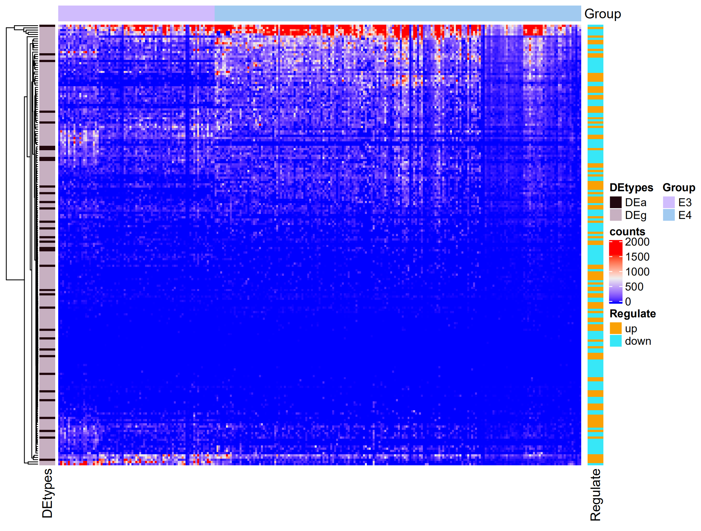
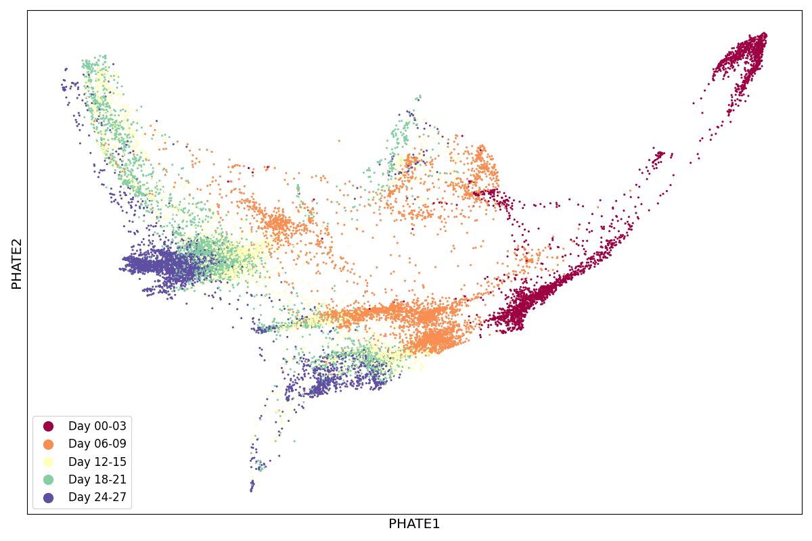

# Integrative analyses of single-cell transcriptome and regulome using sc/n-workflow

## SingleCelldataVZ


### Summarizing single-cell RNA-sequencing data with unified molecular identifiers by scumi
#### [scumi](https://bitbucket.org/jerry00/scumi-dev/src/master/)
> As for --cell_barcode_whitelist, typically you don't need to set this parameter as you don't know which cell barcodes are from cells. Note, this parameter is different from the candidate cell barcodes for protocols such as 10x or inDrops, which are know and should be used as inputs. Let me know if it's confusion.

> For the final results, you should use the depth_1_transcript, which is the UMI count matrix (PCR duplicates removed). The read_count matrix may or may not be useful for your down-stream analysis because this one is the read matrix (PCR duplicates included). 

> As for poly-Ts, for standard sequencing people typically don't sequence the poly-Ts, so you have to remove the polyT filter, otherwise you will get incorrect results. I may add some other filters, such as base-quality filter so it helps filter low-quality reads for the cases without polyT sequenced.

### Differential gene expression analysis in single-cell RNAseq
##### Installation
```r
#SigEMD 
source all scripts in https://github.com/NabaviLab/SigEMD

#DEsingle (https://github.com/miaozhun/DEsingle)
if (!requireNamespace("BiocManager", quietly = TRUE))
install.packages("BiocManager")

BiocManager::install("DEsingle")
```

> scRNA pipeline

```perl
$ perl ../scRNA.pipeline.pl 
Description: 
Version:  1.0.0
Contact: meng.luo@majorbio.com
		Framework by Meng Luo
		developed By cuili.li && Meng.Luo
Usage:
	required:
		-fqlist <file>  Input file with sample name,the path of raw data and the path of R2
		-ref  <dir>     the dir with reference Genome and other files
		-outdir <dir>   output dir
		-dsh    <dir>   output work sh
		-queue  <str>   DNA or RNA ,defult RNA
		-cellrefdir  <dir>	the dataset of singleR
		-sample <str> <single> sample or <multiple> samples
	Optional:
		-cellref	<str>   the Ref dateset of SingleR for celltype identification,default hpca
		-minRNA	<num>   Default 200, the Min features filtered in Seurat
		-maxRNA	<num>   Default 2500, the Max features filtered in Seurat
		-mito	<num>   Default 5, the mito percent filtered in Seurat
		-marker	<str>   Default "wilcox", the Parament for FindAllmarker in Seurat,optional "wilcox","bimod","roc","t","negbinom","poisson","LR","MAST","DESeq2"
		-logfc	<num>   Default 0.25, limit testing to genes which show
		-mem <num>   Default 100, THE MEMORY 
		-cpu <num>   Default 8, THE threads
		-species <str> Default human ,currently only used to mouse and human data analysis
		-step	<num>	pipeline control
		-stop	<num>	stop step
		-protocols <str> default cellranger, or scumi
		-polyT <none>   If there are poly-T sequences after the cell barcodes in read1. scumi will look at the poly-T sequences from base 19 to base 23
		-RTbarcode <none>	If the set of cell barcode whitelists is known, scumi can only consider these cell barcodes by specifying --cell_barcode_whitelist
		-h		Help
```

> DEG.single.R Pipeline

```shell
$Rscript DEG.single.R
Usage: DEG.single.R [-[-count|c] <character>] [-[-rpkm|r] [<character>]] [-[-group|g] <character>] [-[-perm|p] [<character>]] [-[-imput|i] [<character>]] [-[-outdir|o] <character>] [-[-help|h]]
Contact: meng.luo@majorbio.com

Usage example:
       Rscript DEG.single.R --count filename --rpkm filename --group filename
Usage:
    --counts counts file name
          --rpkm rpkm file name
          --group group info
    --perm permutation test for SigEMD method,default is 100
    --imput imputatiom expression data for SigEMD method or not,default is not
          --outdir result director
          --help                usage
```
#### Results VZ
<div align="center"><a href=""></a></div>
<div align="center"><a href=""></a></div>


#### References
> T. Wang and S. Nabavi, "Differential gene expression analysis in single-cell RNA sequencing data," 2017 IEEE International Conference on Bioinformatics and Biomedicine (BIBM), Kansas City, MO, 2017, pp. 202-207.

> Zhun Miao, Ke Deng, Xiaowo Wang, Xuegong Zhang, DEsingle for detecting three types of differential expression in single-cell RNA-seq data, Bioinformatics, Volume 34, Issue 18, 15 September 2018, Pages 3223–3224, https://doi.org/10.1093/bioinformatics/bty332

#### PHATE (Potential of Heat-diffusion for Affinity-based Transition Embedding) to analyze and DataVZ

##### Installation
```r
#phateR (http://htmlpreview.github.io/?https://github.com/KrishnaswamyLab/phateR/blob/master/inst/examples/bonemarrow_tutorial.html)
if (!require(viridis)) install.packages("viridis")
if (!require(ggplot2)) install.packages("ggplot2")
if (!require(readr)) install.packages("readr")
if (!require(Rmagic)) install.packages("Rmagic")
if (!require(ggsci)) install.packages("ggsci")
```
```shell
#phate(https://nbviewer.jupyter.org/github/KrishnaswamyLab/PHATE/blob/master/Python/tutorial/EmbryoidBody.ipynb)
$pip install --user --upgrade phate scprep 

```

> phateR.VZ.R Pipeline

```shell
$Rscript phateR.VZ.R
Usage: phateR.VZ.R [-[-count|c] <character>] [-[-rpkm|r] [<character>]] [-[-group|g] <character>] [-[-dim|d] [<character>]] [-[-outdir|o] <character>] [-[-help|h]]
Contact: meng.luo@majorbio.com

Usage example:
       Rscript phateR.VZ.R --count filename --group filename
Usage:
    --count count file name
          --rpkm rpkm file name
          --group group info
    --dim the dimension for phate results, default is 3
          --outdir result director, default is currently dir
          --help                usage
```
> phate.pipeline.py Pipeline

```shell
$python3 phate.pipeline.py
usage: phate.pipeline.py [-h] -d DIRNAME -f FILENAME
phate.pipeline.py: error: the following arguments are required: -d/--dirname, -f/--filename
```
#### Results VZ

<div align="center"><a href=""></a></div>
<div align="center"><a href=""></a></div>


#### learning Video 

<iframe src="//player.bilibili.com/player.html?bvid=BV1hF411a7He&page=1" height="600" width="800" scrolling="no" border="0" frameborder="no" framespacing="0" allowfullscreen="true"> </iframe>

#### References
> Moon, K.R., van Dijk, D., Wang, Z. et al. Visualizing structure and transitions in high-dimensional biological data. Nat Biotechnol 37, 1482–1492 (2019). https://doi.org/10.1038/s41587-019-0336-3


