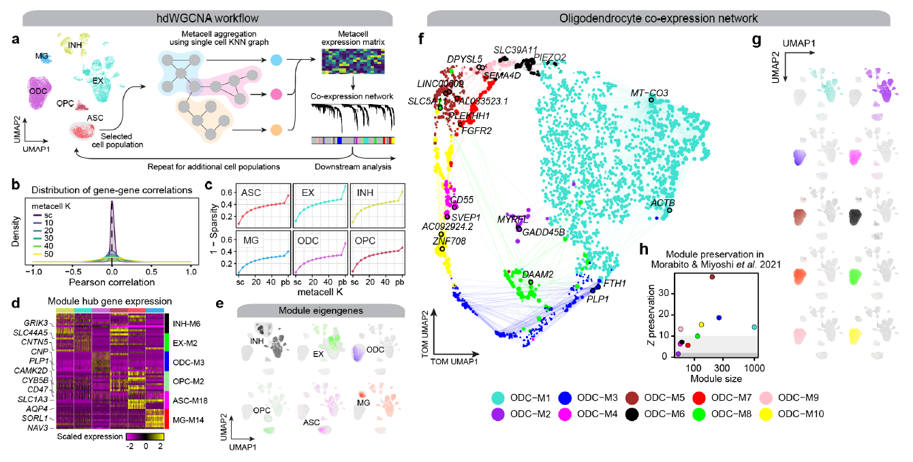
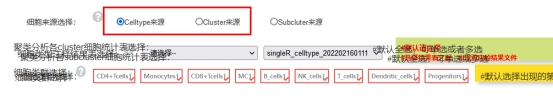
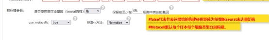
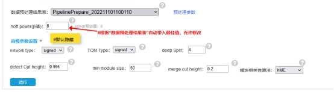
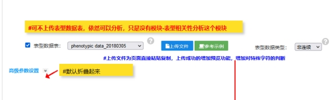
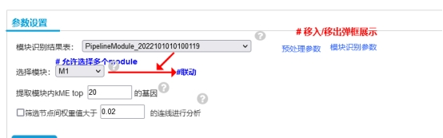
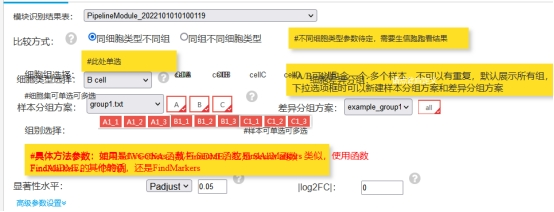
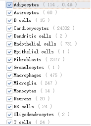
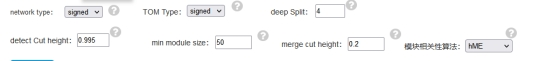

# The workflow of hdWGCNA analysis for Single-cell Spatial Transcriptomics data

##  The workflow of hdWGCNA analysis for Single-cell Spatial Transcriptomics data




空间转录共表达网络分析流程

分析思路：针对数据的不同，分两种情况，当前流程不能进行多个样本分析，如果要分析需要针对过个样本的重新修改脚本（可以直接合并或者单独分析），目前的思路是分析单个样本的同单细胞分析一样的做法，多个样本需要（merge rds），再进行分析：

1，如果从原始count开始处理（针对spaceranger获得的结果），则只能按照cluster进行WGCNA分析，我们前期数据的过滤及分析目前写的脚本只能分析人和鼠的物种；

2，提供rds分析的结果及细胞注释结果，如果提供合并后的结果，同时有细胞注释的结果则也可以按照细胞注释的结果进行分析。

分析内容：数据预处理；模块识别；模块表型相关；hub基因可视化；差异模块分析

 

***\*基于以上做好的数据准备：\****

***\*1，包含多个样本（样本得必须单独分开分析，只不过需要吧几个样本都放在一个object里面），数据已经进行常规的分析，但是没有细胞注释。\****

**2，*****\*包含多个样本，数据已经进行常规的分析，同时有注释信息的结果。\****

**3，*****\*分析则可以按照样本来进行分析，不依赖细胞类型及聚类分析来进行分析，这个根据给的分组情况来选择（分组中也有不同的细胞类型，虽然是一起分析的，但是可以按照样本来划分从而进行分析）。\****

**4，*****\*先过滤样本，然后再使用metaspot（同metacell）的方法来构建所有的关系，但是这里如果构建得基于你的数据，比如聚类的结果，或者不同样本间的关系，然后再往下构建WGCNA的分析。\****

**5，*****\*如果是空间转录的常规分析推荐使用SCT的方法做标准化处理前期的数据\*******\*，和后面不同标准化的方法不同，根据空间的分析，最好使用SCT的处理来进行分析。Metaspot（可以按照每个细胞类型或者聚类的分类结果来进行分析） 之后，总的原本spot会减少很多，后续的获得的spot也会变得更少或许就几十个（小于50则会剔除）。\****

**6，*****\*空间转录用SCT的数据没有问题，seurat官方推荐使用，做WGCNA没有像单细胞那种做power遇到问题，就是power值，很难能到达0.8。\*******\*（kME计算时间很长和单细胞的不同，多个循环harmony计算的时间很长（最多10个），难于收敛（超过一天的计算都有可能）\*******\*）\****

**7，*****\*作图说明：如果分的模块很多的情况下，有些可视化的图需要修改输出的size，加大\****

 

一、运行流程

Rscript4.2 /mnt/ilustre/users/meng.luo/project/RNA/scRNA/hdWGCNA/spatial/hdWGCNA_ST_pipeline.R

 

参考分析路径：/mnt/ilustre/users/meng.luo/project/RNA/scRNA/hdWGCNA/spatial

 

根据不同的分析模块，给出对应不同的灵活分析参数，正常情况按照默认的运行没有问题。

具体参数（运行需要加载相应的代码（网络图做了更改）bin路径下，所以运行脚本时需要给脚本的绝对路径）：

```r
Rscript4.2 /mnt/ilustre/users/meng.luo/project/RNA/scRNA/hdWGCNA/spatial/hdWGCNA_ST_pipeline.R --rds mouse_brain_ST_anterior.rds --cellfile cells.csv 
详细参数：
Options:
	-P PREDATA, --predata=PREDATA
		PROCESSED spatial data

	-H OUTSPATH, --outsPath=OUTSPATH
		Input spaceRanger outs pathway

	-j SLICE, --slice=SLICE
		spatial image name

	-J SPECIES, --species=SPECIES
		species name (human or mouse)

	-Z SCTRANSFORM, --SCTransform=SCTRANSFORM
		SCTransform on single-cell data

	-r RDS, --rds=RDS
		Input rds file

	-g GENESELECT, --geneselect=GENESELECT
		 the gene selection approach variable( VariableFeatures) fraction (default) all  or  custom(gene_list)

	-f FRACTION, --fraction=FRACTION
		 fraction of cells that a gene needs to be expressed in order to be included

	-l LIST, --list=LIST
		 gene selection approach custom and give the custom gene list

	-c CELLFILE, --cellfile=CELLFILE
		cell annotation file

	-e CELL, --cell=CELL
		cell name

	-t SEURATCLUSTER, --seuratcluster=SEURATCLUSTER
		use the default seurat clusters

	-u CLUSTER, --cluster=CLUSTER
		seurat clusters number

	-o OUTDIR, --outdir=OUTDIR
		output folder name

	-d REDUCTION, --reduction=REDUCTION
		reduction A dimensionality reduction stored in the Seurat object. Default umap

	-m MODE, --mode=MODE
		determines how to make gene expression profiles for metaspots from their constituent single cells. Options are "average" or "sum".

	-i MIN_SPOTS, --min_spots=MIN_SPOTS
		the minimum number of spots in a particular grouping to construct metaspots

	-y METACELLS, --metacells=METACELLS
		use metacell or not

	-v SOFT, --soft=SOFT
		softpower VALUE

	-x MAXBLOCKSIZE, --maxBlockSize=MAXBLOCKSIZE
		integer giving maximum block size for module detection 

	-T CORTYPE, --corType=CORTYPE
		pearson and bicor  corresponding to Pearson and bidweight midcorrelation  respectively

	-N NETWORKTYPE, --networkType=NETWORKTYPE
		network type Allowed values are (unique abbreviations of) unsigned signed signed hybrid

	-M TOMTYPE, --TOMType=TOMTYPE
		Allowed values are (unique abbreviations of)  unsigned signed signed hybrid

	-U MINMODULESIZE, --minModuleSize=MINMODULESIZE
		minimum module size for module detection

	-I MERGECUTHEIGHT, --mergeCutHeight=MERGECUTHEIGHT
		dendrogram cut height for module merging

	-L DETECTCUTHEIGHT, --detectCutHeight=DETECTCUTHEIGHT
		dendrogram cut height for module detection

	-V GBV, --gbv=GBV
		chose the hME(default) or ME

	-S SCALE.MODEL.USE, --scale.model.use=SCALE.MODEL.USE
		 linear poisson or  negbinom 

	-F CORFNC, --corFnc=CORFNC
		character string specifying the function to be used to calculate co-expression similarity  Defaults to Pearson correlation

	-C COROPTIONS, --corOptions=COROPTIONS
		Use use =  p   method =  spearman  to obtain Spearman correlation 

	-E SCORES, --scores=SCORES
		Compute hub gene signature scores

	-D METHOD, --method=METHOD
		compute gene scores for a give number of genes for each module || using either the Seurat or UCell algorithm

	-W NETWORK, --network=NETWORK
		Network Visualization OR NOT 

	-w TRAIT, --trait=TRAIT
		input trait.txt file

	-X TRT, --trt=TRT
		Module Trait Correlation or not

	-G DME, --dme=DME
		Differential module eigengene (DME) analysis

	-R CHARACTER, --group=CHARACTER
		sample group information file name with header: sample<tab>group

	-A CHARACTER, --compare=CHARACTER
		group comparison information file name with header: control<tab>case

	-h, --help
		Show this help message and exit
```

二、分析模式（当前是按照单细胞的模型来进行）

当前数据分析的选择（只有以下两种，无subcluster（这里也就是cell Type 的小分类，如果分析结果文件中有对应的注释信息，也直接根据cell type来选就行，我觉得这个不用加都可以））当前只针对一个样本的，数据进行分析，如果是多个样本，最好还是直接提供rds合并好的数据进行分析，如果提供多个样本，分析时也需要按照样本分析的话，需要更新脚本。

 

 

1，分析所有的细胞类型（进行常规分析，默认用hme的方法进行）：

数据路径：/mnt/ilustre/users/meng.luo/project/RNA/scRNA/hdWGCNA/spatial/brain

Rscript4.2 /mnt/ilustre/users/meng.luo/project/RNA/scRNA/hdWGCNA/spatial/hdWGCNA_ST_pipeline.R --rds mouse_brain_ST_anterior.rds --cellfile cells.csv 

 

2, 用me的方法构建：

数据路径：/mnt/ilustre/users/meng.luo/project/RNA/scRNA/hdWGCNA/spatial/brain

Rscript4.2 /mnt/ilustre/users/meng.luo/project/RNA/scRNA/hdWGCNA/spatial/hdWGCNA_ST_pipeline.R --rds mouse_brain_ST_anterior.rds --cellfile cells.csv --gbv F 

 

3, 用me的方法构建,只做某一类细胞，比如“Caudoputamen”：

数据路径：/mnt/ilustre/users/meng.luo/project/RNA/scRNA/hdWGCNA/spatial/brain

Rscript4.2 /mnt/ilustre/users/meng.luo/project/RNA/scRNA/hdWGCNA/spatial/hdWGCNA_ST_pipeline.R --rds mouse_brain_ST_anterior.rds --cellfile cells.csv --gbv F --cell Caudoputamen

 

4, 使用seurat的分类结果（默认也是“hME”），全部一起分析：

数据路径：

/mnt/ilustre/users/meng.luo/project/RNA/scRNA/hdWGCNA/spatial/DD073R_A1_processed

Rscript4.2 /mnt/ilustre/users/meng.luo/project/RNA/scRNA/hdWGCNA/spatial/hdWGCNA_ST_pipeline.R --outsPath outs/ --seuratcluster T --predata T

 

5, 使用seurat的分类结果,某一类的结果比如，“0”（“ME”）：

Rscript4.2 /mnt/ilustre/users/meng.luo/project/RNA/scRNA/hdWGCNA/hdWGCNA_SC_pipeline.R --rds Merged_Seurat.rds --gbv F --seuratcluster T --cluster 0 --predata T

 

 

 

数据预处理，以下是默认参数，可以自己调整（参考单细胞）

 

 

模块构建，以下是默认参数，可以自己调整

 

如果不给表型，默认做RNA的基因数及count值的关联

 

 

Hub基因可视化，这个结果都有，只不过需要看，你前期运行的是当个细胞或者是多个细胞的结果，数据体层需要提前

 

 

模块差异分析，指的是每个细胞中的模块差异，如果不提供分组信息，则默认按照所有的样本来进行比较分析（不同细胞类型），需要看选择的细胞类型，

 

 

 

三、分析流程分析的一些详情

1, 数据情况

不管几个样本都可以做，几个样本对应的就是spot，还有就是针对的是样本来做WGCNA，使用 Metaspot（也和metacell是一样的，但是每个spot可能包含1-10个cell）。可以使用不同样本之间进行分析（单个样本进行），或者就是合并数据之后得数据得分析结果比如聚类分析结果或细胞类型结果（不管是几个样本，都是一起分析的）。结果不好的项目的情况，获得的细胞注释的结果很少，比如一个细胞注释的结果是不到50个spot，那都是直接剔除的，但是我们参数可以设置。这个的分析思路和metacell一样，使用metacell最小是10个（最大的share 100，小于200以下可以考虑不做，做完的metacell可能没有结果，如果少于10个就不用进行分析了(不建议用SCT的方法，这个构建模型的时候获得的power很难达到0.8)。

 

 

2, soft-power

根据文献中的要求，默认选择的阈值是R2只超过0.8以上的第一个值作为软阈值。

3, Construct co-expression network

当前的分析都是按照，单个细胞进行共表达网络构建，这里的参数可以考虑如下，默认的参数都是按照文章中的一些参数，所以这些也是可以调整，其中明显影响的参数是merge cut hgiht.

 

 

4, Module Eigengenes and Connectivity

模块的特征基因和连通性分析注意分两种情况，模块相关的算法：hme和me（目前这两种方法结果会有出入，最好的选择是hme，使用harmany的包进行矫正后的数据进行分析，结果获得的R2值比me的会更高），根据hme或者me的结果，我们可以获得hub基因，这里提供了两种计算方法，来计算hub基因的得分。这里也可以获得模块间的相关。（针对空间转录的结果，harmany很难收敛，计算的时间会很长）

 

5, Module Trait Correlation

如果不提供性状，默认分析''nCount_Spatial'和 'nFeature_Spatial"。

 

6, Differential module eigengene (DME) analysis

差异模块分析，可以根据不同样本（比如，control和condition），此外如果不提供比较差异的分组信息，默认做所有的样本进行分析。

 

#### learning Video 

<iframe src="//player.bilibili.com/player.html?aid=491204967&bvid=BV1SN411H7Yq&cid=1272089296&p=1" height="600" width="800"scrolling="no" border="0" frameborder="no" framespacing="0" allowfullscreen="true"> </iframe>

#### References

> Gusev, A., Ko, A., Shi, H. *et al.* Integrative approaches for large-scale transcriptome-wide association studies. *Nat Genet* **48**, 245–252 (2016). https://doi.org/10.1038/ng.3506


