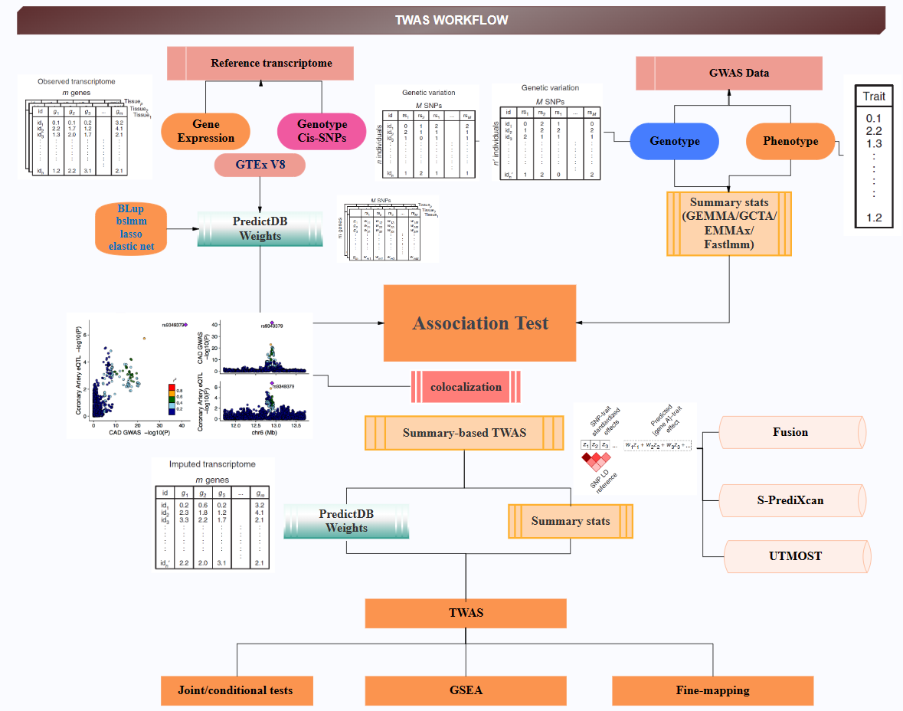
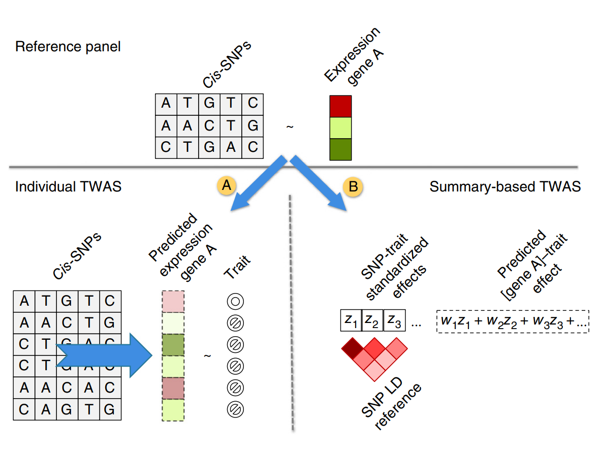
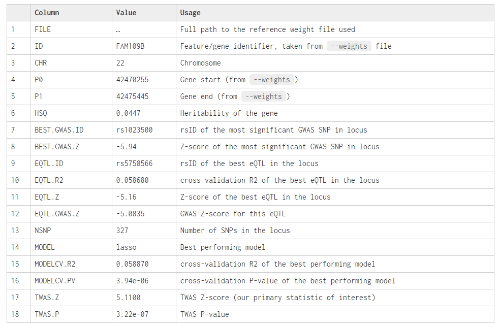
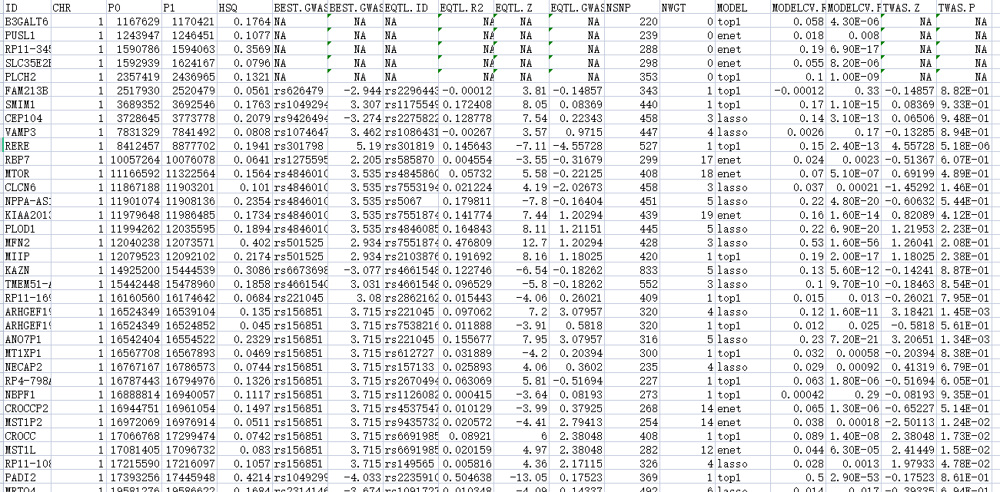
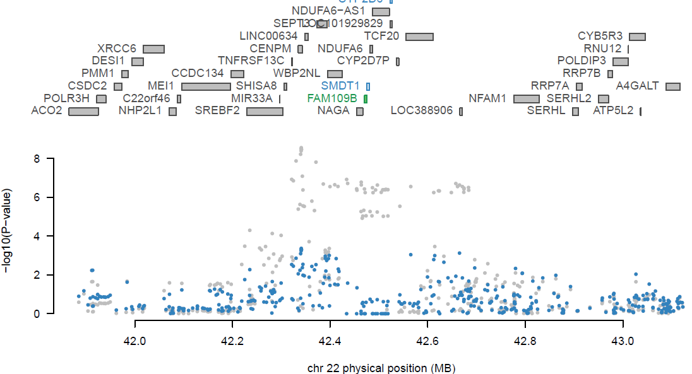
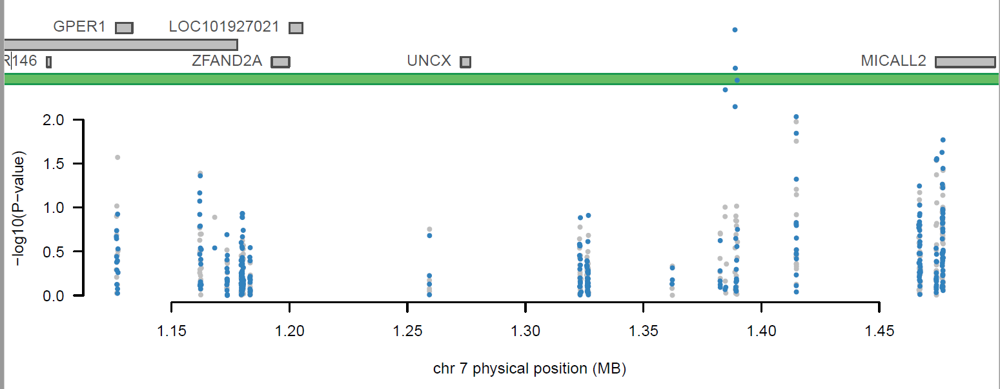
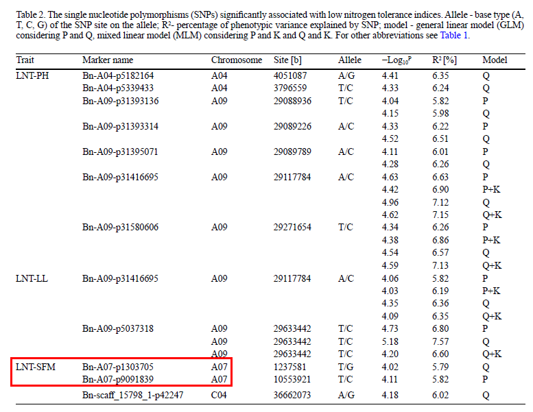
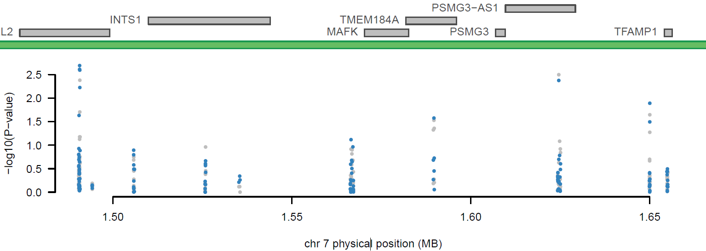

# Integrative approaches for large-scale transcriptome-wide association studies

##  The workflow of TWAS analysis

G/TWAS简介

全基因组关联分析(Genome-wide association study, GWAS) 的目的是将复杂性状的研究从候选基因转向全基因组水平，以期用更大规模的检测得到与表型变异相关的每一个基因。将基因组关联分析（Genome-Wide Association Studies，GWAS）与基因表达数据集整合，研究基因-性状的关联性，找出与性状变异最为相关的基因。用表达数量性状基因座（expression QuantitativeTrait Loci，eQTL）的mRNA/蛋白质(protein)的表达水平与数量性状的比例关系来研究遗传突变与基因表达的相关性；并将eQTL分析作为一种过渡，即遗传突变->基因表达变化->表型，来阐释突变导致表型变异的原理。

目前该方法只基于GWAS汇总统计的结果和基于基因预测的结果来进行关联分析（目前分析软件是用FUSION（http://gusevlab.org/projects/fusion/）来进行分析）。

 

TWAS分析方法（图1）：

 

\1. 直接估计基因表达效应大小(eQTL)，建模所有snp (BLUP)，或建模snp和效应大小(BSLMM)或（TOP1/LASSO/Elastic-net）。(小群体)

\2. 基于个体基因型使用评估的效应大小直接预测其基因型样本的表达，并测量预测表达与性状之间的关联（大群体）。或间接估计预测表达与性状之间的相关性，作为snp -性状标准化效应量的加权线性组合，同时考虑snp之间的LD（连锁）。

计算例子：

Psychiatric Genomics Consortium (PGC)（Schizophrenia 例子1）数据来源精神病相关（ssGWAS 36,989 cases and 113,075 controls）和GTEx v8 (全血的数据1,264 X 4,701)  PGC Schizophrenia summary statistics to perform a TWAS with the GTEx whole-blood data

Psychiatric Genomics Consortium (PGC)（例子1）一个基因座中识别多个相关基因(或来自多个组织的相同基因)，我们希望识别哪些是条件独立的（Joint/conditional tests and plots）或 （Fine-mapping multiple TWAS associations at a locus）

一个基因座中识别多个相关基因(或来自多个组织的相同基因)，我们希望识别哪些是条件独立的（Joint/conditional tests and plots）或 （Fine-mapping multiple TWAS associations at a locus）

 

#### learning Video 

<iframe src="//player.bilibili.com/player.html?aid=595172924&bvid=BV12q4y1Y7HD&cid=563007802&p=1" height="600" width="800" scrolling="no" border="0" frameborder="no" framespacing="0" allowfullscreen="true"> </iframe>

#### References

> Gusev, A., Ko, A., Shi, H. *et al.* Integrative approaches for large-scale transcriptome-wide association studies. *Nat Genet* **48**, 245–252 (2016). https://doi.org/10.1038/ng.3506

