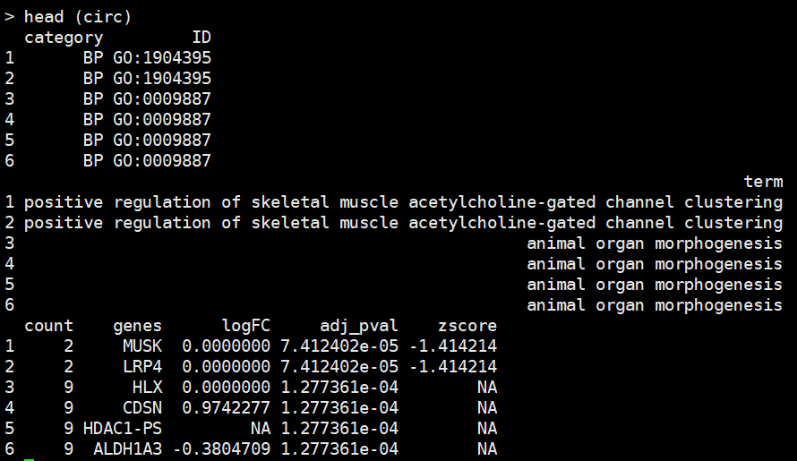
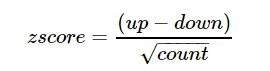
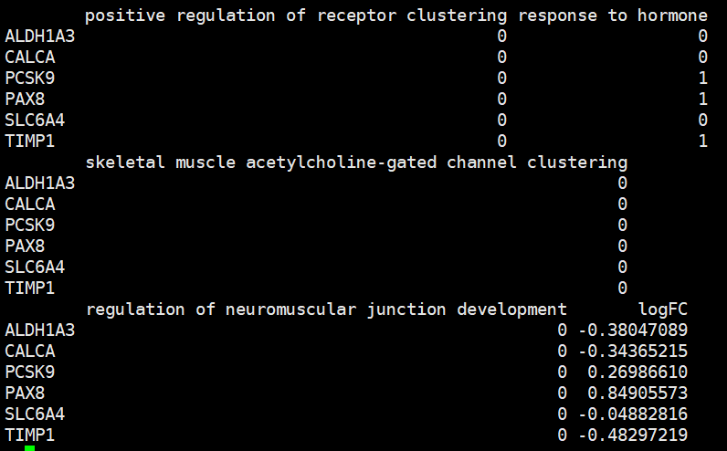
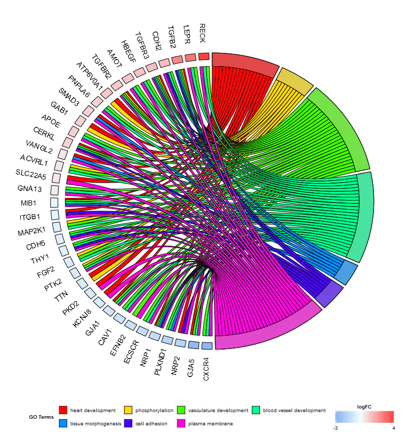
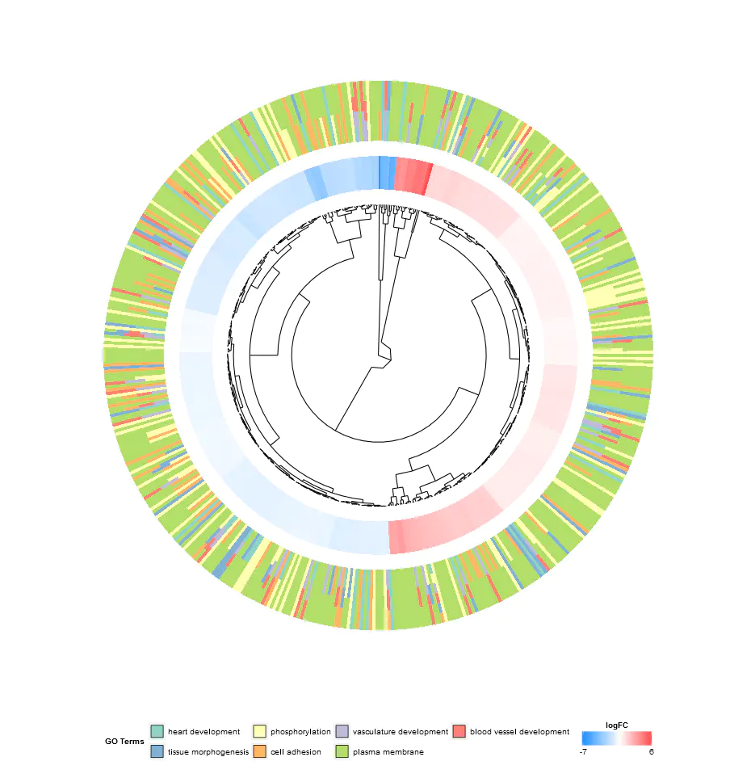
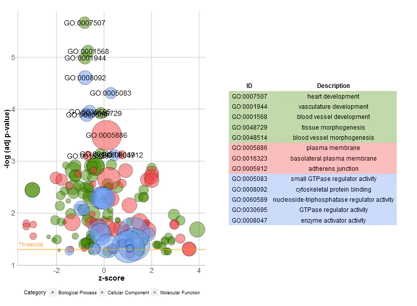
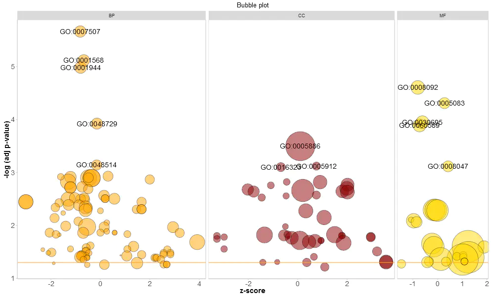
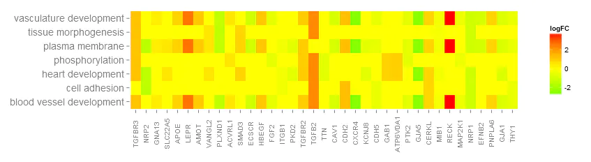
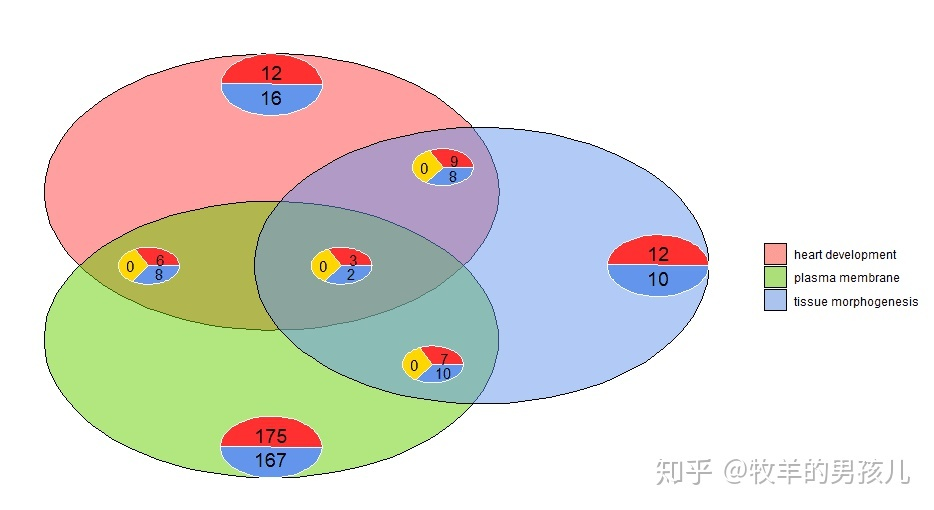
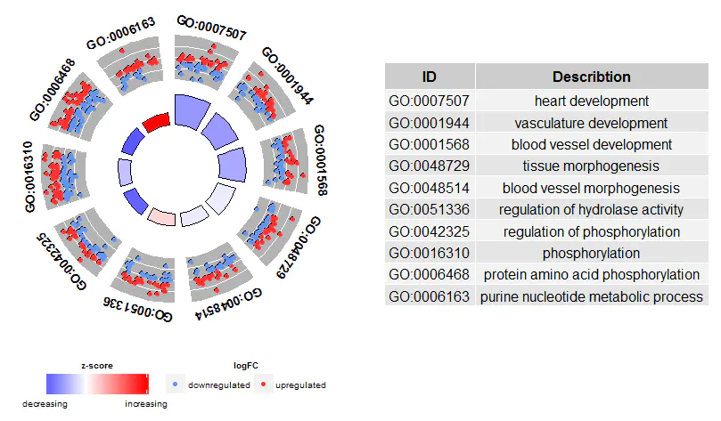

# visually combining expression data with functional analysis

# **富集和弦图**


**功能富集分析**，是指借助各类数据库和分析工具进行统计分析。挖掘在数据库中与我们研究的生物学问题具有显著相关性的功能类别，**期望发现在生物学过程中起关键作用的生物通路,从而揭示和理解生物学过程的基本分子机制。**其中GO富集分析就是重要的一个内容。

R包**GOplot**基于ggplot2增强图形化展示。它利用任何通用富集分析的输出，并在不同细节层次上产生图像：从总览最富集的类别（条形图、气泡图），到在一套给定类别中展示不同类型分子信息的更详细视图（环形图、弦图、聚类图）。

参考文献：

1 . Walter, W., Sánchez-Cabo, F., & Ricote, M. (2015). *GOplot: an R package for visually combining expression data with functional analysis: Fig. 1. Bioinformatics, 31(17), 2912–2914.* doi:10.1093/bioinformatics/btv300

## 导入包

```
library(GOplot)
```

## 参数传递

```
argv <- arg_parser('')
argv <- add_argument(argv,"--file1", help="the enrichment list")
argv <- add_argument(argv,"--file2", help="the genefc file")
argv <- add_argument(argv,"--type", help="go or kegg")
argv <- parse_args(argv)

file1 <- argv$file1
file2 <- argv$file2
type <- argv$type
```

- file1:导入云平台富集结果，例如：go_enrich_stat.xls  或者 kegg_enrich_stat.xls

- file2:导入差异分析结果中的“gene_name"和"log2fc"两列，主要是画图需要用到log2fc值，如果没有该值则默认log2fc为0，file2可有可无
- type:如果是go富集结果, type为go, 如果是kegg富集结果，type为kegg

## R颜色导入

```
color <- grDevices::colors()[grep("gr(a|e)y", grDevices::colors(), invert = T)]
```

##  整理go和kegg信息

导入go或者kegg富集结果后，根据pajd和pvalue排序，然后选取必要的数据构建数据框

```
if (type == 'go'){
    enrich_f <- read.table(file1, sep = "\t", header = T, check.names = F)  ##导入数据
    enrich_o <- enrich_f[order(enrich_f$p_corrected, enrich_f$p_uncorrected), ]   ##排序
    enrich_r <- data.frame(Category = enrich_o$go_type, ID = enrich_o$go_id, Term = enrich_o$discription, Genes = gsub(";", ", ", enrich_o$seq_list_name), adj_pval = enrich_o$p_uncorrected)  ##构建数据框
}

if (type == 'kegg'){
    enrich_f <- read.table(file1, sep = "\t", header = T, comment.char = "")  ##导入数据
    enrich_o <- enrich_f[order(enrich_f$Corrected.P.Value, enrich_f$P.Value), ]  ##排序
    enrich_r <- data.frame(Category = enrich_o$typeI, ID = enrich_o$ID, Term = enrich_o$Term, Genes = gsub("\\|", ", ", enrich_o$Genes_name), adj_pval = enrich_o$Corrected.P.Value)  ##构建数据框
}
```

## 得到log2FC

如果有file2,gene和log2fc信息则从file2中获取，如果没有file2，gene信息从富集结果中提取，log2f默认为0

```
if (!is.na(file2)){
    rt2 <- read.table(file2, sep = "\t", header = T, col.names = c("gene_name","log2fc"))
    genelist <- data.frame(ID = rt2$gene_name, logFC = rt2$log2fc)
    row.names(genelist) <- genelist[, 1]
}else {
    genes <- unique(unlist(strsplit(as.character(enrich_r$Genes), ", ")))
    genelist <- data.frame(ID = toupper(genes), logFC = 0 )
    row.names(genelist) <- genelist[, 1]
}
```

## 得到最终绘制图片所需数据集

```
circ <- circle_dat(enrich_r, genelist)
termNum1 = 10                                     #限定GO数目（仅展示前10）
termNum1=ifelse(nrow(enrich_r)<termNum1,nrow(enrich_r),termNum1)
chord1 <- chord_dat(circ, genelist, enrich_r$Term[1:termNum1])

termNum2 = 20                                     #限定GO数目（仅展示前20）
termNum2=ifelse(nrow(enrich_r)<termNum2,nrow(enrich_r),termNum2)
chord2 <- chord_dat(circ, genelist, enrich_r$Term[1:termNum2])
```

在后续画图中主要需要用到的两个数据集为**circ** 和 **chord1**

**circ**数据集是由GOplot包的**circle_dat**函数构建，circle_dat函数需要输入两个数据框，第一个是go富集相关数据，第二个是提取logfc值的数据框，其中的genes都采用了字母大写处理，函数参数主要部分如下：

> circle_dat
> function (terms, genes) 
> colnames(terms) <- tolower(colnames(terms))
> terms$genes <- toupper(terms$genes)
> genes$ID <- toupper(genes$ID)
> tgenes <- strsplit(as.vector(terms$genes), ", ")
>
>  df <- data.frame(category = rep(as.character(terms$category), 
>             count), ID = rep(as.character(terms$id), count), 
>             term = rep(as.character(terms$term), count), count = rep(count, 
>                 count), genes = as.character(unlist(tgenes)), 
>             logFC = logFC, adj_pval = rep(terms$adj_pval, count), 
>             zscore = rep(zsc, count), stringsAsFactors = FALSE)

**circ**数据框中，将所有的富集gene按行排序，具体格式如下：



- count：GO term包含的基因数 

- zscore: 每个GO term下上调(logFC>0)基因数和下调基因数的差与注释到GO term基因数平方根的商，反映该功能所含蛋白的总体表达趋势，大于0为上调，小于0为下调，公式如下：



**chord1**数据集是由GOplot包的**chord_dat**函数构建，chord_dat函数需要输入3个数据框，函数参数：function (data, genes, process) ，第一个数据框是circle_dat函数得到的circ数据框，第二个数据框是提取logfc的数据框，第三个数据框是筛选term的数据框，整理后的data具体的格式如下：




行名是genename,列名是筛选出来的term名称和logfc

## GOChord画图画和弦图

```
p <- GOChord(chord1, 
          space = 0.001,           #基因之间的间距
          gene.order = 'logFC',    #排序基因
          gene.space = 0.25,       #基因离圆圈距离
          gene.size = 3,           #
          border.size = 0.1,     
          process.label = 7,       #GO名称大小
          lfc.col=c('firebrick3', 'white','royalblue3'),##上调下调颜色设置
         # ribbon.col=brewer.pal(length(go$Term[1:termNum]), 'Set3'),#GO term 颜色设置
  )  
```

 左侧是基因（颜色代表上下调），右侧是不同GO term，连接的带表示某基因在某GO term中 




## GOCluster画聚类圈图

```
chord <- chord_dat(circ, genelist, enrich_r$Term[1:termNum1])
p <- GOCluster(data=circ, 
          process=as.character(enrich_r[1:termNum1,3]), #选择GO term
          metric='euclidean',                    #选择距离度量方法
          clust='average',                       #选择聚类方法
          clust.by = 'term',                     #指定是否应该对基因表达模式或功能类别进行聚类。term(default)  or logFC
          term.width = 2,                        #GO term 宽度
         # term.col= color[sample(1:length(color), length(color))][1:termNum1], #颜色设置
          nlfc=FALSE,                            #是否包含多个logFC列
          lfc.col=c('firebrick3', 'white','royalblue3') #颜色设置
            )
```



从内到外依次为：基因聚类，倍数变化，GO term 

## GOBubble画气泡图

```
GOBubble(circ, title="GOBubble plot",##设置标题
        labels = 3,##-log(adj p-value)>5
        ID = T,##TRUE显示符合标准的GO term ID，FALSE显示GO term name
        table.legend = TRUE, table.col = TRUE, ##右侧表格设置                                                                                                                
        bg.col = FALSE#背景颜色设置
        )   

GOBubble(circ, display = "single", labels = 3, table.legend = F)  ##3个分类画一张图里
GOBubble(circ,title = 'Bubble plot', display = 'multiple', bg.col = T, labels = 3)  ##3个分类分开画图
```




 X轴是z-score，Y轴是adj p。3种颜色代表3大类（BP，CC，MF），一个气泡代表一个GO term，面积代表该GO term中的基因数




## GOHeat画热图

```
GOHeat(chord1, nlfc = 1, fill.col =c('red', 'yellow', 'green'))
```

*nlfc = 1*：颜色对应logFC
*nlfc = 0*：颜色对应每个基因注释了到了几个GO Term



X轴是基因，Y轴是GO term，颜色表示基因的倍数变化（logFC） 

## GOVenn画韦恩图

```
term1 <-  as.character(enrich_r[1,3])
term2 <-  as.character(enrich_r[2,3])
term3 <-  as.character(enrich_r[3,3])
l1 <- subset(circ, term == term1 , c(genes,logFC))
l2 <- subset(circ, term == term2 , c(genes,logFC))
l3 <- subset(circ, term == term3 , c(genes,logFC))

GOVenn(l1,l2,l3, label = c(term1, term2, term3))

```




 3个GO term相关基因的venn图。例如heart development和tissue morphogenesis共有4+13+1+4=22个基因，其中共同上调4+1=5个，共同下调13+4=17个

## GOCircle画圈图图

```
GOCircle(circ, nsub = 10, label.size = 5, rad1 = 3, rad2 = 4, table.legend = F)
```



从外到内依次为：GO ID；基因上下调（上调红色，下调蓝色）；z-score


