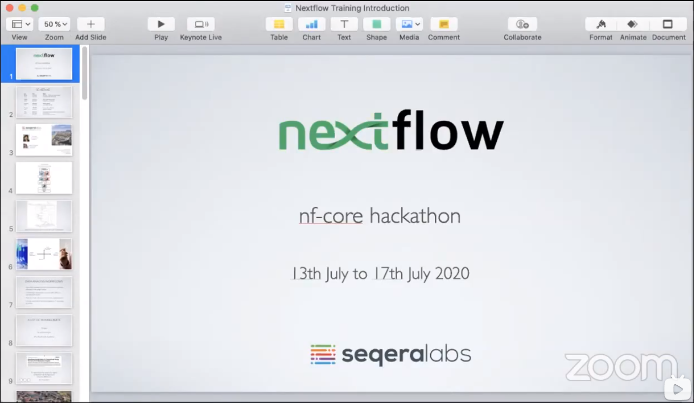
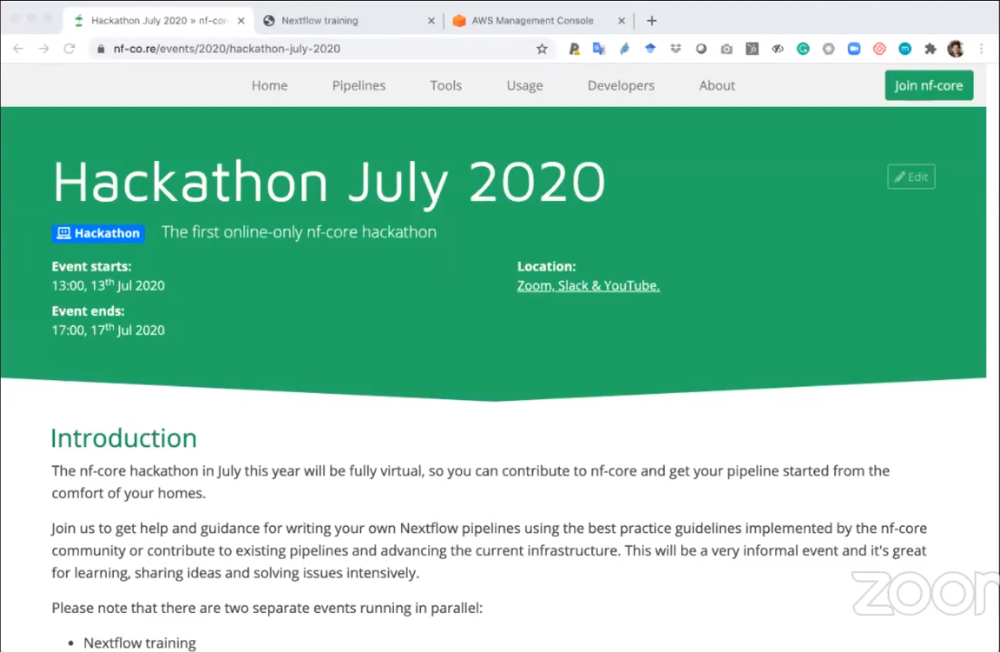
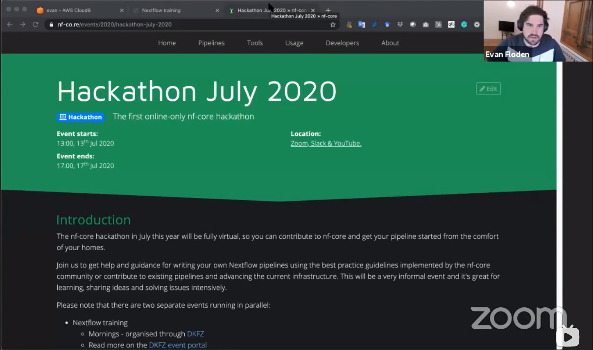
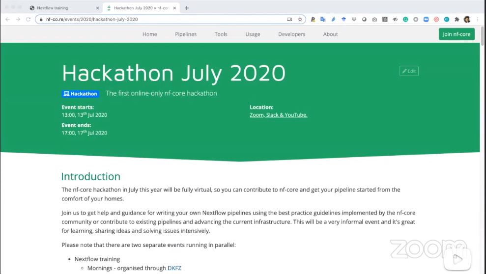

# Resource

<link rel="stylesheet" href="css/font.css">
<link rel="stylesheet" href="css/font-awesome.min.css">
<!--link rel="stylesheet" href="style.css"-->
 
<!--div align="center"></div-->

<link rel="stylesheet" href="style.css">

<h3><a href="https://seqera.io/training/" target="_blank"> Nextflow Training Workshop</a></h3>

 

This guide complements the full Nextflow documentation - if you ever have any doubts, head over to the docs located <a href="https://www.nextflow.io/docs/latest/">here.</a> 

 By the end of this course you should:

<li>Be proficient in writing Nextflow pipelines</li> 
<li>Know the basic Nextflow concepts of Channels, Processes and Operators</li>  
<li>Have an understanding of containerised workflows</li> 
<li>Understand the different execution platforms supported by Nextflow</li> 
<li>Be introducted to the Nextflow community and ecosystem</li>
 

    

        

            <iframe width="150%" height="250%" id="video_id" src="//player.bilibili.com/player.html?aid=378956828&bvid=BV17f4y1u71J&cid=435831906&page=1"
                    frameborder="0" allow="accelerometer; autoplay; encrypted-media; gyroscope; picture-in-picture"
                    allowfullscreen></iframe>
        
    
    
 
        

            

                
                
<p1>Nextflow Training Workshop - July 2020 - Day 1</p1>

                

                    
                

                
            

            

                
                
<p1>Nextflow Training Workshop - July 2020 - Day 2</p1>

                

                    
                

            

            

                
                
<p1>Nextflow Training Workshop - July 2020 - Day 3</p1>

                

                    
                

            

            

                
                
<p1>Nextflow Training Workshop - July 2020 - Day 4</p1>

                

                    
                

            

        

        

            

                
                
<p1>Nextflow Training Workshop - July 2020 - Day 5</p1>

                

                    
                

            
            

            
        

 
 

<h3><a href="../videos/nfcore" target="_blank">nf-core online courses</a></h3>

 

<h3><a href="../videos/cbw" target="_blank">CBW's Machine LEarning workshop</a></h3>

 

