# Software

<link rel="stylesheet" href="bootstrap.min.css">

<!--script src="main.js" ></!--script-->

<link rel="stylesheet" href="stylesss.css">
 

<!--div align="center"></div-->
<!--script src="https://ajax.googleapis.com/ajax/libs/jquery/3.4.0/jquery.min.js"></script-->

<h2>Hexagon Sticker for Developed R/Python Packages</h2>

<button style="color: rgb(18, 19, 18);background-color: bisque;padding: 4px 22px;font-size: 19px;font-family: 'Times New Roman', Times, serif;font-weight: bold;">2021</button>

 
 
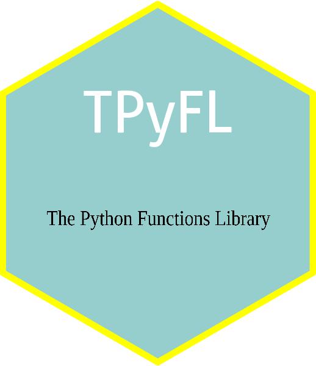
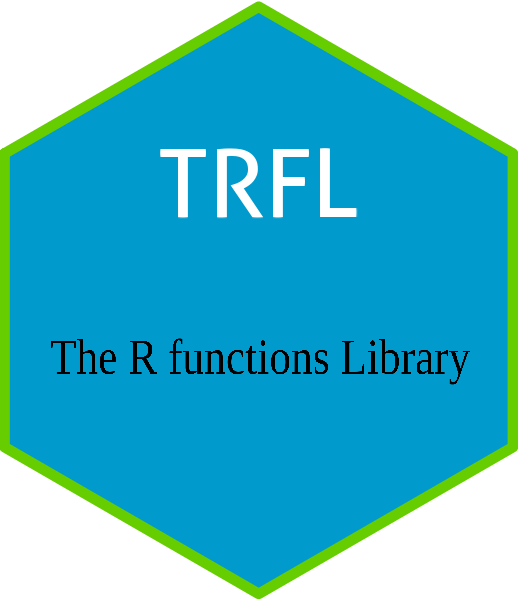
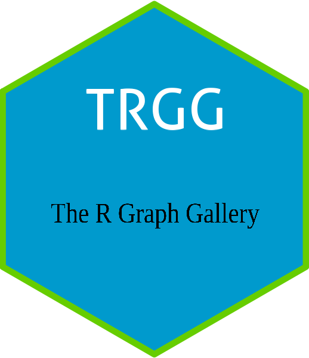
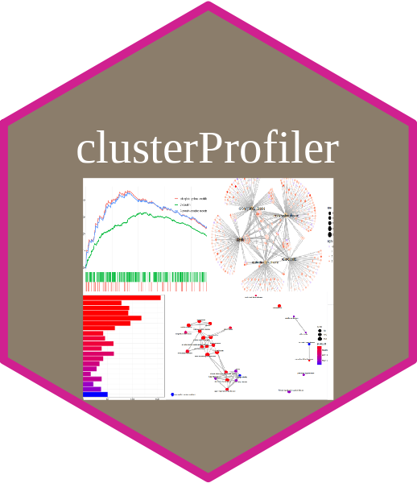
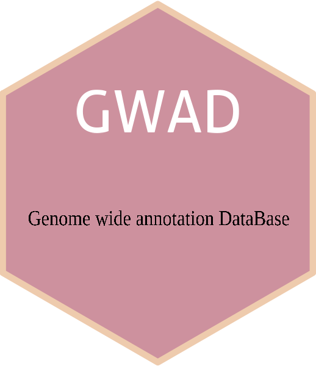
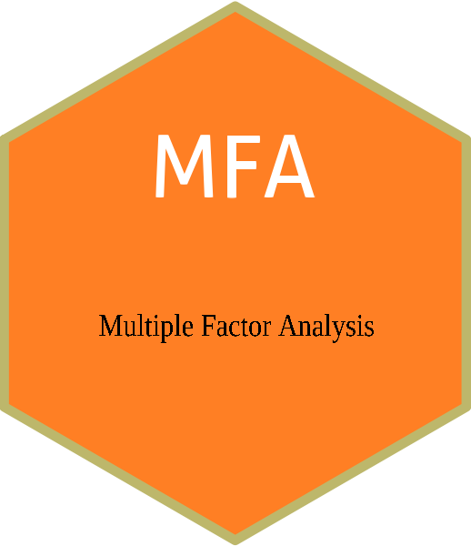
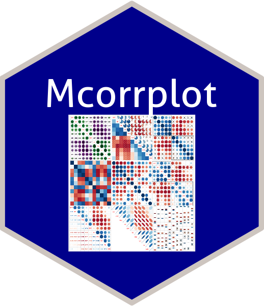

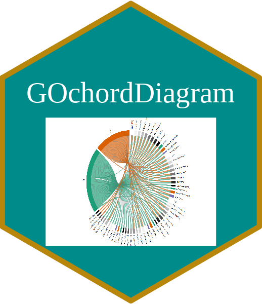
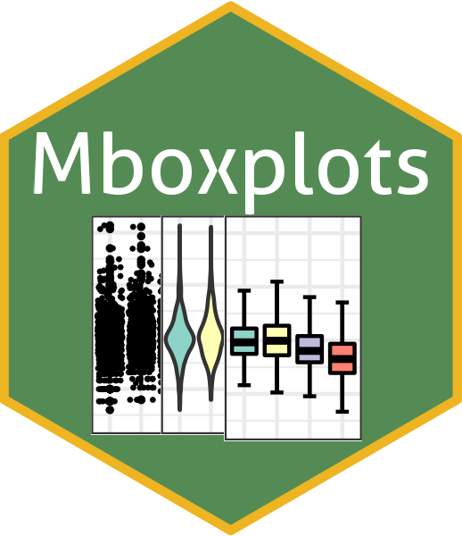
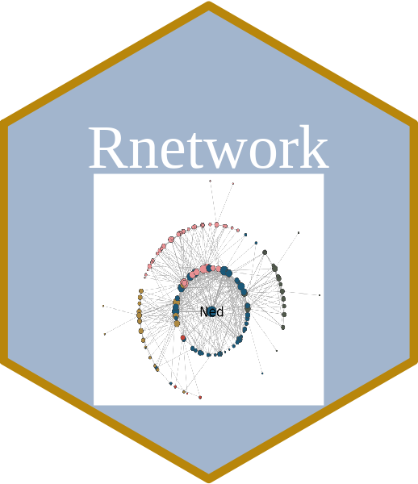
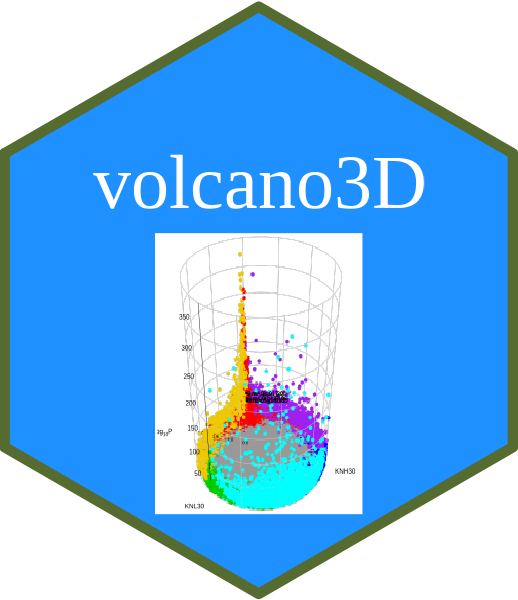
<a href="#">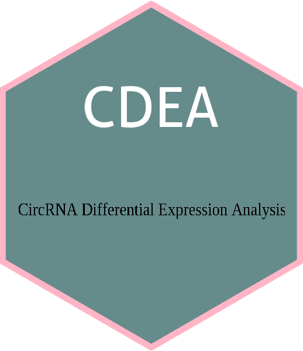</a> 
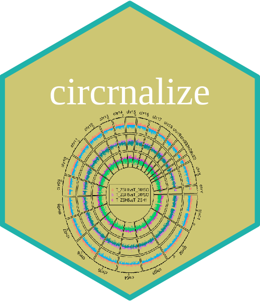
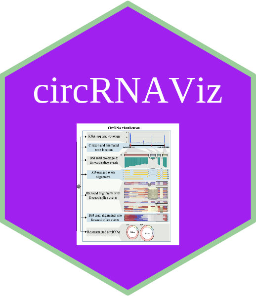
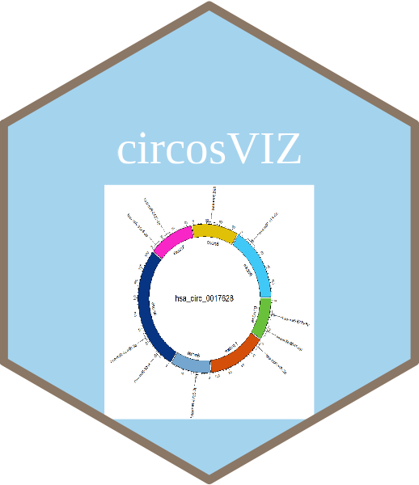
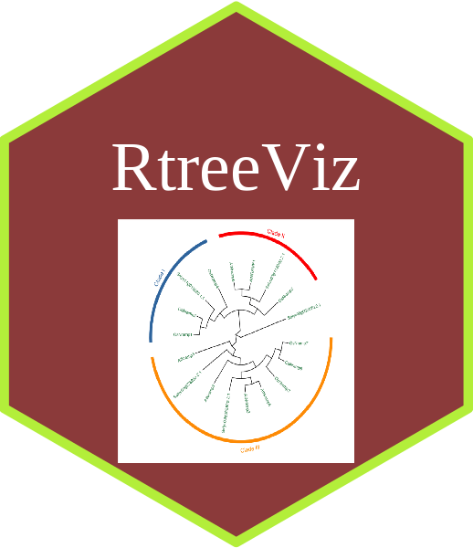

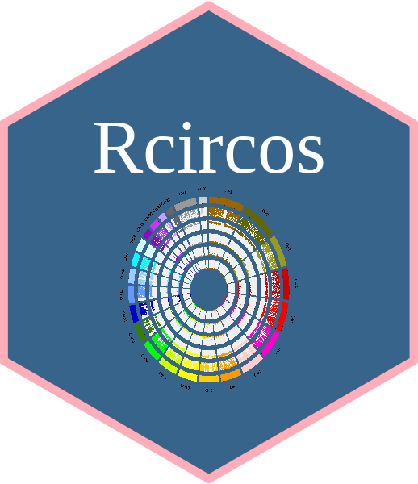
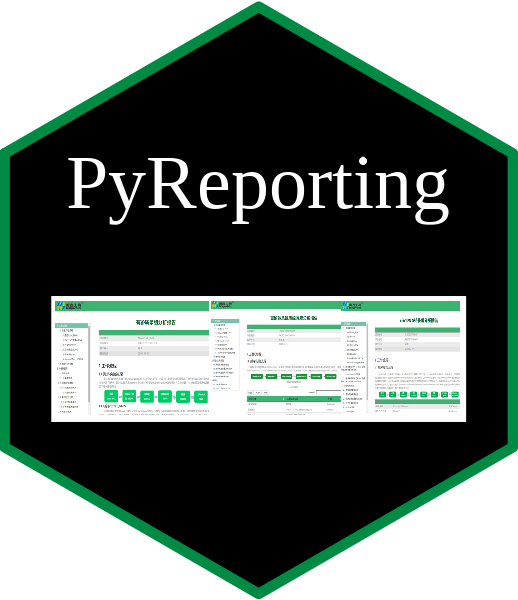
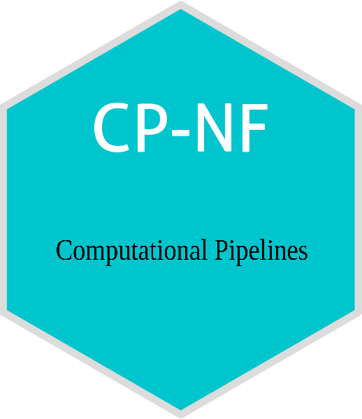
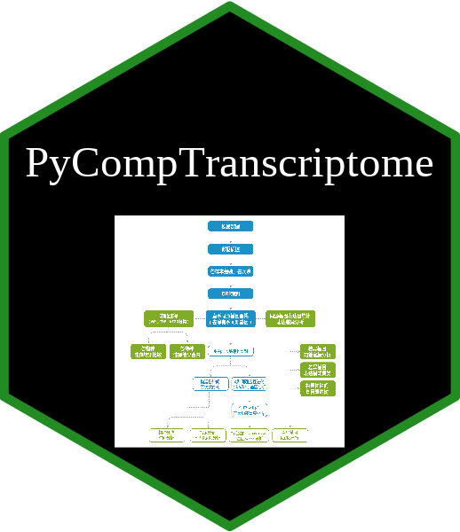
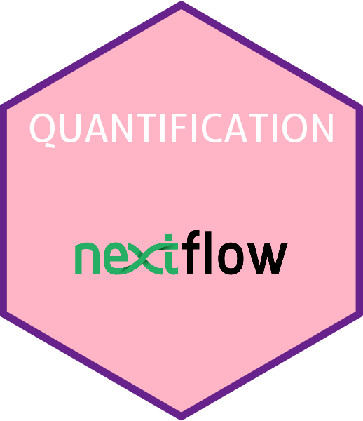
 
 
 
 
 
 

<h2>Computational Biology Workflows</h2>

 

<button style="color: rgb(18, 19, 18);background-color: bisque;padding: 4px 22px;font-size: 19px;font-family: 'Times New Roman', Times, serif;font-weight: bold;">2021</button>

    

      <!-- Row  -->
      

        <!-- Column -->
        

          <!--h2 class="my-3"></h2-->
          
        

        <!-- Column -->
        <!-- Column -->
      

      

        <!-- Column -->
        

          

            <a href="#">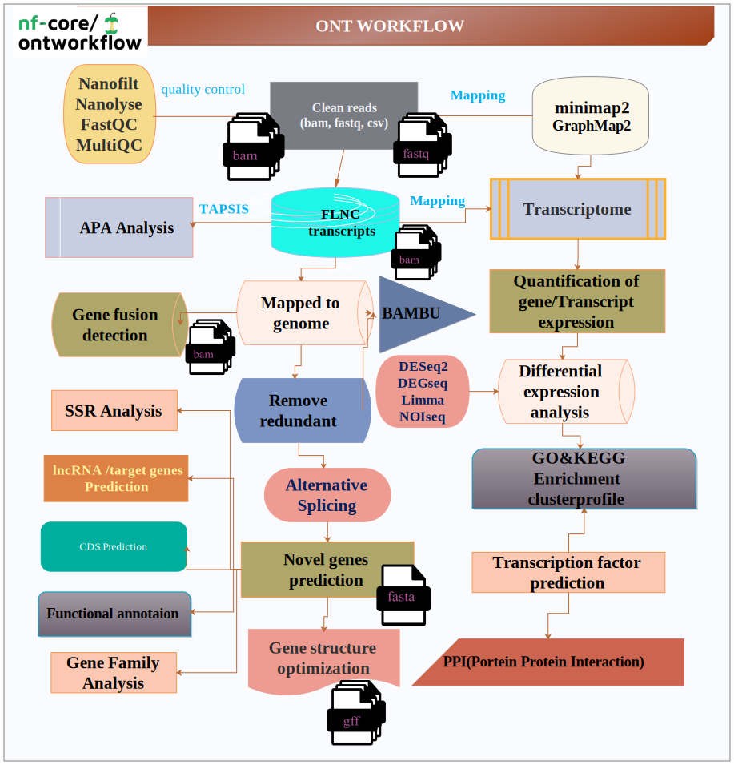</a>
            <h5 class="font-weight-medium mt-3" style="text-align: center;"><a href="https://elixir-workflow-workshop.github.io/2021/" class="text-decoration-none link">ONT Workflow</a></h5>
            <!--div class="date-pos bg-info-gradiant p-2 d-inline-block text-center rounded text-white position-absolute">Jan18</div-->
            <!--h5 class="font-weight-medium mt-3"><a href="https://www.krishnaswamylab.org/workshop" class="text-decoration-none link">Machine Learning for Single Cell Analysis</a></h5-->
            
nf-core/ontworkflow is a bioinformatics analysis pipeline for Nanopore DNA/RNA sequencing data that can be used to perform basecalling, demultiplexing, QC, mapping and downstream analysis.(Developed in MajorBio, Privated and Unpublished).

            <!--a href="https://www.krishnaswamylab.org/workshop" target="_blank" class="text-decoration-none linking text-themecolor mt-2">Learn More</a-->
            <a href="https://github.com/czheluo/nf-core-circrnaworkflow"><button style="color: rgb(18, 19, 18);background-color: rgb(8, 158, 151);padding: 4px 22px;font-size: 19px;font-family: 'Times New Roman', Times, serif;font-weight: bold;">Github </button></a>
          

        
  
        

          

            <a href="#">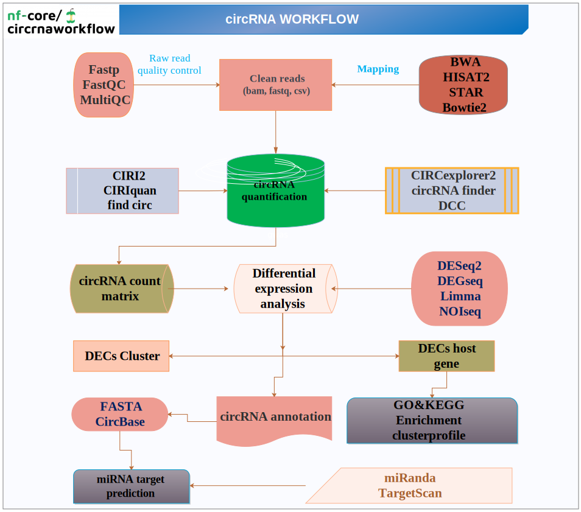</a>
            <!--div class="date-pos bg-info-gradiant p-2 d-inline-block text-center rounded text-white position-absolute">Nov29</div-->
            <h5 class="font-weight-medium mt-3" style="text-align: center;"><a href="https://elixir-workflow-workshop.github.io/2021/" class="text-decoration-none link">circRNA Workflow</a></h5>
            
nf-core/circrnaworkflow is a best-practice analysis pipeline for the quantification, miRNA target prediction and differential expression analysis of circular RNAs in paired-end RNA sequencing data (Developed in MajorBio, Privated and Unpublished).</a>

            <a href="https://github.com/czheluo/nf-core-circrnaworkflow"><button style="color: rgb(18, 19, 18);background-color: rgb(8, 158, 151);padding: 4px 22px;font-size: 19px;font-family: 'Times New Roman', Times, serif;font-weight: bold;">Github </button></a>
          

        

              
        <!-- Column -->
        <!--div class="col-md-4 on-hover">
          

            
            
Oct23

            <h5 class="font-weight-medium mt-3"><a href="#" class="text-decoration-none link">New Seminar on Newest Food Recipe from World’s Best</a></h5>
            
Business Park, Opp. Corns Sam Restaurant, New Yoark, US

            <a href="#" class="text-decoration-none linking text-themecolor mt-2">Learn More</a>
          

        

        <- Column ->
        

          

            
            
Oct23

            <h5 class="font-weight-medium mt-3"><a href="#" class="text-decoration-none link">Learn from small things to create something bigger.</a></h5>
            
Business Park, Opp. Corns Sam Restaurant, New Yoark, US

            <a href="#" class="text-decoration-none linking text-themecolor mt-2">Learn More</a>
          

        </div-->
      

    

 

<button style="color: rgb(18, 19, 18);background-color: bisque;padding: 4px 22px;font-size: 19px;font-family: 'Times New Roman', Times, serif;font-weight: bold;">2020</button>

    

      <!-- Row  -->
      

        <!-- Column -->
        

          <!--h2 class="my-3"></h2-->
          
        

        <!-- Column -->
        <!-- Column -->
      

      

        <!-- Column -->
        <!--div class="col-lg-6 " style="width: 100%;">
          

            
            
Nov29

            <h5 class="font-weight-medium mt-3" style="text-align: center;"><a href="https://elixir-workflow-workshop.github.io/2021/" class="text-decoration-none link">circRNA Workflow</a></h5>
            
circRNA quantification, differential expression analysis and miRNA target prediction of RNA-Seq data (Developed in MajorBio, Privated and Unpublished).</a>

            <a href="https://github.com/czheluo/nf-core-circrnaworkflow"><button style="color: rgb(18, 19, 18);background-color: rgb(8, 158, 151);padding: 4px 22px;font-size: 19px;font-family: 'Times New Roman', Times, serif;font-weight: bold;">Github </button></a>
          

        </div-->
        
        

          

            <a href="#">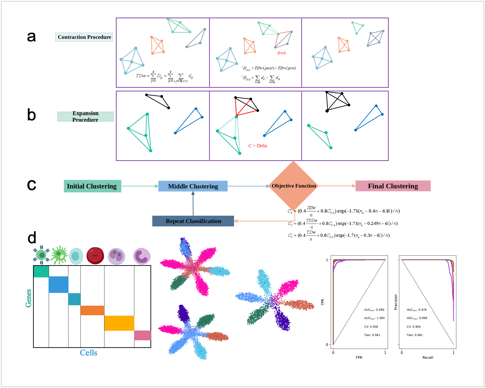</a>
            <h5 class="font-weight-medium mt-3" style="text-align: center;"><a href="https://elixir-workflow-workshop.github.io/2021/" class="text-decoration-none link">DYCA</a></h5>
            <!--div class="date-pos bg-info-gradiant p-2 d-inline-block text-center rounded text-white position-absolute">Jan18</div-->
            <!--h5 class="font-weight-medium mt-3"><a href="https://www.krishnaswamylab.org/workshop" class="text-decoration-none link">Machine Learning for Single Cell Analysis</a></h5-->
            
DYCA: an new non-hierarchical clustering methods for single-cell RNA-seq data integration and evaluation (in review).

            <!--a href="https://www.krishnaswamylab.org/workshop" target="_blank" class="text-decoration-none linking text-themecolor mt-2">Learn More</a-->
            <a href="https://github.com/czheluo/nf-core-circrnaworkflow"><button style="color: rgb(18, 19, 18);background-color: rgb(8, 158, 151);padding: 4px 22px;font-size: 19px;font-family: 'Times New Roman', Times, serif;font-weight: bold;">Github </button></a>
          

        

        

          

            
            <h5 class="font-weight-medium mt-3" style="text-align: center;"><a href="https://elixir-workflow-workshop.github.io/2021/" class="text-decoration-none link">sc/nRNAseq Workflow</a></h5>
            <!--div class="date-pos bg-info-gradiant p-2 d-inline-block text-center rounded text-white position-absolute">Jan18</div-->
            <!--h5 class="font-weight-medium mt-3"><a href="https://www.krishnaswamylab.org/workshop" class="text-decoration-none link">Machine Learning for Single Cell Analysis</a></h5-->
            
nf-core/scnRNAseq Workflow is a bioinformatics pipeline for scalable, reproducible, best-practice analyses of single-cell/nuclei RNA-sequencing data and can be used to perform QC, mapping and downstream analysis (cluster, annotaion, infer CNV, trajectory analysis and RNA velocity). Designed By Meng Luo (Developed in MajorBio, Privated and Unpublished).

            <!--a href="https://www.krishnaswamylab.org/workshop" target="_blank" class="text-decoration-none linking text-themecolor mt-2">Learn More</a-->
            <a href="https://github.com/czheluo/nf-core-circrnaworkflow"><button style="color: rgb(18, 19, 18);background-color: rgb(8, 158, 151);padding: 4px 22px;font-size: 19px;font-family: 'Times New Roman', Times, serif;font-weight: bold;">Github </button></a>
          

        

        <!-- Column -->
        <!--div class="col-md-4 on-hover">
          

            
            
Oct23

            <h5 class="font-weight-medium mt-3"><a href="#" class="text-decoration-none link">New Seminar on Newest Food Recipe from World’s Best</a></h5>
            
Business Park, Opp. Corns Sam Restaurant, New Yoark, US

            <a href="#" class="text-decoration-none linking text-themecolor mt-2">Learn More</a>
          

        

        <- Column ->
        

          

            
            
Oct23

            <h5 class="font-weight-medium mt-3"><a href="#" class="text-decoration-none link">Learn from small things to create something bigger.</a></h5>
            
Business Park, Opp. Corns Sam Restaurant, New Yoark, US

            <a href="#" class="text-decoration-none linking text-themecolor mt-2">Learn More</a>
          

        </div-->
      

    

