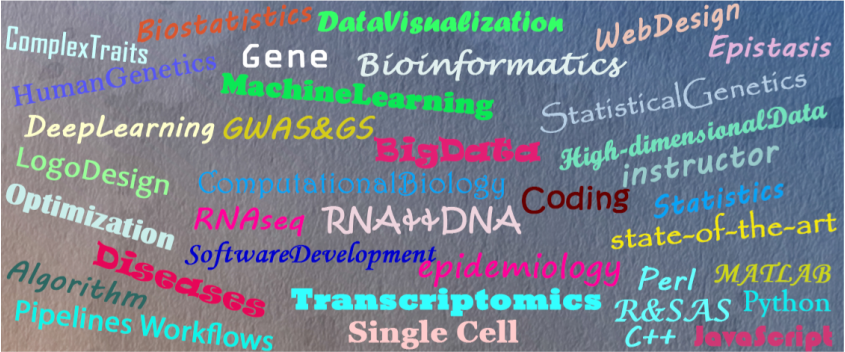

# 动植物组学生物信息团队

<link rel="stylesheet" href="stylesss.css">
 
<!--div align="center"></div-->
<!--script src="https://ajax.googleapis.com/ajax/libs/jquery/3.4.0/jquery.min.js"></script-->

<h3>Meet the Team In MCBRL</h3>

<section id="team">

    

        

          

            
          

          

            <h1>Meng Luo</h1>
            

              
              
              
            

          

        

        

          <h1 style="color:rgba(109, 10, 34, 0.842);font-size: 28px;">Meng Luo</h1>
          
Lab Manager

          <a style="color:rgb(9, 165, 157);font-size: 19px;font-weight: bold;" href="mailto:meng.luo@majorbio.com">meng.luo@majorbio.com</a>
          <!--h2> Meng Luo
            Lab Ma

            </h2-->
        

      
       
    
  

      

        

          

            
          

          

            <h1>Wanyun Yang</h1>
            

              
              
              
            

          

        

        

          <a style="color:rgba(109, 10, 34, 0.842);font-size: 28px;font-weight: bold;">Wanyun Yang</a>
           
           
          <a style="color:rgb(9, 165, 157);font-size: 19px;font-weight: bold;">Bioinformatics Engineer</a>
           
          <a style="color:rgb(9, 165, 157);font-size: 19px;font-weight: bold;" href="mailto:wanyun.yang@majorbio.com" target="_blank">wanyun.yang@majorbio.com</a>

        

      

      

        

          

            
          

          

            <h1>Jiawen Ma</h1>
            

              
              
              
            

          

        

        

          <a style="color:rgba(109, 10, 34, 0.842);font-size: 28px;font-weight: bold;">Jiawen Ma</a>
           
           
          <a style="color:rgb(9, 165, 157);font-size: 19px;font-weight: bold;">Bioinformatics Engineer</a>
           
          <a style="color:rgb(9, 165, 157);font-size: 19px;font-weight: bold;" href="mailto:jiawen.ma@majorbio.com" target="_blank">jiawen.ma@majorbio.com</a>
        

      
  
      

        

          

            
          

          

            <h1>Wanyun Yang</h1>
            

              
              
              
            

          

        

        

          <a style="color:rgba(109, 10, 34, 0.842);font-size: 28px;font-weight: bold;">Yunhe Liang</a>
           
           
          <a style="color:rgb(9, 165, 157);font-size: 19px;font-weight: bold;">Bioinformatics Engineer</a>
           
          <a style="color:rgb(9, 165, 157);font-size: 19px;font-weight: bold;" href="mailto:yunhe.liang@majorbio.com" target="_blank">yunhe.liang@majorbio.com</a>

        

      

    

    

      

        

          

            
          

          

            <h1>Chaonan Liu</h1>
            

              
              
              
            

          

        

        

          <a style="color:rgba(109, 10, 34, 0.842);font-size: 28px;font-weight: bold;">Chaonan Liu</a>
           
           
          <a style="color:rgb(9, 165, 157);font-size: 19px;font-weight: bold;">Bioinformatics Engineer</a>
           
          <a style="color:rgb(9, 165, 157);font-size: 19px;font-weight: bold;" href="mailto:chaonan.liu@majorbio.com" target="_blank">chaonan.liu@majorbio.com</a>

        

      

      

        

          

            
          

          

            <h1>Wanyun Yang</h1>
            

              
              
              
            

          

        

        

          <a style="color:rgba(109, 10, 34, 0.842);font-size: 28px;font-weight: bold;">Shang Wei</a>
           
           
          <a style="color:rgb(9, 165, 157);font-size: 19px;font-weight: bold;">Bioinformatics Engineer</a>
           
          <a style="color:rgb(9, 165, 157);font-size: 19px;font-weight: bold;" href="mailto:shang.wei@majorbio.com" target="_blank">wanyun.yang@majorbio.com</a>

        

      

      

        

          

            
          

          

            <h1>Jiawen Ma</h1>
            

              
              
              
            

          

        

        

          <a style="color:rgba(109, 10, 34, 0.842);font-size: 28px;font-weight: bold;">Zhenghong Chang</a>
           
          
          <a style="color:rgb(9, 165, 157);font-size: 19px;font-weight: bold;">Bioinformatics Engineer</a>
           
          <a style="color:rgb(9, 165, 157);font-size: 19px;font-weight: bold;" href="mailto:zhenghong.chang@majorbio.com" target="_blank">jiawen.ma@majorbio.com</a>
        

      
  
      <!--div class="person-container">
        

          

            
          

          

            <h1>Wanyun Yang</h1>
            

              
              
              
            

          

        

        

          <a style="color:rgba(109, 10, 34, 0.842);font-size: 28px;font-weight: bold;">Yunhe Liang</a>
           
           
          <a style="color:rgb(9, 165, 157);font-size: 19px;font-weight: bold;">Bioinformatics Engineer</a>
          <a style="color:rgb(9, 165, 157);font-size: 19px;font-weight: bold;" href="mailto:yunhe.liang@majorbio.com" target="_blank">yunhe.liang@majorbio.com</a>

        

      

    

<!--link href="https://cdn.jsdelivr.net/npm/bootstrap@5.1.3/dist/css/bootstrap.min.css" rel="stylesheet" integrity="sha384-1BmE4kWBq78iYhFldvKuhfTAU6auU8tT94WrHftjDbrCEXSU1oBoqyl2QvZ6jIW3" crossorigin="anonymous">

<!--link rel="stylesheet" href="https://maxcdn.bootstrapcdn.com/bootstrap/3.4.1/css/bootstrap.min.css"-->

<button class="button" onclick="$('#target').toggle();">
  Visiting Coworkers
</button>

  

    

      

        

          
        

        

          <h1>Daokuan Zhang</h1>
          

            
            
            
          

        

      

      

        <a style="color:rgba(109, 10, 34, 0.842);font-size: 28px;font-weight: bold;">Daokuan Zhang</a>
           
           
          <a style="color:rgb(9, 165, 157);font-size: 19px;font-weight: bold;">Bioinformatics Engineer</a>
      

    

    

      

        

          
        

        

          <h1>Xiaolong He</h1>
          

            
            
            
          

        

      

      

        <a style="color:rgba(109, 10, 34, 0.842);font-size: 28px;font-weight: bold;">Xiaolong He</a>
           
           
          <a style="color:rgb(9, 165, 157);font-size: 19px;font-weight: bold;">Bioinformatics Engineer</a>
      

    

    

      

        

          
        

        

          <h1>Jiameng Li</h1>
          

            
            
            
          

        

      

      

        <a style="color:rgba(109, 10, 34, 0.842);font-size: 28px;font-weight: bold;">Jiameng Li</a>
           
           
          <a style="color:rgb(9, 165, 157);font-size: 19px;font-weight: bold;">Bioinformatics Engineer</a>
      

    

    

      

        

          
        

        

          <h1>Chunxiang Xue</h1>
          

            
            
            
          

        

      

      

        <a style="color:rgba(109, 10, 34, 0.842);font-size: 28px;font-weight: bold;">Chunxiang Xue</a>
           
           
          <a style="color:rgb(9, 165, 157);font-size: 19px;font-weight: bold;">Bioinformatics Engineer</a>
      

    

     
  

    

      

        

          
        

        

          <h1>Dongmei Fu</h1>
          

            
            
            
          

        

      

      

        <a style="color:rgba(109, 10, 34, 0.842);font-size: 28px;font-weight: bold;">Dongmei Fu</a>
         
         
        <a style="color:rgb(9, 165, 157);font-size: 19px;font-weight: bold;">Bioinformatics Engineer</a>
         
        <a style="color:rgb(9, 165, 157);font-size: 19px;font-weight: bold;" href="mailto:dongmei.fu@majorbio.com" target="_blank">dongmei.fu@majorbio.com</a>
      

    

  

  

</section>
 
 

<h3>Github Contributions Chart</h3>

<!--h4 onclick="myFunction(1)">Visiting Coworkers</h4-->
<!--h4 onclick="GFG_Fun()">Visiting Coworkers</h4--> 
<!--script>
  function myFunction() {
    var x = document.getElementById("myDIV");
    if (x.style.display === "block") {
      x.style.display = "none";
    } else {
      x.style.display = "block";
    }
  }
</script-->
<!--script>
  function myFunction() {
    var x = document.getElementById("myDIV");
    if (x.style.display === "none") {
      x.style.display = "block";
    } else {
      x.style.display = "none";
    }
  }
</script-->
<!--script>
  $('#GFG_UP').text(
  "Click on button to toggle the DIV Box using Bootstrap.");

  function show(divId) {
      $("#" + divId).show();
  }

  function GFG_Fun() {
      show('div');
      $('#GFG_DOWN').text("DIV Box is visible.");
  }
</script-->                  

