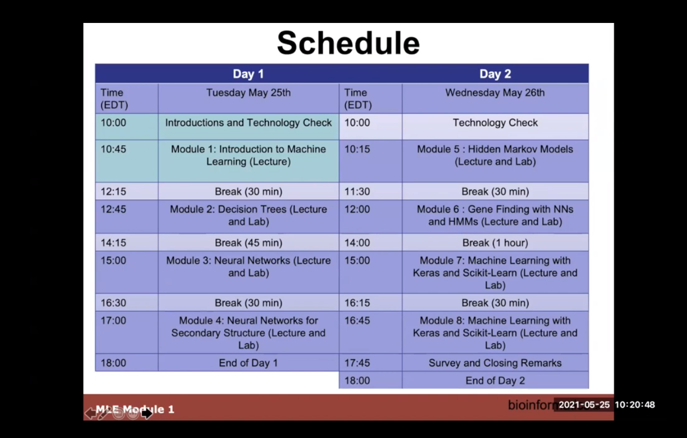
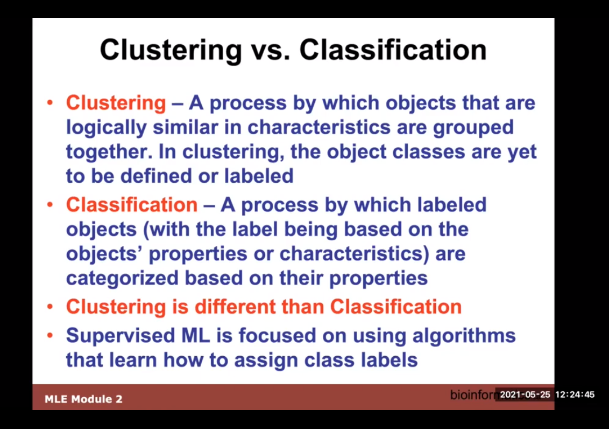
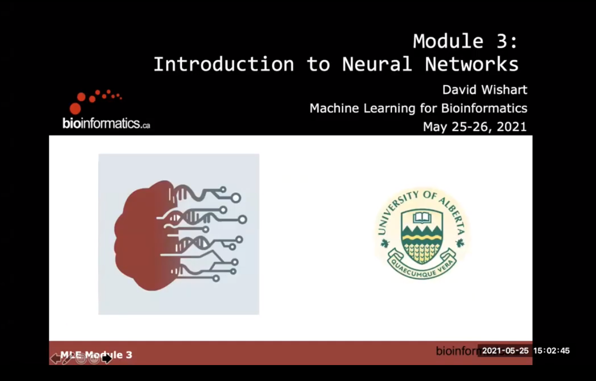
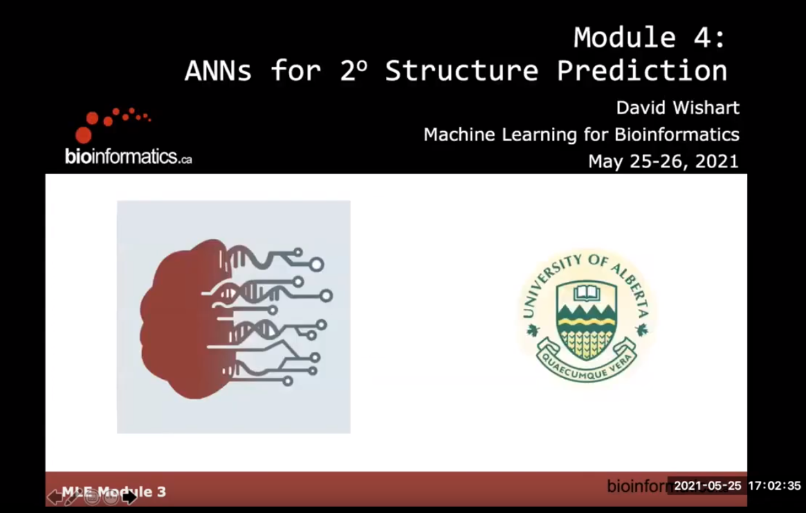
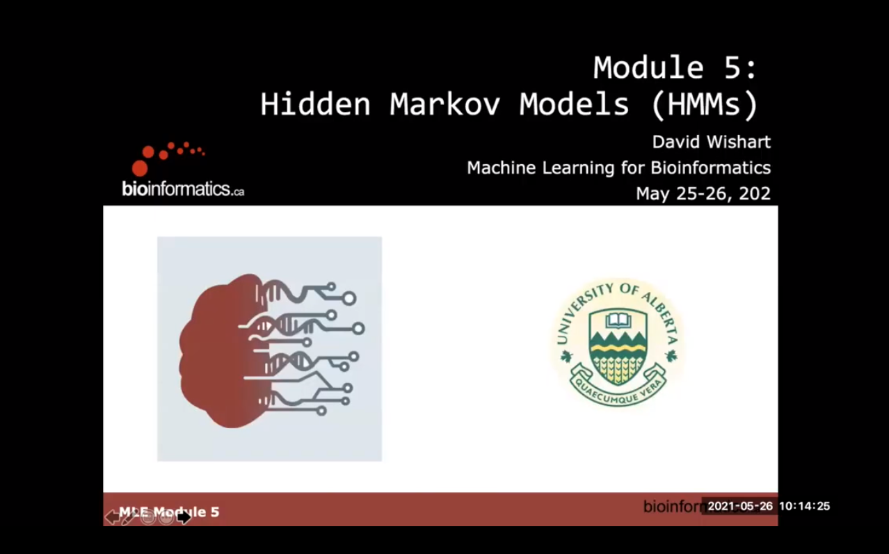
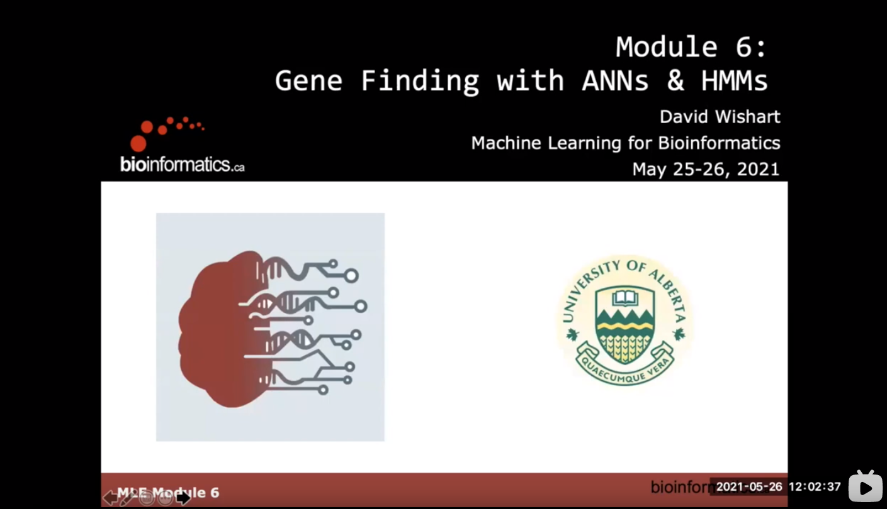
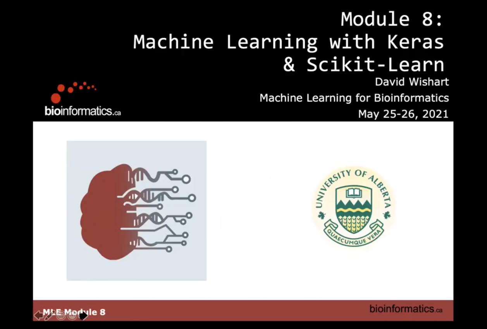

# CBW

<link rel="stylesheet" href="../css/font.css">
<link rel="stylesheet" href="../css/font-awesome.min.css">
<!--link rel="stylesheet" href="style.css"-->
 
<!--div align="center"></div-->

<link rel="stylesheet" href="../style.css">

<h3><a href="https://bioinformaticsdotca.github.io/ML_2020">CBW's Machine LEarning workshop</a></h3>

    The course schedule can be found <a href="https://bioinformaticsdotca.github.io//ML_2020_schedule">here</a>.

    
   
Pre-work including programs to install can be found <a href="https://bioinformaticsdotca.github.io//ML_2020_prework">here</a>.
 
    

    
 
 

    

        

            <iframe width="150%" height="250%" id="video_id" src="//player.bilibili.com/player.html?aid=719317072&bvid=BV16Q4y1U7tx&cid=444178001&page=1"
                    frameborder="0" allow="accelerometer; autoplay; encrypted-media; gyroscope; picture-in-picture"
                    allowfullscreen></iframe>
        
    
    
 
        

            

                
                
<p1>CBW's Machine LEarning workshop - 01 Introduction to Machine Learning</p1>

                

                    
                
  
            

            

                
                
<p1>CBW’s Machine LEarning workshop - 02 Lecture & Lab_ Decision Trees</p1>

                

                    
                

                
            

            

                
                
<p1>CBW's Machine LEarning workshop - 03 Lecture - Neural Networks</p1>

                

                    
                

                
            

            

                
                
<p1>CBW's Machine LEarning workshop - 04 Lab Neural Networks for secondary structure</p1>

                

                    
                

                
            
          
        

        

            

                
                
<p1>CBW's Machine LEarning workshop - 05 Lecture  Hidden Markov Models</p1>

                

                    
                

                
            
 
            

                
                
<p1>CBW's Machine LEarning workshop - 06 Lab  Gene Finding with NNs and HMMs</p1>

                

                    
                

                
            
 
            

                
                
<p1>CBW's Machine LEarning workshop - 08 Lab Machine Learning with Keras & Scikit-Learn</p1>

                

                    
                

            
            
        
        

